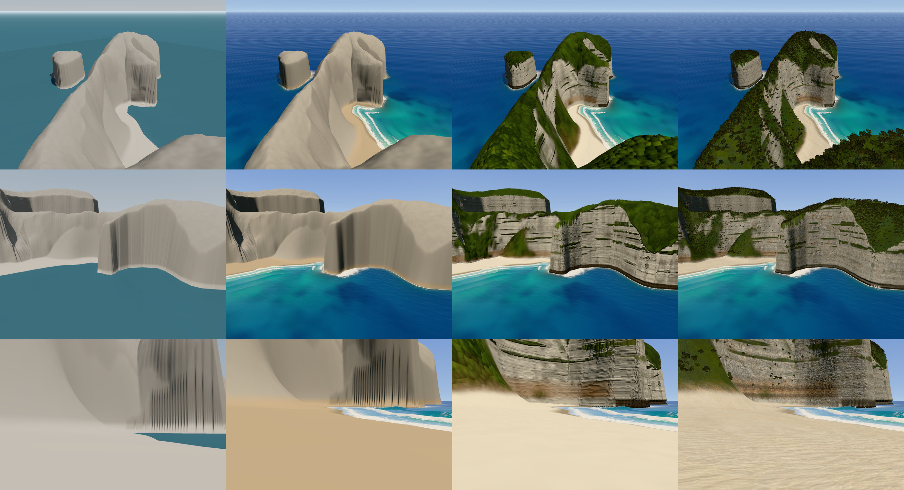

# Kelingking, in three.js

A real place rebuilt in the browser: Kelingking Beach on Nusa Penida, the T-Rex headland.
The plan is a scroll piece that starts with the whole bay from the air, walks down the
trail on the ridge, and ends standing on the sand with the waves coming in.



v1 was built in three stages (shape, sea, surfaces) plus a first pass of scanned textures and
trees. Each stage is a tagged commit you can check out and run: `stage-1`, `stage-2`,
`stage-3`, `stage-3b`, and `v1` (the same look plus the setup for the versions). See [how v1 was built](docs/gallery/history/README.md).

From here it is built one element per version, each checked against real photos before
moving on. The plan, the rules and a brief per version are in
[docs/versions](docs/versions/README.md), and every version's hero frames are in
[docs/gallery](docs/gallery/README.md).

| Version | Element | Status |
|---|---|---|
| v1 | Shape, sea, surfaces, first scans and trees | done |
| v2 | Light and atmosphere | done |
| v3 | Rock | done |
| v4 | Water | done |
| v5 | Sand and the waterline | done |
| v6 | Trail and stairs | done |
| v7 | Plants | done |
| v8 | The scroll descent | done |
| v9 | Speed and the shareable build | next |

## Run it

```bash
python3 -m http.server 5178
```

Then open http://localhost:5178: the landing page, the scroll from high over the bay down
to the water's edge (v8). It needs a local server (module workers do not run from `file://`).
A standalone single-file build comes later (v9).

The tools that match the scene to photos are the same page with a shot in the URL:
http://localhost:5178/?shot=viewpoint. There, keys `1` to `9` switch shots, `O` photo overlay,
`D` difference blend, `L` outline mode, `F` free camera, `C` contour lines, and the panel on the
right tunes the camera and the terrain live. On the landing page the panel, a readout and keys
`1` to `6` (the stops) only appear with `?debug`.

## How the scroll works

v8 made the page itself (`src/scroll/`, `index.html`). The scene is `src/app.js`, shared with
the tools (`src/debug.js`), which `src/main.js` picks from the URL.

- **One path, one number.** `path.js` turns the scroll into `tau`, from 0 over the bay to 5 at
  the water, through six stops: the bay from the air, the clifftop viewpoint, the ridge
  (`trailTop`), the switchbacks (`trailLow`), the foot of the path, the water's edge. From 0
  to 1 the camera flies: it turns while still looking straight down, then tilts up and drops
  onto the platform along the viewpoint's own line of sight. From 1 on it walks v6's walk line
  at eye height and crosses the sand to where the `swash` frame stands.
- **It looks at the place, not at its feet.** The path swings through every compass
  direction on the switchbacks, but the head stays within about 20 degrees of south-west from
  all of it, so the camera looks at the head (and, past the hairpin, at the south end of the
  beach) while it walks. Pitch and lens are keyframed by metres walked and smoothed over a few
  metres. `node tools/descent.mjs` prints how fast it moves and turns per screen of scroll.
- **Pacing** is a monotone curve through `PACE` knots (screens of scroll against `tau`), with
  beats at the stops where the camera slows almost to a stop while the words come in. About
  15 screens top to bottom.
- **The page layer** (`scroll.js`, `page.css`): Lenis for a weighted smooth scroll, GSAP for
  the words (lines rising out of masks, SplitText), all driven from GSAP's ticker in one loop
  with the camera and the frame. Each block of words shows while the camera's `tau` is in its
  `data-tau` range in `index.html`, so the words follow the camera, not the raw scroll. The
  top bar gives the camera's live latitude, longitude and height, and a rule down the right
  edge draws as the camera goes down.
- **Loading.** The loader counts through the real stages (terrain in the worker, textures,
  growing the plants, the path), then draws a frame at fifteen points down the path behind
  it, so no shader compiles and no texture uploads the first time the camera gets somewhere,
  and times a few of them to pick the pixel ratio (aiming for 13 ms a frame).
- **Phones.** The lens widens on a tall screen, the flight starts higher so the frame stays on
  the modelled ground, the words sit at the bottom and a line across the top replaces the rule.

```bash
node tools/descent.mjs                 # the path's speeds, turn rates and clearance per stretch
node tools/scroll-clip.mjs             # a recording of the whole page, frame by frame (1080p)
node tools/scroll-clip.mjs --phone     # the same at 390 x 844
node tools/path-bench.mjs              # frame times all the way down, against the last version
node tools/path-bench.mjs --pace       # real frame pacing while the page scrolls itself
```

Landing page switches: `debug`, `at=2.5` (start at that `tau`), `notext`, `record` (for
`scroll-clip.mjs`), and every scene switch (`pr=`, `q=`, `hour=`, ...).

## How the terrain is made

Nothing is sculpted by hand in a 3D tool. The shape comes from map data plus a few numbers
tuned against photos.

1. **OpenStreetMap** gives the coastline, the cliff-top lines, the trail and spot heights
   (the head's summit is tagged at 111 m). `tools/extract-osm.mjs` turns `data/osm.json`
   into `src/terrain/geo.js` in local metres, origin on the summit.
2. **`src/terrain/layout.js`** holds the hand-tuned part: a spine running down the ridge
   with a height and width at each control point, a spur for the jaw, and zones that say
   how sheer the cliffs are and where the beaches are.
3. **`src/terrain/heightfield.js`** combines them in two passes. First a top surface
   (the island plateau blended into the ridge). Then the drop: on rock the cliff falls at
   the waterline, in beach zones it falls from the mapped cliff-top line and sand fills the
   gap. Signed distance fields (exact Euclidean transform) do the heavy lifting, and the
   transform also reports the nearest cliff-top pixel, so a beach wall takes its height from
   the edge above it.
4. It runs in a web worker at 1024 or 2048 texels over 1.6 km (0.78 m per texel), and the
   page builds a mesh plus a full-resolution normal map from it.
5. **The path** (`src/trail/`, v6) is one line from the top of the steps to the sand, with a
   walking height held to a steepest grade and turned into steps where it is steep. It is cut
   into the ground (a level shelf, cut and fill banks) before anything else is built from the
   height, so the mesh, the plants and the shadows all stand on the carved ground. The steps,
   handrails and logs are built from the same line in the worker.

## How the cliffs and surfaces work

A plain grid cannot draw these cliffs: a 100 m face that is 7 m wide on the map gets a
handful of grid rows, crossed at an angle, and renders as stripes and teeth. So:

- **The generator hands out a function, not just a grid.** Everything smooth (distances to
  the coast and to the cliff tops, the top surface, the zone settings) is stored on the grid,
  and `heightAt(x, y)` applies the sharp steps at any point. Rims and the feet of walls are
  rounded over a couple of metres, and the rock faces follow a blurred coastline, so sharp
  corners of the map do not become sharp vertical edges.
- **Faces are strips of their own** (`src/terrain/mesh-builder.js`). A face field gives the
  distance to the middle of every face; its zero line is traced into chains, and along each
  chain a column of vertices runs across the face at right angles, evenly spaced over the
  carved surface (about 55 cm apart near the headland). Neighbouring columns are zipped
  together. The ground is still a grid, denser over the headland, and wherever a strip covers
  it the grid is pushed back into the rock or left out, so the strip is what you see. That is
  what removed the comb of teeth along the rims.
- **The faces are carved**, which a heightfield cannot do: the wave-cut notch at the
  waterline (deeper under the jaw), buttresses and bays, the big beds of the limestone
  standing out or cut back, a low undercut all along the back of the beach, and the overhang
  at its south end, where the face bulges 20 m out over the sand above a cave (settings in
  `layout.js`, `overhangs`). The islet is a rounded thumb, sheer on its north-west side.
- **Light under the rock.** For every vertex of a strip the mesh builder works out, in the
  face's own vertical section, how much of the sky the rock above leaves, the angle above
  which rock hides the sun, and how much sunlit ground lies in view past the drip line. The
  shader uses those for the sky light, the sun's shadow and the light bounced up from the
  sand, plus a second bounce off the rock overhead, which fills a cave with warm light.

The look is scanned textures (Poly Haven, CC0) plus procedural structure
(`src/terrain/terrain-shader.js`), patched into three.js's standard material:

- **Limestone bedding** from one table (`src/terrain/strata.js`), shared by the mesh and the
  shader, so a ledge in the geometry and its band of colour line up: packages of massive or
  thin-bedded rock, beds with rounded noses, and recessed partings between them that read as
  the dark lines on the faces from a distance. The shader adds the fine relief, each bed's
  shade (grey to creamy), the shadow the ledges cast for the sun's angle against the face,
  and the sky the ledges hide. Runoff streaks, ochre and brown staining under the overhangs,
  and a ragged dark band at the waterline whose height changes along the coast.
- **The ground under the plants** is a scanned grass-and-rock surface, darker and browner
  with leaf litter where the plants' crowns cover it (worked out from where they stand), and
  straw and earth under the grass near the camera.
- **Sand**, near-white coral sand (about 0.5 reflectance), trampled up close (two close-range
  scans), packed firm and wet where the swash runs, glossy for a moment after it drains, damp
  above, with red grains, grit and rock dust along the foot of the walls. The beach's shape
  follows a trace of the drone photo: flat to the foot of the walls, a steep face and a berm
  at the water, low at the south end so the swash reaches the rock.
- Everything finer than a pixel is faded out by the pixel footprint, so it holds up from 1 km
  and at your feet without shimmering.

**Sun shadows are baked.** For each map column there is one height above which a point sees
the sun, which is exact for a heightfield, cliff faces included. It is baked on the GPU in one
pass whenever the sun moves (`src/terrain/sun-shadow.js`), and the ground and sea each read
it with a single texture lookup. Carved faces combine it with their own horizon (above).
Until v3 the ground never actually used it: see v3 in `PROCESS.md`.

## How the water works

The sea (`src/water/`) is several pieces that share one set of inputs: a texture the terrain
worker writes (seabed height, distance offshore, how sandy the shore is, how much sand hangs
in the water), a second one for the rock coast (distance to the rock's real foot, read off
the carved mesh, and how exposed it is to the swell), and the light from `src/sky/`.

- **The open sea is a wave spectrum** (`ocean.js`), turned into surfaces on the GPU by an
  inverse FFT, after Tessendorf: a 13 s swell from the south-west and the local wind sea
  (JONSWAP, 7 m/s), in four cascades from a 757 m patch down to 2.2 m, so there are waves at
  every scale from 1 km up to your feet. Where crests fold over they break into whitecaps,
  and the foam fades over a few seconds. Gusts make patches of rougher and smoother water.
- **One mesh follows the camera**: rings packed tight near it and spread out to the horizon,
  drawn only in the wedge the camera can see. Waves smaller than a pixel are not lost: the
  spread of their slopes (from the cascades' mipmaps) roughens the sun glint and tilts the
  reflection, four little mirrors per pixel.
- **Colour comes from light in water**: absorption and backscattering per metre, close to
  pure sea water, measured against the photos region by region (`capture.mjs --measure`).
  Red is gone within a few metres and blue lasts, so white sand under 2 m reads turquoise and
  30 m reads navy. Sand stirred up in the surf is beige, the silt of the milky plumes in the
  east bay only scatters, so it glows pale turquoise.
- **The surf** forms only in front of the beaches, with physical wavelengths (one or two
  crests in the surf zone), irregular timing and sets. Each wave breaks where it gets too
  big for the depth, bigger waves further out.
- **The breaking wave** (`breaker.js`) is its own mesh, because a heightfield cannot fold
  over: a ribbon along each beach whose cross-section steepens, throws a lip, curls into a
  tube and collapses, each half metre of beach at its own stage, so the wave peels. While a
  wave breaks, the sea tucks its crest under the ribbon.
- **Foam has a memory** (`surf-sim.js`): a 1024 by 1024 simulation over the bay carries foam
  and stirred sand with the water (up the beach with each bore, out in the backwash and the
  rips, off the rock after each hit, downwind, in slow eddies), and fades it. The lace is
  drawn where the foam came from, so it stretches into streaks.
- **The swash** (`swash.js`, v5): each wave sends a sheet of water up the sand after its
  bore, thin at its ragged, foamy front, that slows, stops and drains back. One function of
  the time, the place and the bed's height, worked out once a frame into a map over the beach
  (`swash-map.js`), feeds the sea (the sheet, drawn as a film over the ground's wet sand), the
  sand (soaked, glossy, drying) and the foam simulation (which moves with it).
- **Spray** (`spray.js`): droplets off the lip, feathering off the crest, the splash where
  the lip lands, and bursts where the swell hits the rock, in sets. Worked out per particle
  from the time, so a frozen frame and a running page agree.

A frozen capture (`t=`) replays the last 30 s of foam, so its trails look as they would.

## How the plants work

Nothing is scanned or downloaded (v7). Six species that grow on Nusa Penida's limestone are
grown in code when the page loads (`src/veg/grow/`), each in two or three variants:

- **Beach naupaka** (*Scaevola taccada*), the low bush all over the finger: stems from the
  base that fork toward points scattered through the mound (a small space-colonisation
  grower, radii by the pipe model), each ending in a rosette of spoon-shaped leaves, young
  ones upright and brighter, old ones spread and sometimes yellowing.
- **Grass tussocks** along the path: a fountain of arching blades, green at the base, some
  dried to straw at the tips, a few seed stalks.
- **Hanging scrub** on the ledges and faces: stems that grow out over the edge and trail down
  the rock in curtains of small leaves.
- **Screw pine** (pandanus) on stilt roots with spiral tufts of keeled strap leaves,
  **coconut palms** in groves on the plateau, and a **broadleaf tree** for the woods.

Leaves are painted into a small atlas at load (outline, midrib, veins, rim), and built to
their outline as geometry up close, so nothing is cut out by a texture there.

**Where they grow** (`src/veg/scatter.js`, in the terrain worker): on anything short of a
sheer face, none on the sand or at the foot of the cliffs. Scrub in patches tens of metres
across with grass between on the finger, a mosaic of woodland and open grassland with palm
groves on the plateau, hanging scrub in patches down the sheer faces and along the ledges
(the tops of the hard beds, from the same bedding table the mesh is carved with). Grass
tussocks within 22 m of the path, low leafy scrub beside the concrete steps, and views from
the path kept open (v6's rule).

**How they are drawn.** Up close, real geometry (`near.js`, `plant-material.js`): the plants
within reach are picked each frame the camera moves, nearest first, in two or three levels of
detail. Further off, impostors (`impostors.js`): each plant variant is baked on the GPU at
load into 64 views, colour plus normal, depth and how deep in the crown, and drawn as one card
that shows the view nearest to the camera's. Every hand-over is a stipple dissolve. Both are
lit by the same code (`foliage-glsl.js`): light through the leaves, a waxy sheen that
broadens as a pixel covers more leaves, the sky from the atmosphere's harmonics, and the
sunlight left after passing through the crown.

**Wind.** One wind for the island, blowing the way the sea's gusts drift, with gusts tens of
metres across running downwind across the slopes. Plants lean and sway with the push where
they stand, branches sway on their own, leaves flutter, and a gust turns leaves over so their
paler undersides flicker (what you see of a gust from far off).

## How the light works

One physical model for the sun, the sky, the haze and the clouds (`src/sky/`), in real units
(kilolux and kilocandela per square metre), exposed like a camera (`src/post/grade.js`).

- **The sun is where it was.** The viewpoint photo's EXIF, on its Wikimedia Commons page,
  says 6 April 2025 at 11:57 from the clifftop, on an iPhone 16 at ISO 50, f/2.2, 1/1927 s.
  NOAA's solar position equations put the sun 73.7 degrees up, just east of north.
  `?hour=` moves it through that day.
- **The sky is scattering, not a gradient.** Sebastien Hillaire's 2020 method: lookup tables
  for how much sunlight survives through the air, for light scattered many times, for the sky
  around the camera, and for the haze in front of everything (froxels, out to 160 km). Air
  molecules (blue), a light background of aerosol, and a dense layer of sea haze in the
  lowest few hundred metres. The same tables give the sun's colour at the ground and the sky
  light on every surface (spherical harmonics), so the sky you see and the light it casts
  cannot disagree.
- **Exposure from the photo.** The EXIF gives EV100 14.2, and a meter's calibration turns
  that into pixel values. One exposure for every shot, as with a camera on a sunny day. With
  nothing tuned, the render's sky matched the same-day photo within 0.3 stops from 5 to 32
  degrees up. Then the Khronos PBR Neutral tone curve and a small saturation lift.
- **Clouds.** Fair-weather cumulus, marched through a volume at half resolution: billow noise
  kept where a weather map puts cloud clusters, flat bases, rounded tops, lit by the same sun
  and sky and hazed by the same froxels. The sky over the island is kept clear, as on the
  photo day, so their shadows drift over the open sea (and over the island too if the clear
  radius is made smaller).
- **Light between surfaces.** The ground takes light bounced up from what lies below and in
  front of it (sunlit sand warms the cliff foot and the overhang, the sea cools it). Leaves
  pass light through and have a waxy sheen.
- **Measured, not eyeballed.** `capture.mjs --measure` compares the render and the photo
  region by region (sky by elevation, sea by distance, sand, rock and plants in sun and shade,
  and hand-placed rectangles per shot), before and after the tone curve.

## Matching photos

Each shot in `src/shots.js` is tied to a reference photo. The capture tool renders it
headlessly through Chrome's DevTools protocol, with nothing to install:

```bash
node tools/capture.mjs viewpoint --compare     # render and photo side by side
node tools/capture.mjs viewpoint --outline     # render edges traced over the photo
node tools/capture.mjs --overlay=0.5           # every shot, 50% blend
node tools/capture.mjs beach --t=17            # freeze the sea at 17 s
node tools/capture.mjs beach --clip=9          # 9 s clip to captures/beach.mp4 (needs ffmpeg)
node tools/capture.mjs viewpoint --clip=10 --hours=6.5:17.8   # sunrise to sunset instead
node tools/capture.mjs shoreBreak --debug=5    # water debug views 1 to 9 (see water-shader.js)
node tools/capture.mjs cove --set="w.murk=2;o.wind=10"   # water (w.) and wave spectrum (o.) settings
node tools/capture.mjs viewpoint --console     # print the page's shader errors and warnings
node tools/capture.mjs --bench                 # render time per shot
node tools/capture.mjs viewpoint --measure     # average colour per region, render and photo
node tools/capture.mjs viewpoint --set="hour=17;haze=5"   # any page switch
node tools/capture.mjs viewpoint --eval="window.__light"  # read something from the page
node tools/capture.mjs beach --clay            # grey ground, to judge the shape alone
node tools/preview-height.mjs 1024             # top-down shaded map with contours
```

Outline mode is the one that does the work: red is where the render's land meets water or
sky, yellow is where one landform passes in front of another. See `PROCESS.md` for what it
caught.

## Known limits

- **Speed.** With nothing else on the GPU, every hero frame renders in well under 30 ms at
  1400 px on an M1 Max. Earlier figures in `PROCESS.md` (10 to 30 fps) were measured while
  the browser pane was rendering the page at the same time, and were 5 to 8 times too slow.
  See `docs/gallery/v1` for the baseline.
- **Season.** The scrub is wet-season green. Most trail photos are dry season.
- **Materials after v2.** Every material was retuned under v2's physical light: the rock in
  v3, the water in v4, the sand in v5, the plants in v7 (to measured leaf reflectance).
- **No far coast.** The terrain stops 1.6 km out, so the ridges that fade into the haze in
  the drone photos are not there to fade.

## Credits

- Map data (C) OpenStreetMap contributors, available under the Open Database License.
  `data/osm.json` and `src/terrain/geo.js` are derived from it and stay under the ODbL.
- Reference photos are not included in this repo. `references/refs.json` and
  `references/REFERENCES.md` list every source with its author and licence (Unsplash and
  Wikimedia Commons), and `node references/fetch-refs.mjs --get` downloads them locally.
- Rock, sand, ground and path textures are from Poly Haven (polyhaven.com), CC0.
  `node tools/fetch-assets.mjs` downloads the originals (about 330 MB, not committed) and
  `node tools/prepare-assets.mjs` makes the 24 MB of textures in `assets/textures/`. See
  `assets/textures/CREDITS.md`. The plants are not scans: they are grown in code at load
  (`src/veg/grow/`, v7). v1 to v6 used three Poly Haven tree scans.
- three.js, lil-gui, GSAP and Lenis load from jsDelivr, the fonts (Instrument Serif, Inter)
  from Google Fonts.
