# How v1 was built

The same three frames at the end of each stage, rendered from the git tags `stage-1`,
`stage-2`, `stage-3` and `stage-3b` (scans and trees, the look of v1). Left to right in the
grid: stage 1, stage 2, stage 3, v1.

| | Stage 1: shape | Stage 2: the sea | Stage 3: surfaces | v1: scans and trees |
|---|---|---|---|---|
| Clifftop | 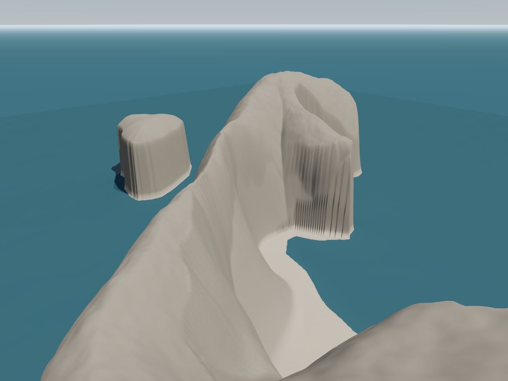 | 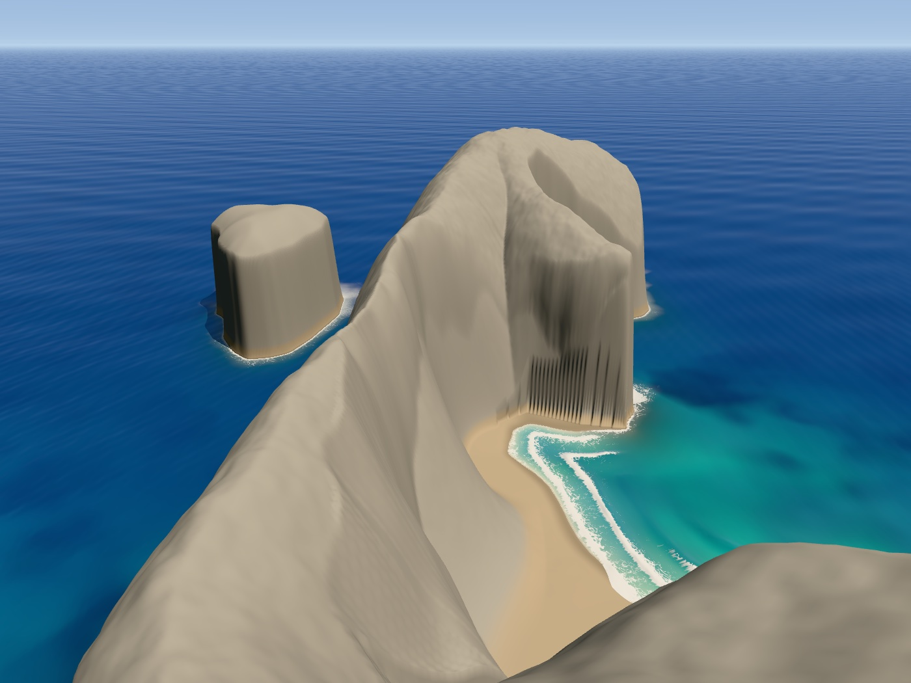 | 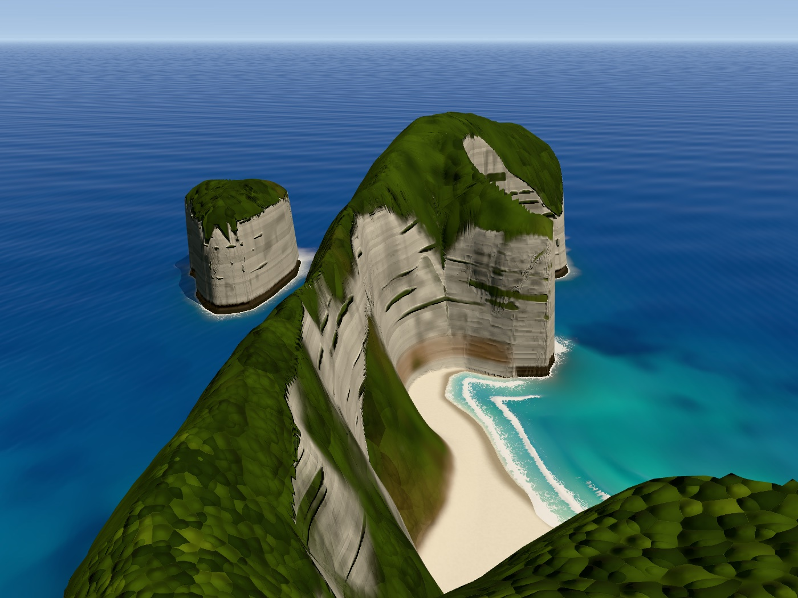 | 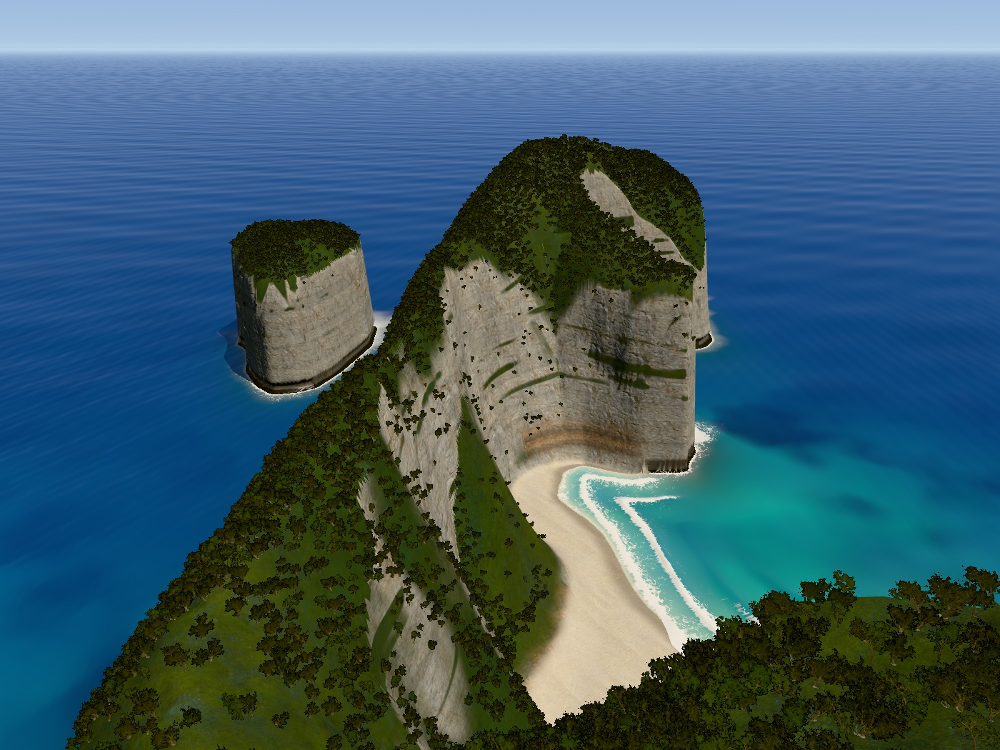 |
| From the sea | 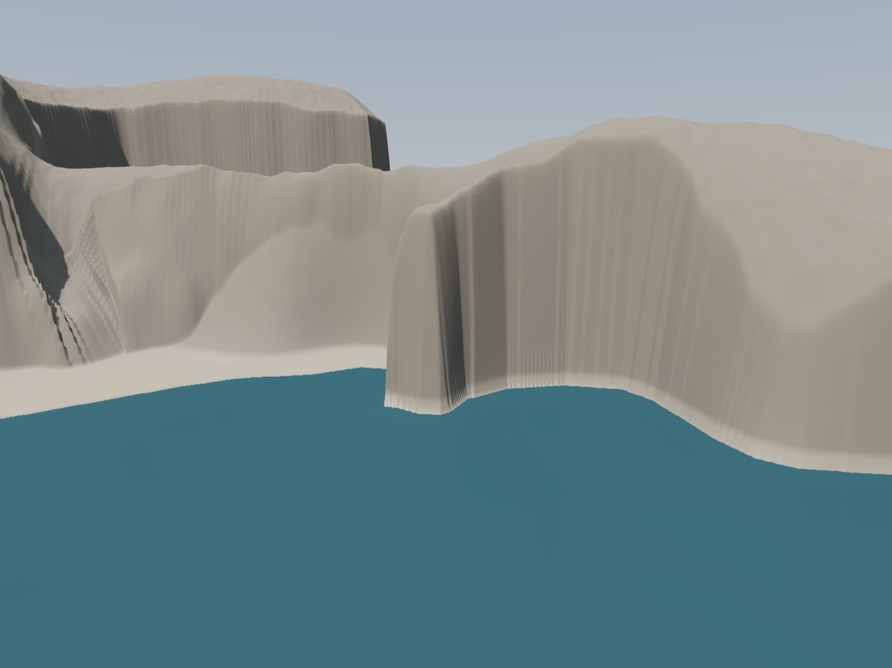 | 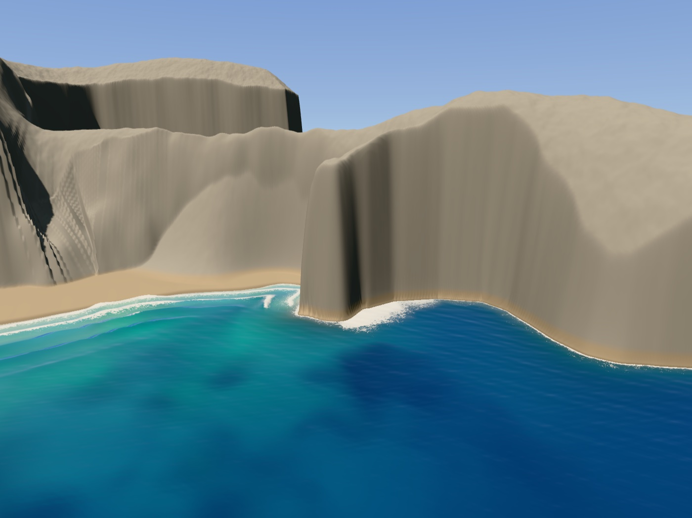 | 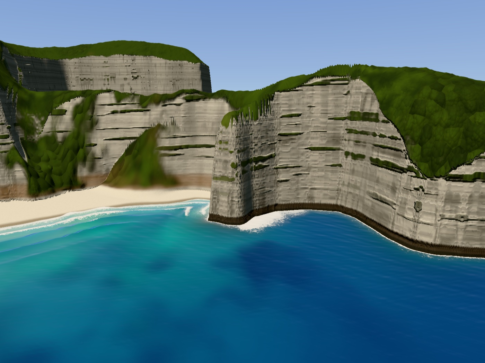 | 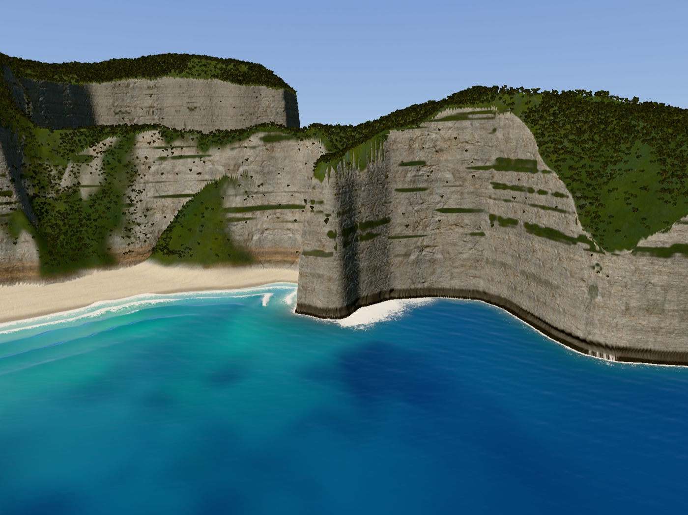 |
| On the sand | 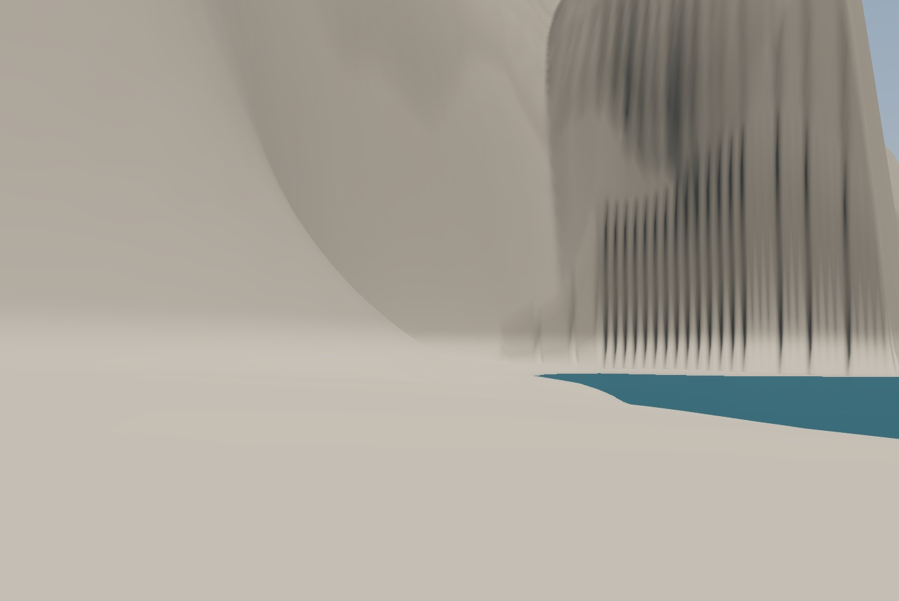 | 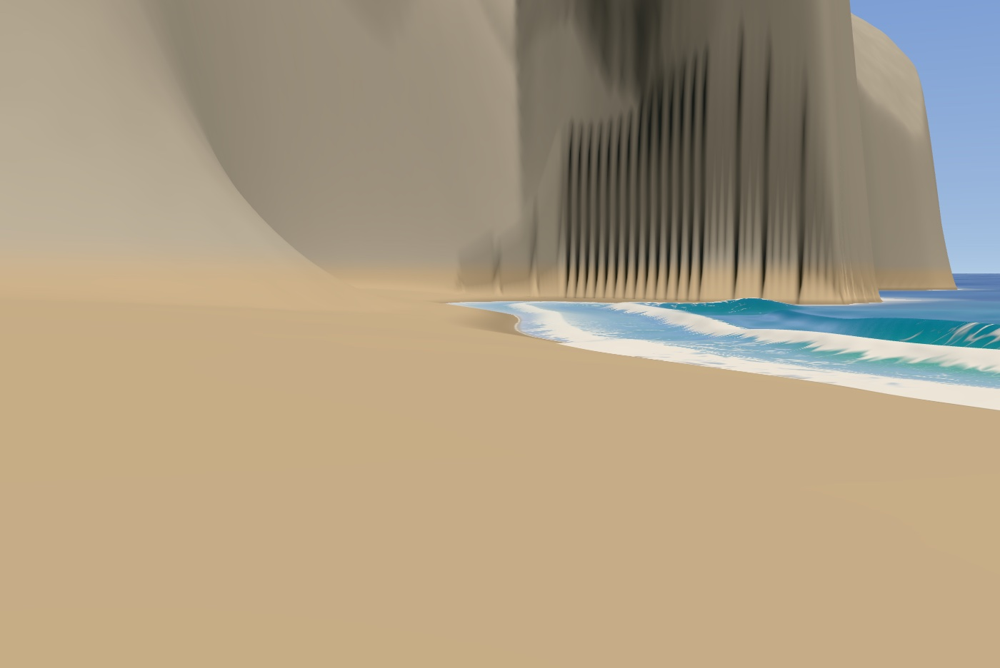 | 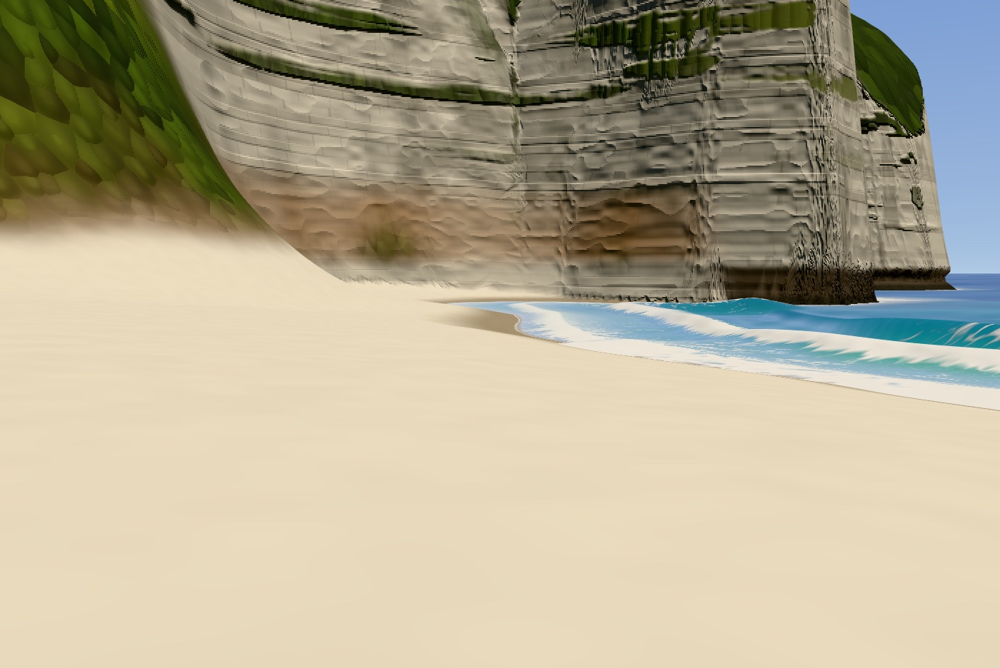 | 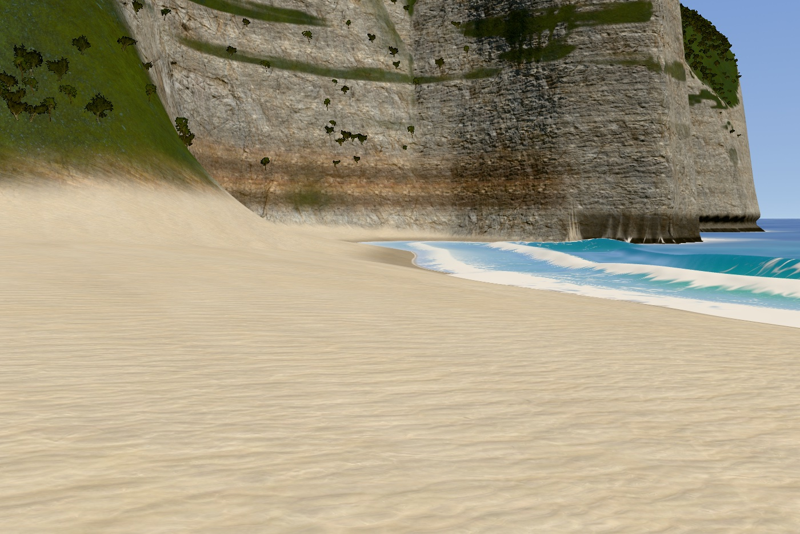 |

- **Stage 1.** The headland from OpenStreetMap in grey clay, checked against the photos with
  the outline tool. Flat placeholder sea.
- **Stage 2.** The sea: colour from depth over white sand, waves that break off the beach,
  foam and swash.
- **Stage 3.** Vertices moved onto the cliff faces so they stop smearing, and surfaces
  painted from noise.
- **v1.** Real scanned rock, sand and ground (Poly Haven, CC0) and 118,000 scanned trees.

To run any of them: `git checkout stage-2` (or `stage-1`, `stage-3`, `stage-3b`), start the
server and open the page. The tag `v1` is the same look plus the stage 0 setup (hero frames,
gallery, version briefs), and is where v2 starts.

The stages were committed afterwards by replaying the build session's edit log, and the
replay reproduces the v1 source files byte for byte.
