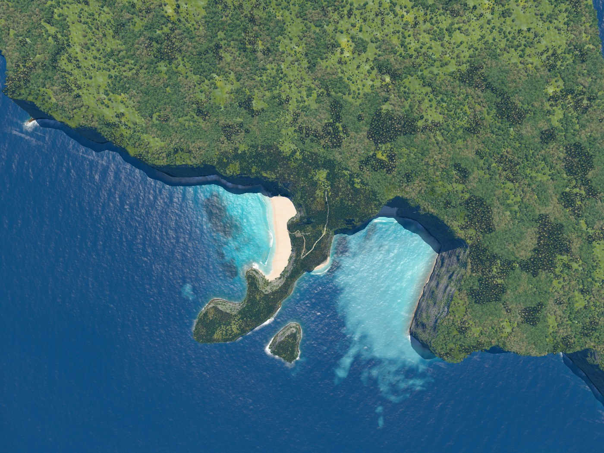
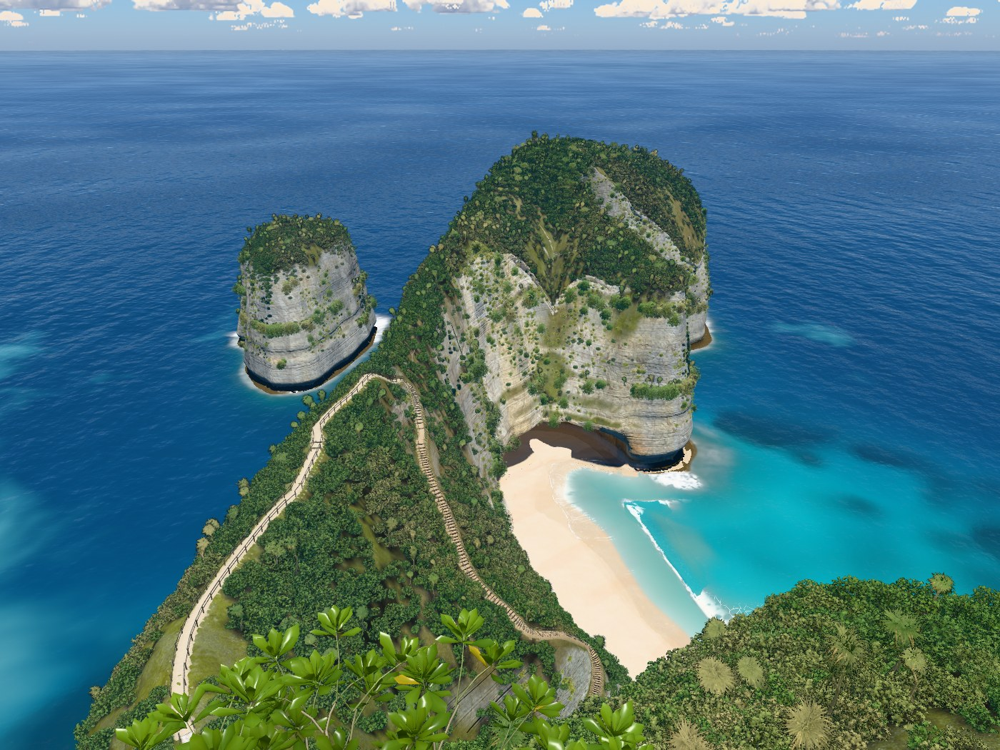
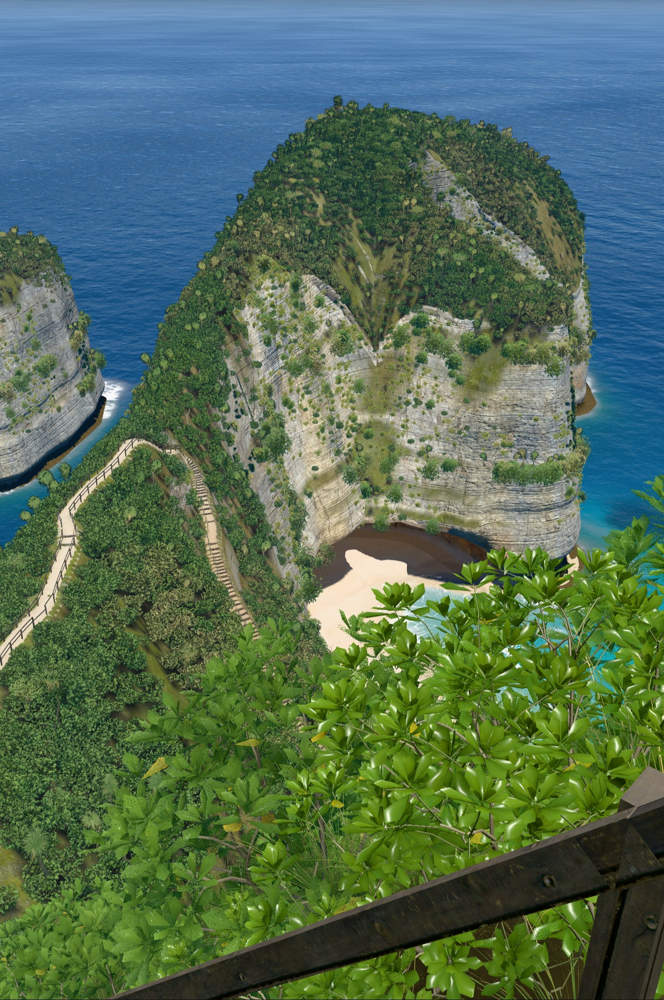
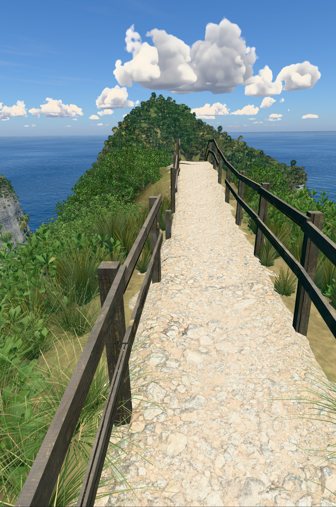
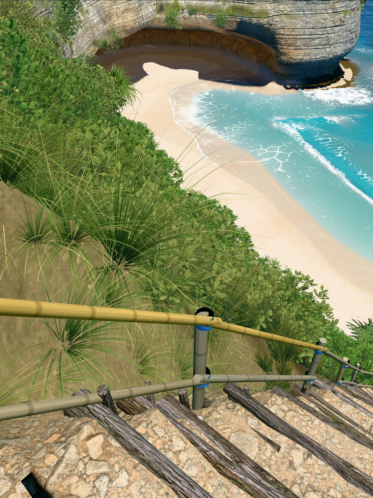
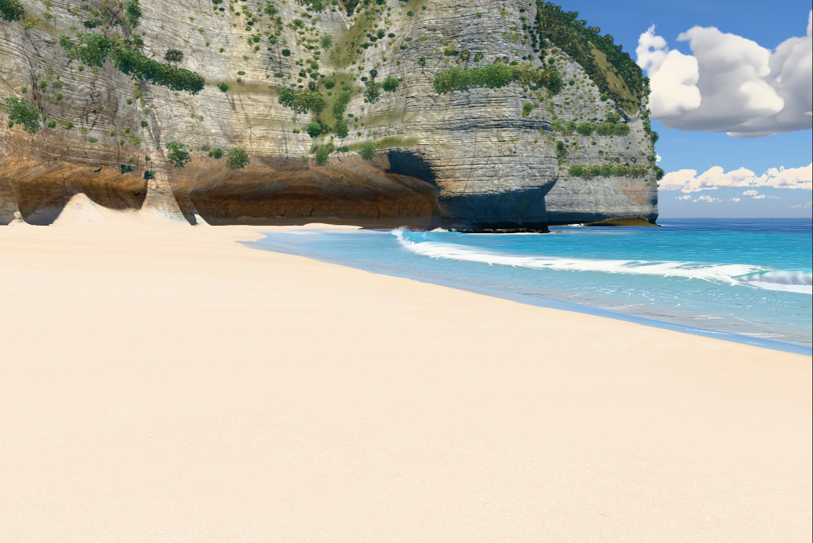
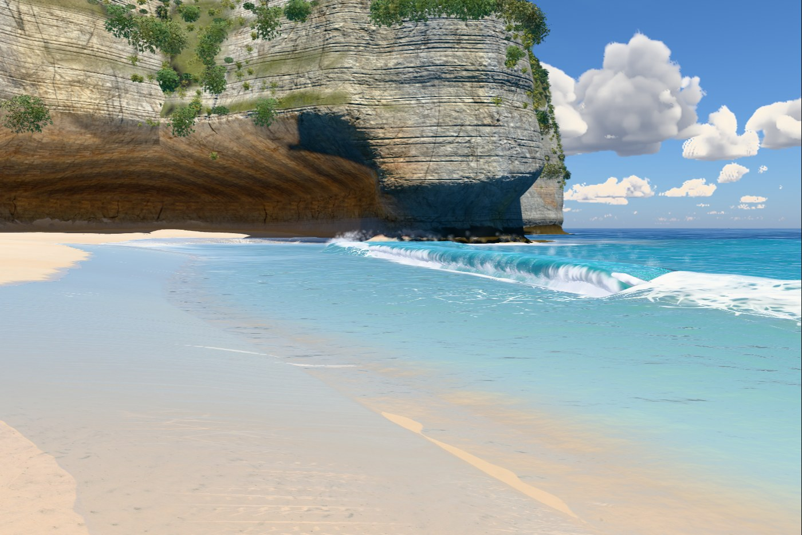
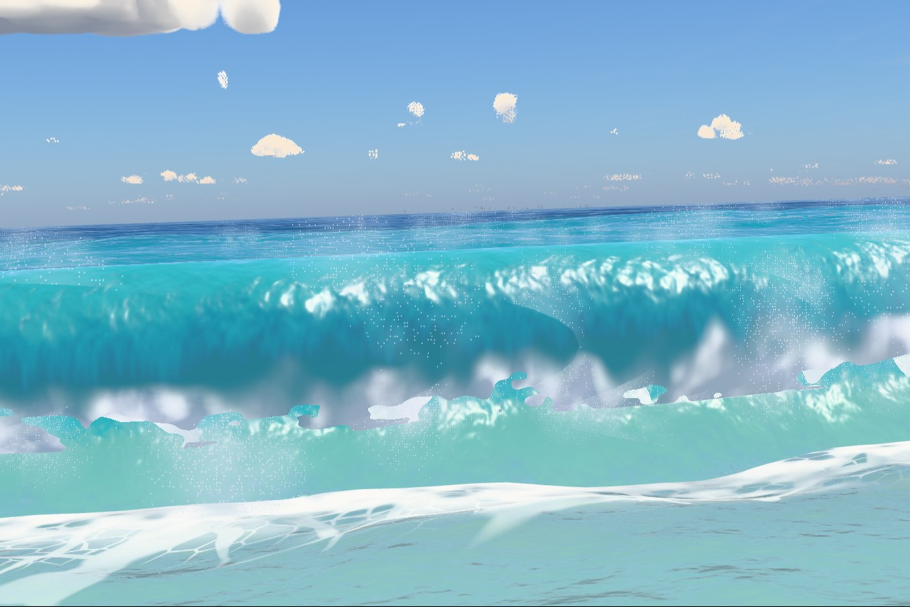
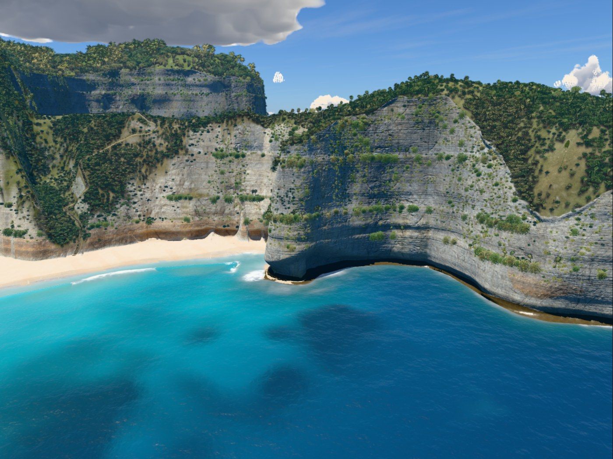

# v10

Hero frames, rendered with `node tools/hero.mjs v10`. The sea is frozen at 17 s.

### Overview, straight down

### Clifftop viewpoint

### On the stairs

### Top of the trail

### Low on the trail

### On the sand

### At the water's edge

### Shore break, eye level

### Head from the sea

## Frame times

Time to render one frame to completion at 1400 px wide, pixel ratio 1, best of three rounds, on
the build machine (Apple M1 Max). Absolute times depend on what else is using the GPU, so only
the change column means anything: it is against v9, timed in the same run.

| Frame | Time | fps | Change |
|---|---|---|---|
| Overview, straight down | 11.4 ms | 88 | +8% |
| Clifftop viewpoint | 7.0 ms | 143 | +6% |
| On the stairs | 8.0 ms | 125 | +3% |
| Top of the trail | 5.5 ms | 182 | +10% (over budget) |
| Low on the trail | 6.7 ms | 149 | -4% |
| On the sand | 6.3 ms | 159 | -5% |
| At the water's edge | 8.1 ms | 123 | +0% |
| Shore break, eye level | 7.5 ms | 133 | -15% |
| Head from the sea | 6.6 ms | 152 | +0% |

These come from one `hero.mjs` run, which swings a lot on this Mac. Side by side with v9 in one
browser (`node tools/ab.mjs --hero --a=v9`, 20 rounds): overview +2%, viewpoint +1%, stairs
-3%, trailTop +4%, trailLow +4%, beach +2%, swash +3%, shoreBreak +1%, sideFromSea +2%. See v10
in `PROCESS.md`.
