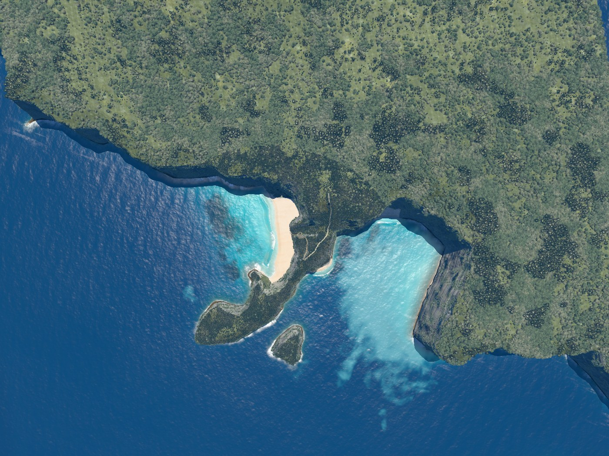
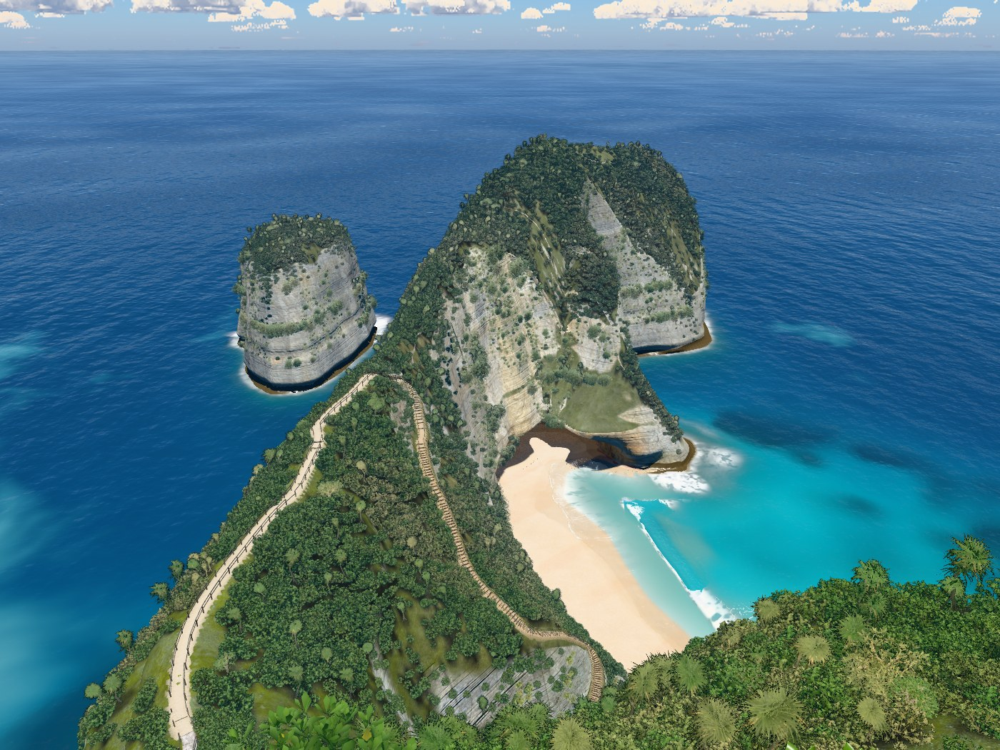
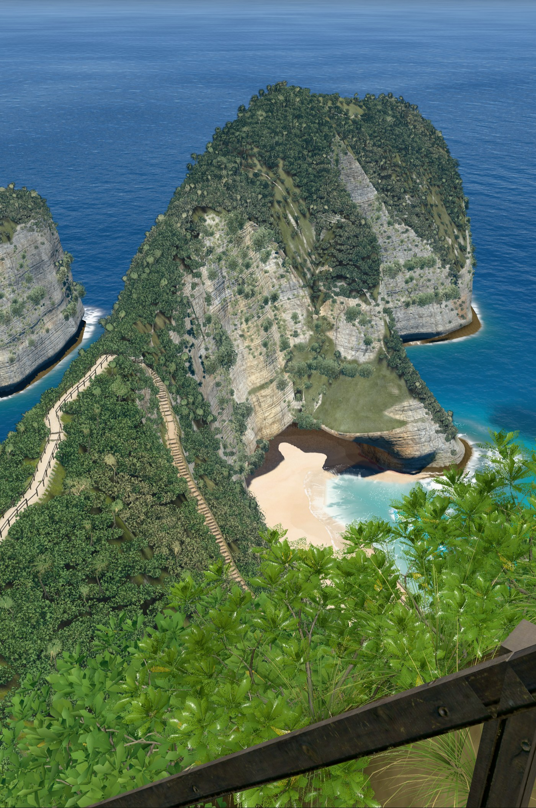
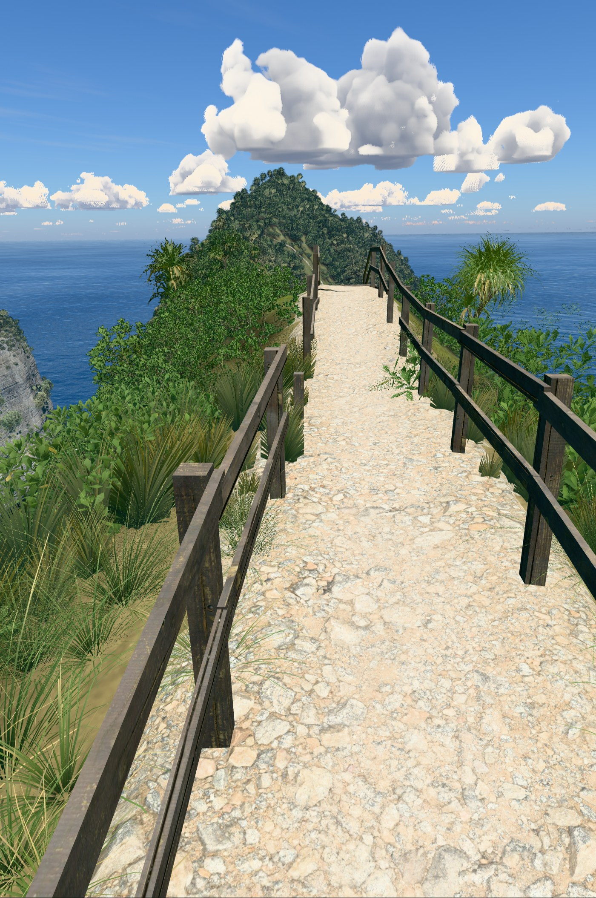
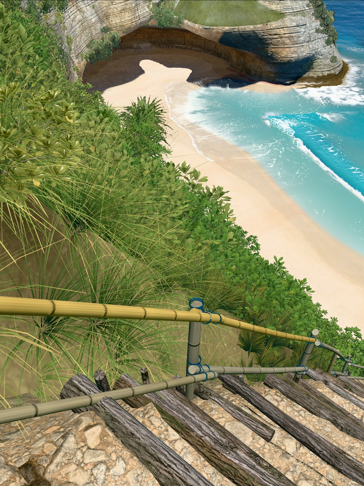
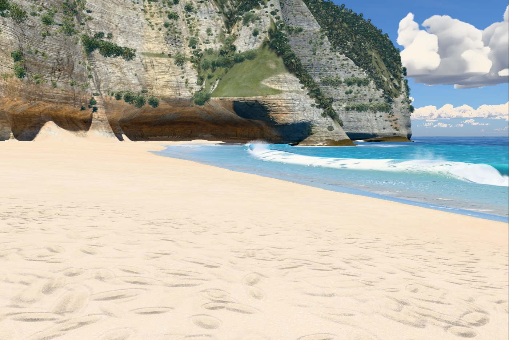
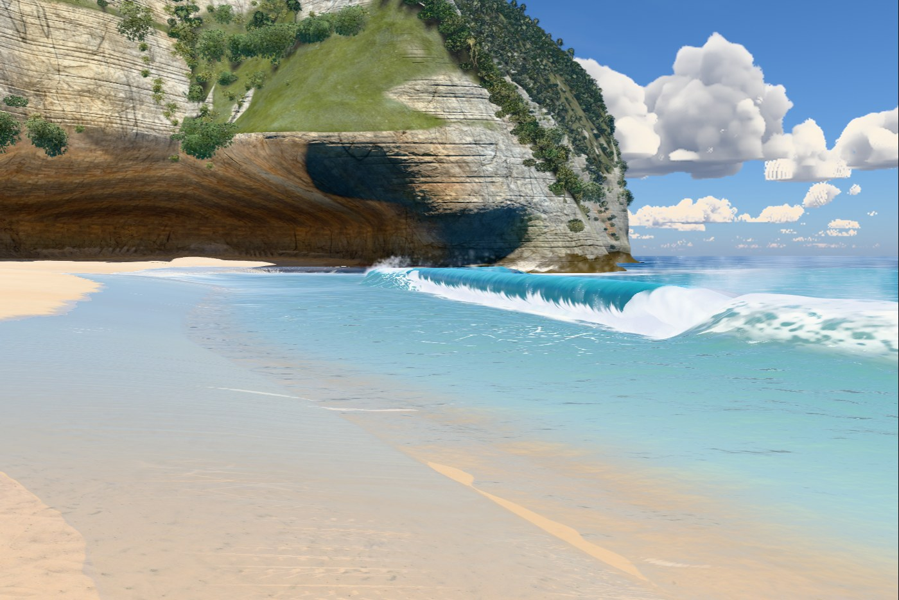
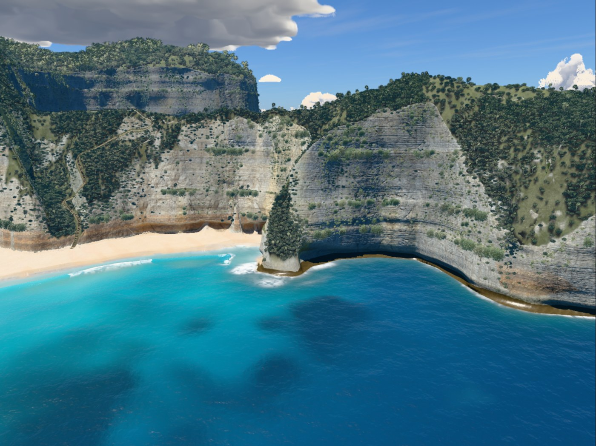

# v14

Hero frames, rendered with `node tools/hero.mjs v14`. The sea is frozen at 17 s.

### Overview, straight down

### Clifftop viewpoint

### On the stairs

### Top of the trail

### Low on the trail

### On the sand

### At the water's edge

### Shore break, eye level

### Head from the sea

## Frame times

Time to render one frame to completion at 1400 px wide, pixel ratio 1, from a complete
timing round on the build machine (Apple M1 Max). The change column is from eight
alternating side-by-side rounds against v13; it is more stable than absolute times.

| Frame | Time | fps | Change |
|---|---|---|---|
| Overview, straight down | 18.4 ms | 54 | 0% |
| Clifftop viewpoint | 13.1 ms | 76 | +3% |
| On the stairs | 13.9 ms | 72 | +6% |
| Top of the trail | 7.8 ms | 128 | -3% |
| Low on the trail | 13.6 ms | 74 | +2% |
| On the sand | 12.5 ms | 80 | 0% |
| At the water's edge | 14.8 ms | 68 | -3% |
| Shore break, eye level | 14.2 ms | 70 | -2% |
| Head from the sea | 11.1 ms | 90 | +1% |

The full `hero.mjs` timing sequence stopped when its second swash page did not become ready.
That page loaded in a separate retry; the paired run completed all nine views. See
`PROCESS.md` for the method and limitation.
