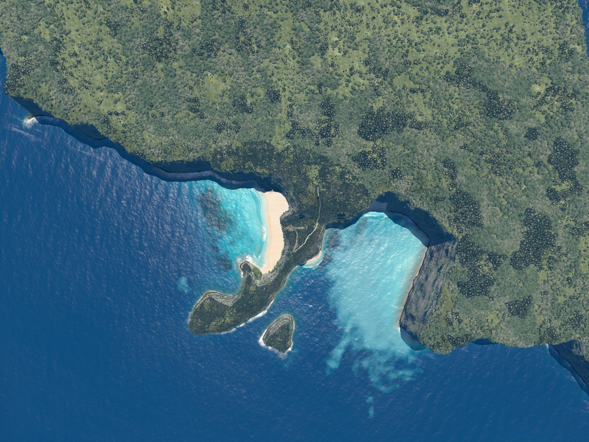
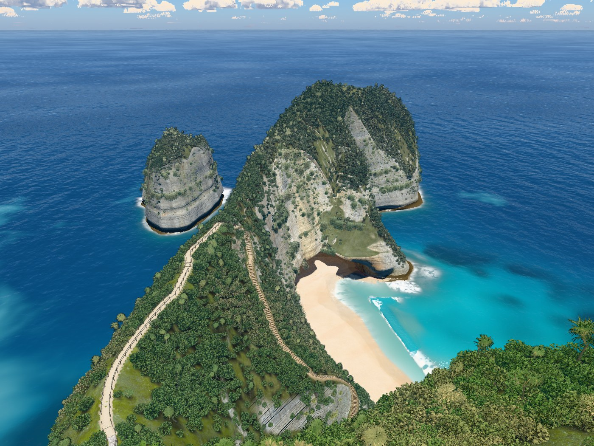
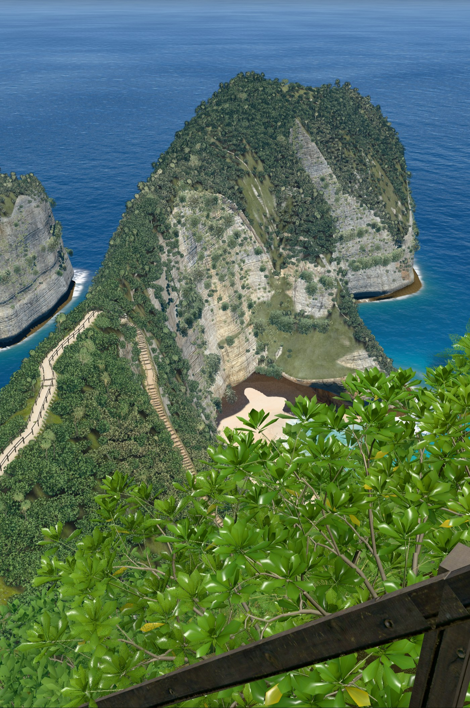
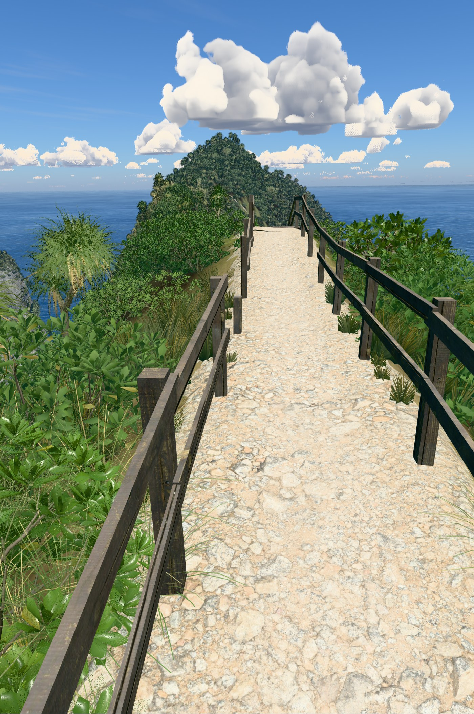
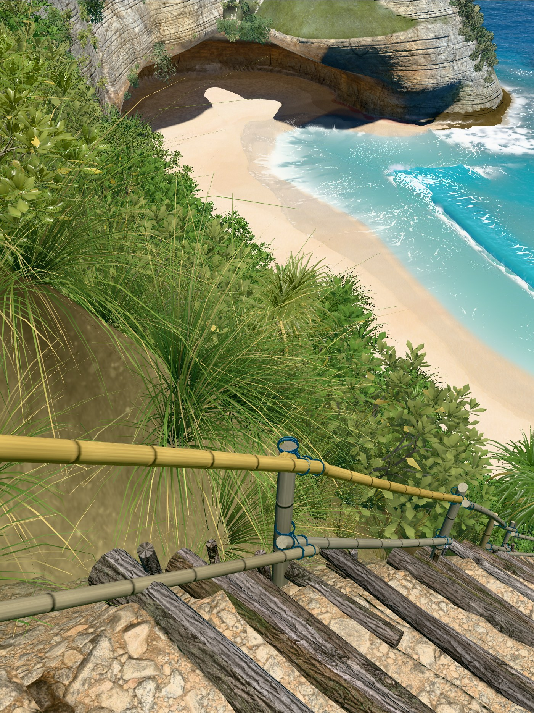
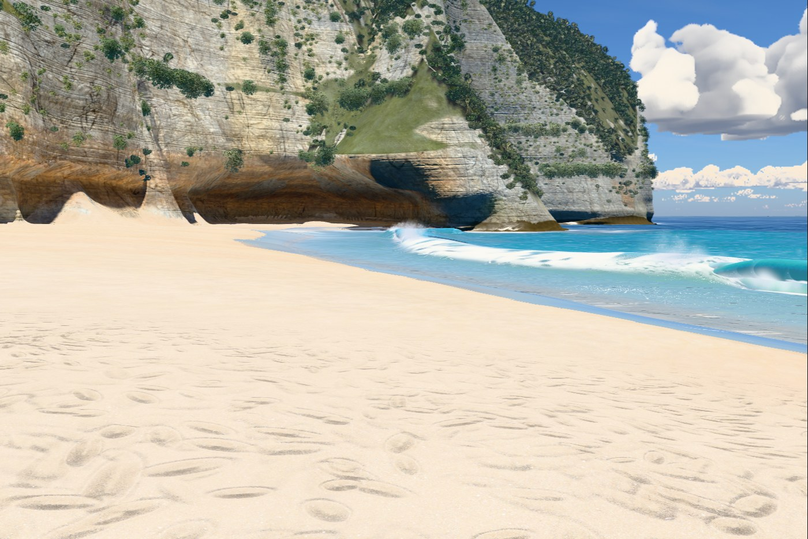
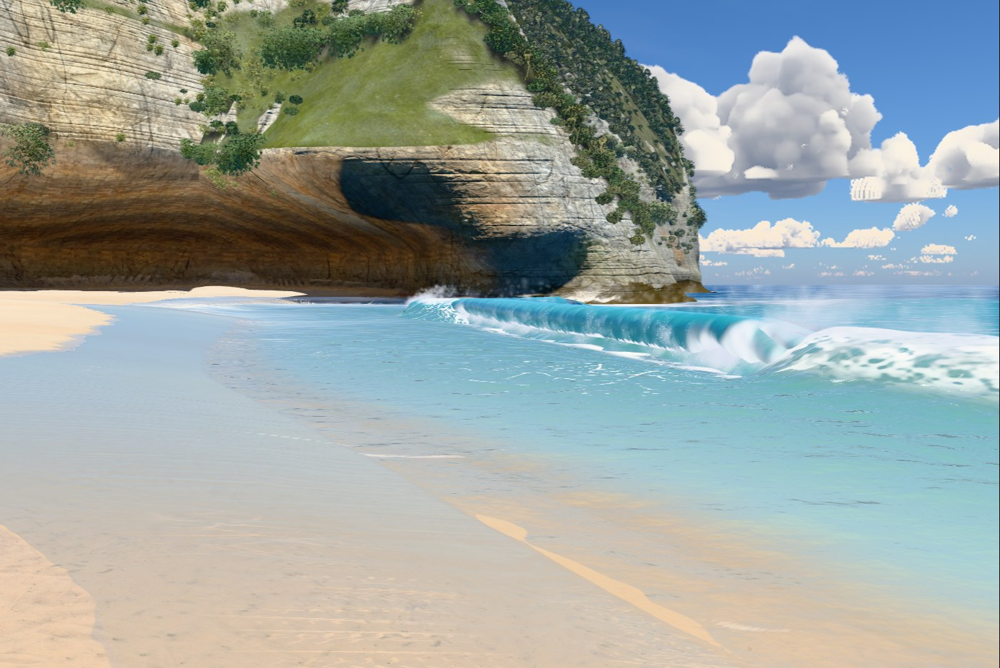
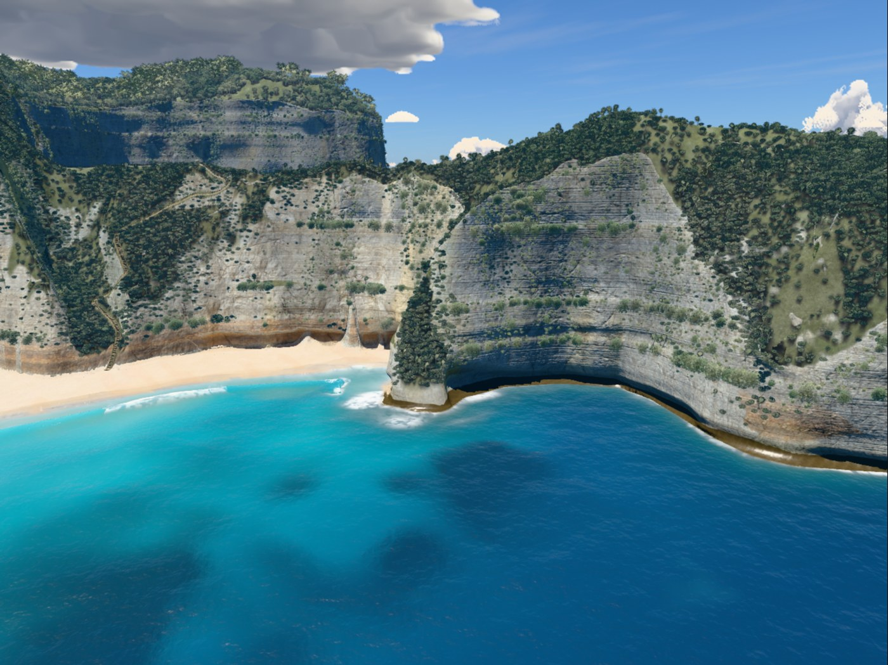

# v16

Hero frames, rendered with `node tools/hero.mjs v16`. The sea is frozen at 17 s.

### Overview, straight down

### Clifftop viewpoint

### On the stairs

### Top of the trail

### Low on the trail

### On the sand

### At the water's edge

### Shore break, eye level

### Head from the sea

## Frame times

Time to render one frame to completion at 1400 px wide, pixel ratio 1, best of three rounds, on
the build machine (Apple M1 Max). Absolute times depend on what else is using the GPU, so only
the change column means anything.

| Frame | Time | fps | Change |
|---|---|---|---|
| Overview, straight down | 12.3 ms | 81 |  |
| Clifftop viewpoint | 8.4 ms | 119 |  |
| On the stairs | 11.0 ms | 91 |  |
| Top of the trail | 8.9 ms | 112 |  |
| Low on the trail | 11.8 ms | 85 |  |
| On the sand | 8.3 ms | 120 |  |
| At the water's edge | 10.4 ms | 96 |  |
| Shore break, eye level | 10.6 ms | 94 |  |
| Head from the sea | 7.9 ms | 127 |  |
