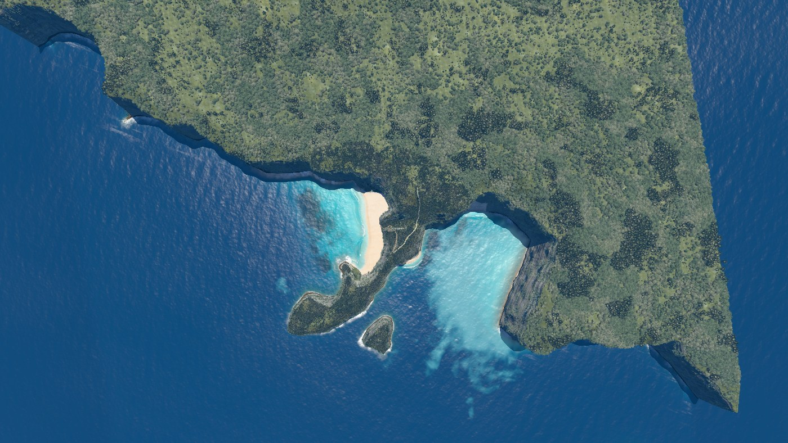
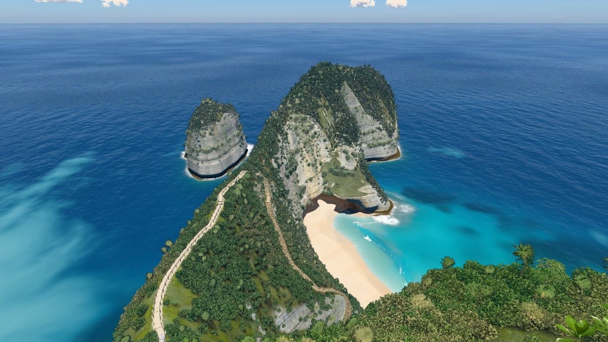
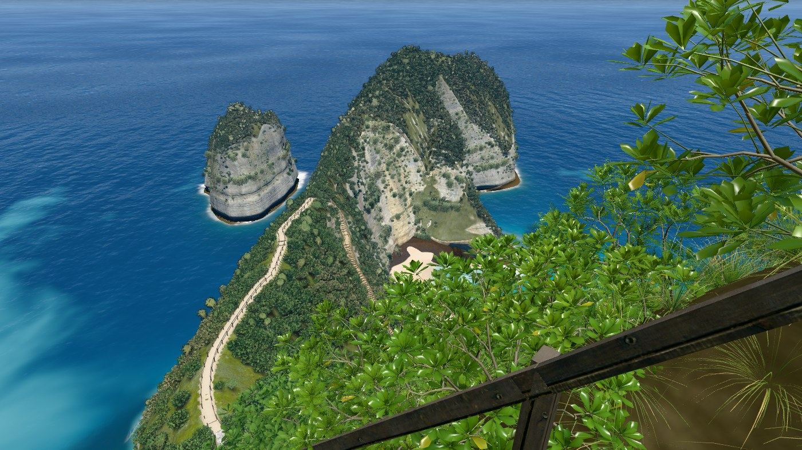
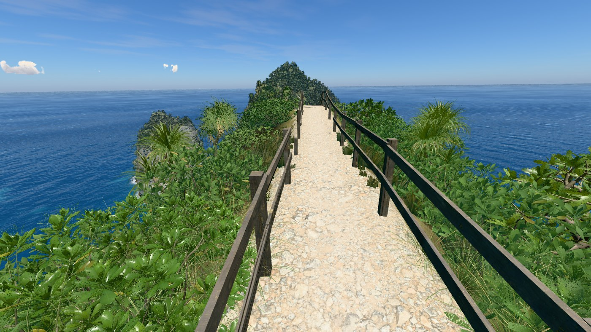
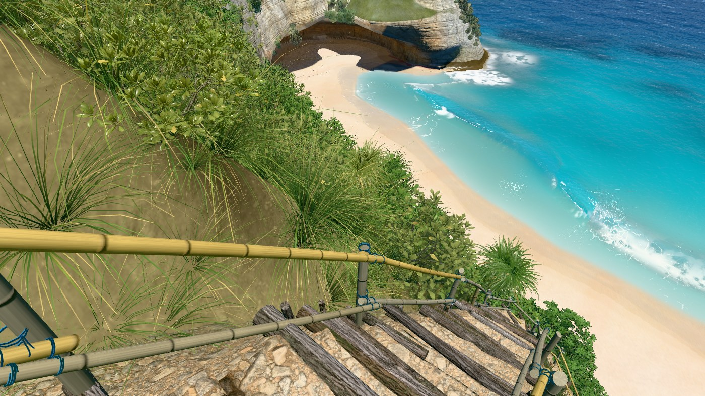
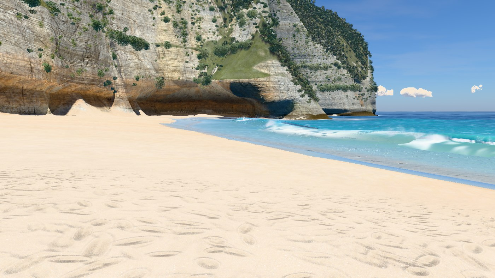
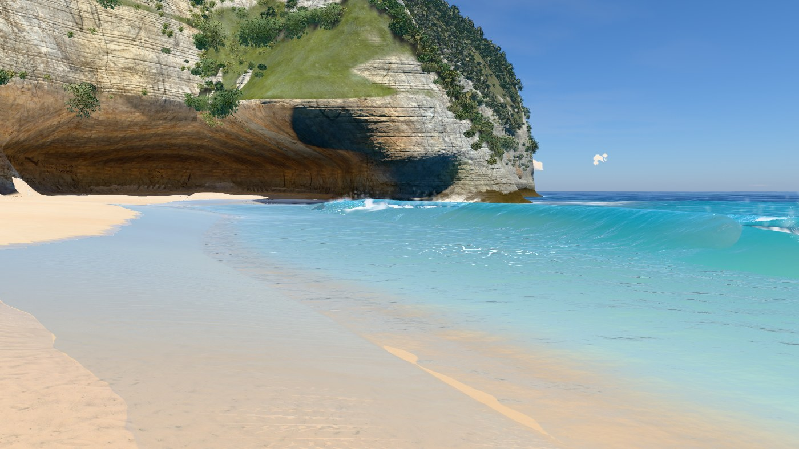
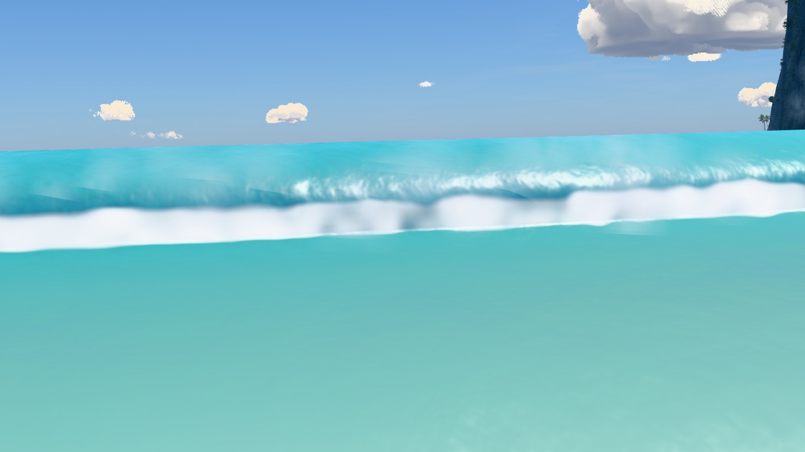
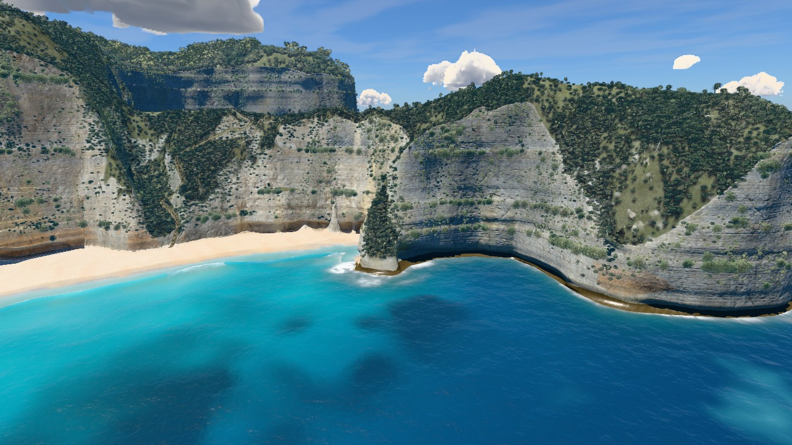

# v18

Fixed hero frames of the rebuilt shore break, rendered at sea time 17 s. Compare with [v17](../v17/README.md). Judge the breaking sequence in the matched motion captures described in the [v18 brief](../../versions/v18-shore-wave-rebuild.md); a single frame cannot show how the lip falls and foam travels.

### Overview, straight down

### Clifftop viewpoint

### On the stairs

### Top of the trail

### Low on the trail

### On the sand

### At the water's edge

### Shore break, eye level

### Head from the sea

## Paired frame timings

Alternating eight-round render against v17 commit `80b450a`, six frames per round, on Apple M1 Max. These are paired medians, not isolated frame times. A 20-round repeat of `trailLow` measured +1%; the +13% in the first run was not stable.

| Frame | v17 | v18 | Change |
|---|---:|---:|---:|
| Overview | 17.97 ms | 18.70 ms | +5% |
| Viewpoint | 11.10 ms | 11.22 ms | -1% |
| Stairs | 10.92 ms | 10.87 ms | +4% |
| Trail top | 8.73 ms | 8.97 ms | +2% |
| Trail low, 20-round repeat | 10.47 ms | 10.68 ms | +1% |
| Beach | 13.33 ms | 12.23 ms | +1% |
| Swash | 16.35 ms | 17.32 ms | +6% |
| Shore break | 5.57 ms | 4.95 ms | -9% |
| Side from sea | 10.87 ms | 10.62 ms | -2% |

The 2026-09-29 side-motion refinement was checked against the first v18 commit
`1092e1a` with the same alternating eight-round method. Across all nine hero cameras,
the final paired changes ranged from -3% to +7% (`beach` +5%, `swash` -3%,
`shoreBreak` +1%). The matched nine-second sand-camera clip is available in the local
preview at `captures/v18-feedback-final-wave.mp4`.
