# v21: cliff foot and sand contact

The local preview is [the sand chapter](http://localhost:5183/?at=4.05). The close and overhead
contact sheets below were made from the terrain code at this checkpoint, without reference
photos. The nine hero frames follow for the full scroll context.

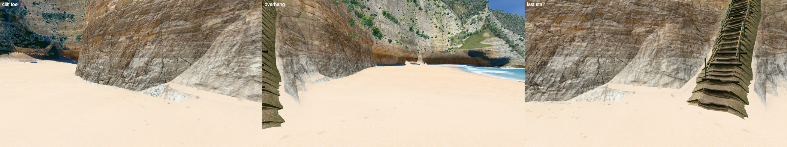

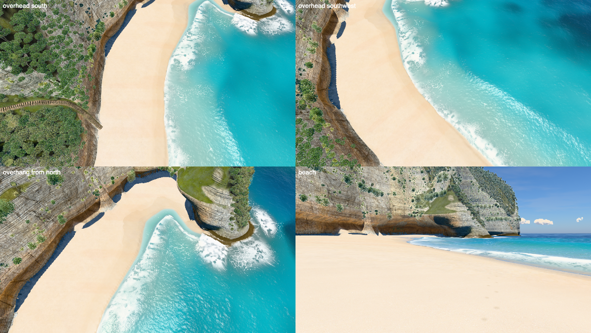

| Frame | Time at 1400 px |
|---|---:|
| Overview | 10.6 ms |
| Viewpoint | 6.5 ms |
| Stairs | 6.6 ms |
| Trail top | 10.3 ms |
| Trail low | 11.0 ms |
| Beach | 7.0 ms |
| Swash | 9.2 ms |
| Shore break | 16.9 ms |
| Side from sea | 6.7 ms |

These are one run's absolute times; [bench.json](bench.json) has the per-frame values. The
alternating comparison against the previous `b3d3c8c` checkpoint kept eight frames between
-4% and +1%. A 20-round repeat of the noisy stairs view measured +2%. All stayed within
the project's 10% limit.

## Hero frames

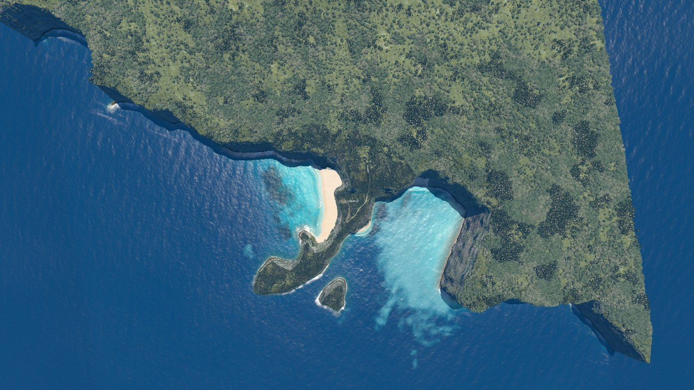
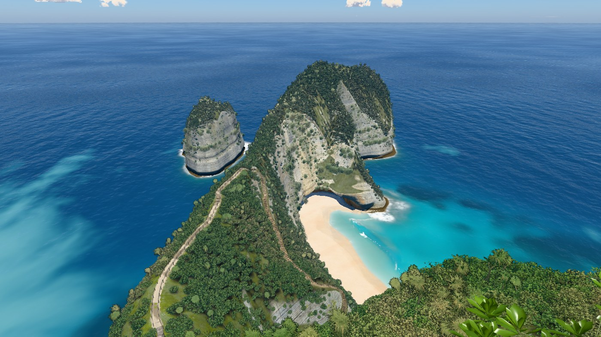
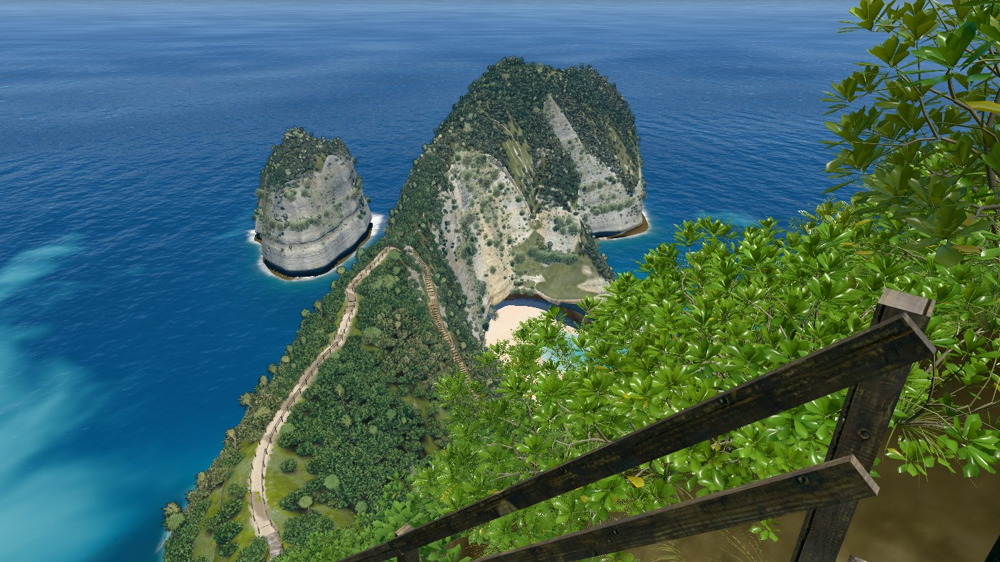
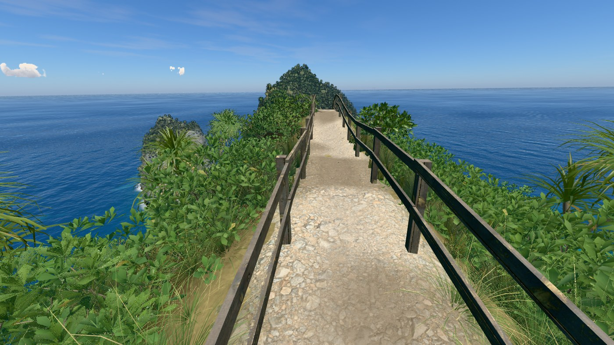
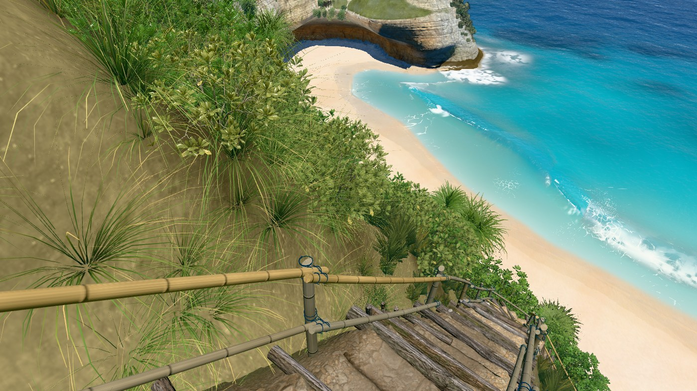
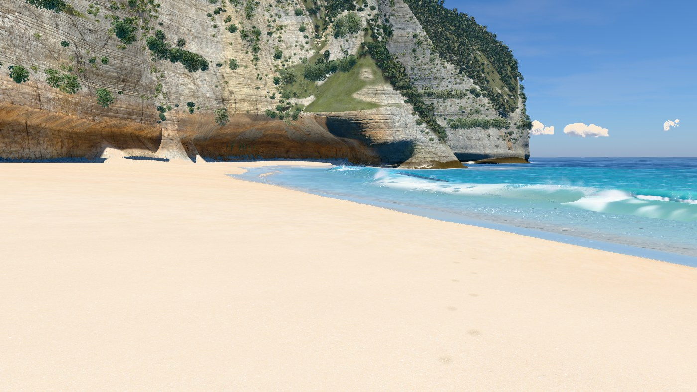
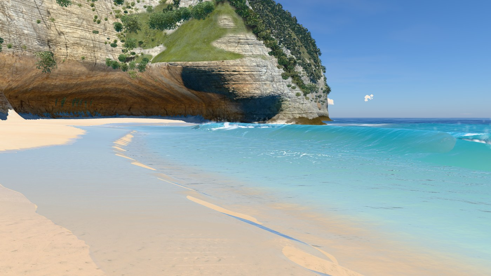
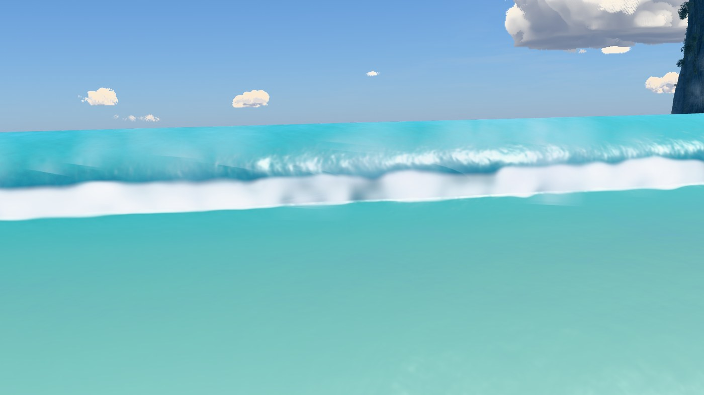
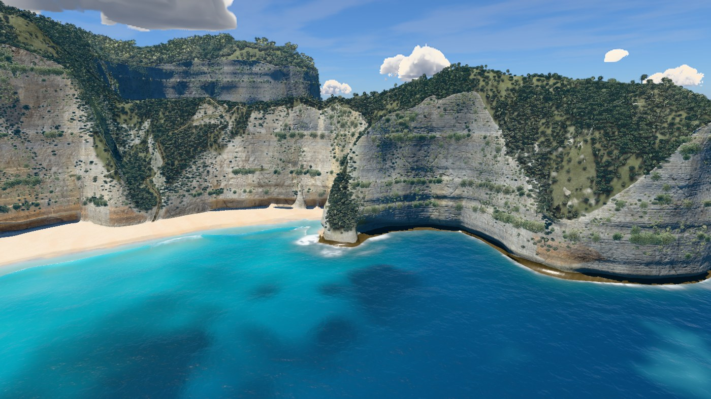
