# v22: continuous lower cliff and beach junction

[Scrolling preview](http://localhost:5183/) · [Beach chapter](http://localhost:5183/?at=4.05)

The blue serrated overlap has been rebuilt as a continuous lower wall. The beach floor now
extends beneath it, including the shortened profiles at the ends of the cove. The contact
sheet includes walking-height views and the same junction from the descent.

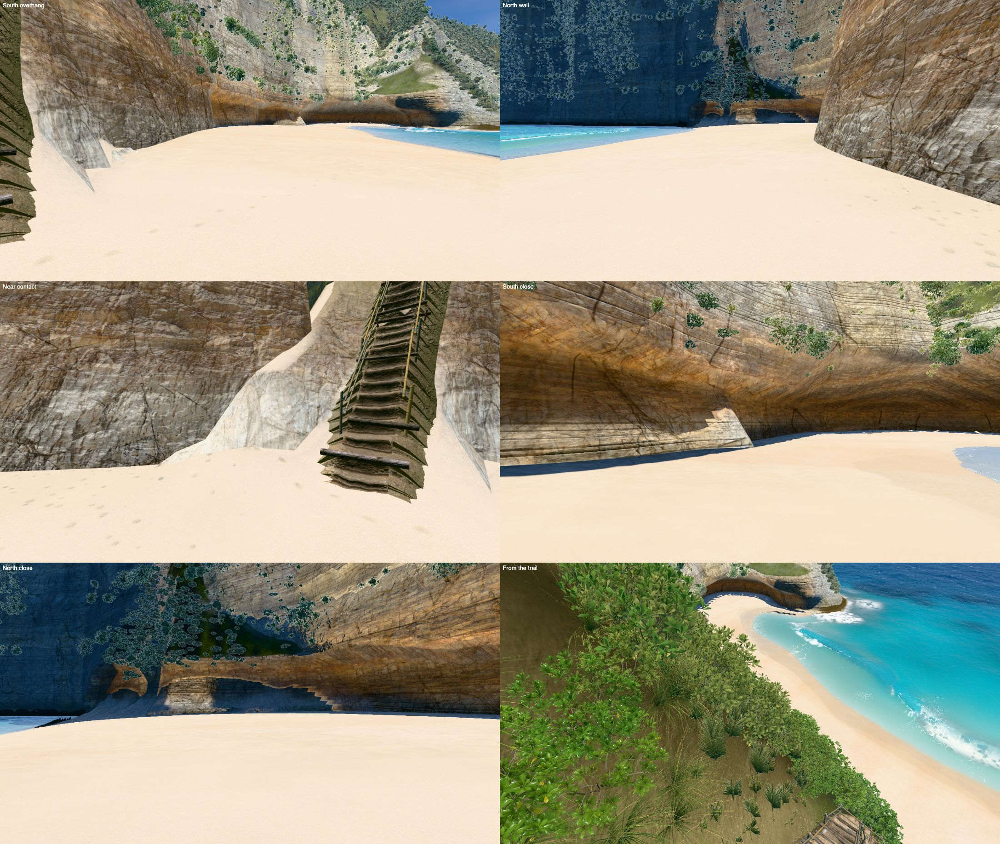

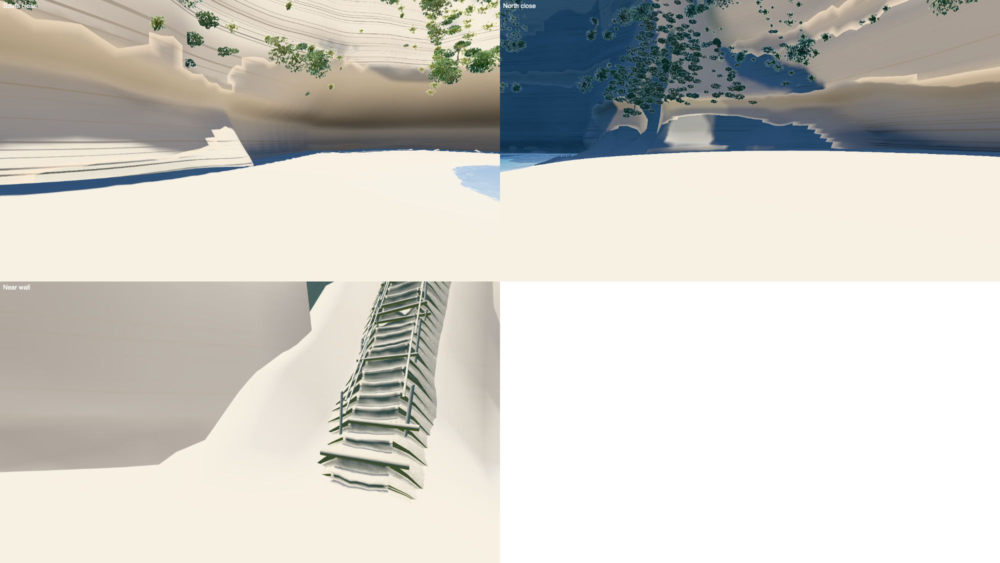

## Checks

All nine hero frames rendered without console messages. The terrain bake is current and
the local standalone opens offline, generating its own terrain with fallback materials.

Paired timing against v21 checkpoint `e03424b`, eight alternating rounds of six frames at
1400 px and pixel ratio 1:

| Frame | v21 | v22 | Median paired change |
|---|---:|---:|---:|
| Overview | 16.93 ms | 15.35 ms | -5% |
| Viewpoint | 10.02 ms | 9.50 ms | 0% |
| Stairs | 9.65 ms | 9.23 ms | 0% |
| Trail top | 7.63 ms | 7.70 ms | -1% |
| Trail low | 10.60 ms | 10.78 ms | -1% |
| Beach | 10.60 ms | 10.67 ms | +5% |
| Swash | 12.30 ms | 12.27 ms | 0% |
| Shore break | 5.67 ms | 5.50 ms | +3% |
| Side from sea | 9.52 ms | 9.78 ms | 0% |

The changes are medians of paired round ratios, rather than ratios of the two absolute
medians. Every frame meets the 10% limit. [bench.json](bench.json) records the run.

The viewpoint and overview outline captures were generated; reference photos were not
available in this worktree, so the headland silhouette was compared with the stored v21
renders. These gallery images contain only the rendered scene.

## Hero frames

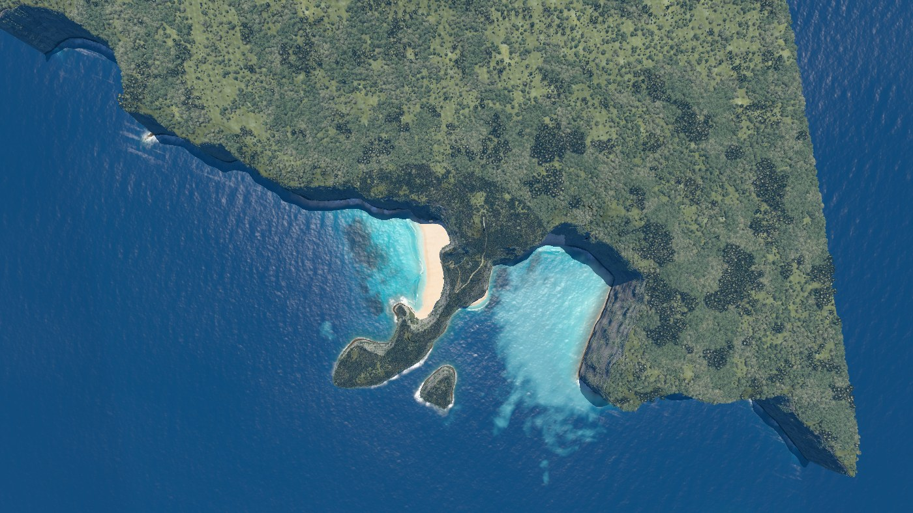
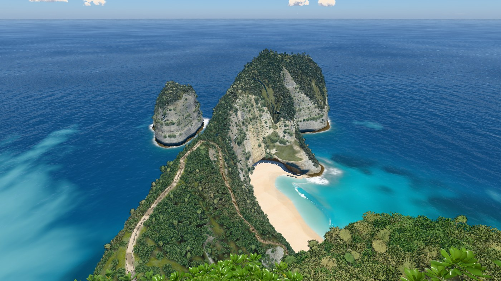
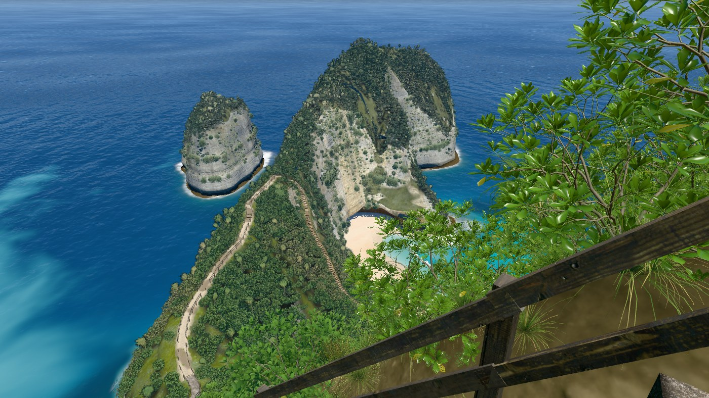
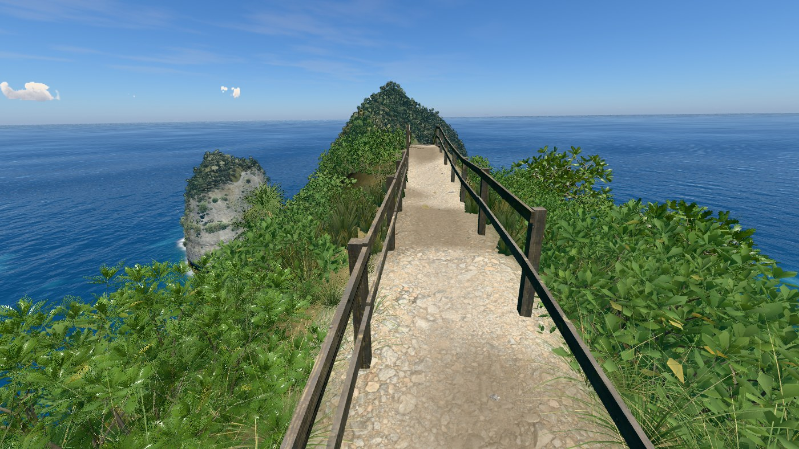
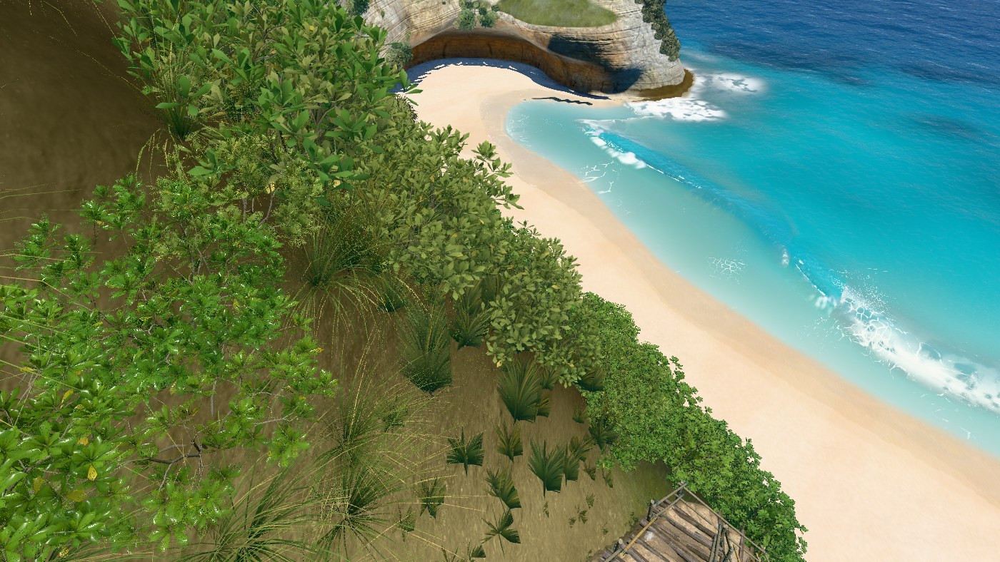
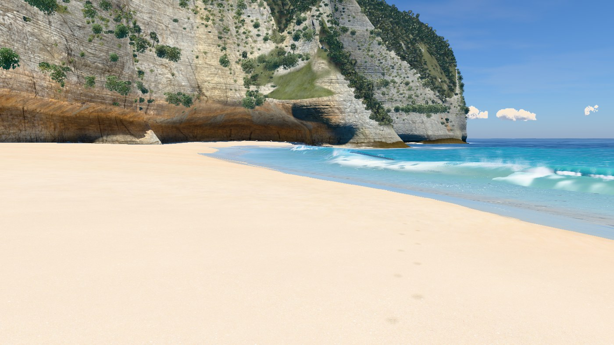
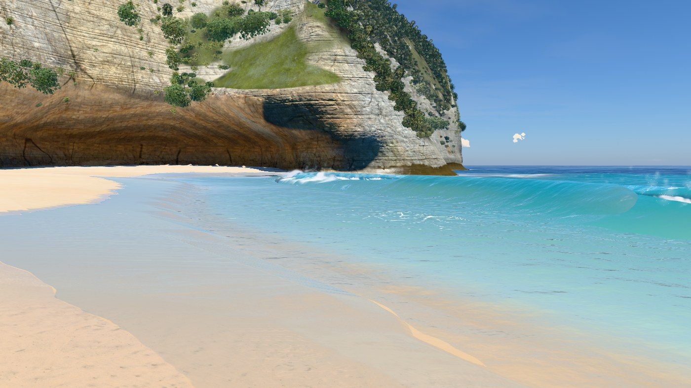
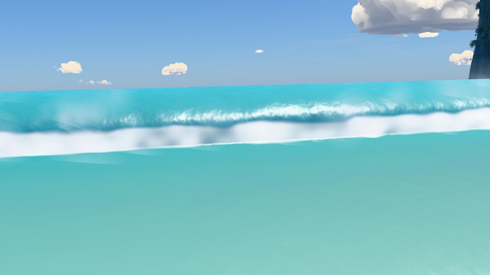
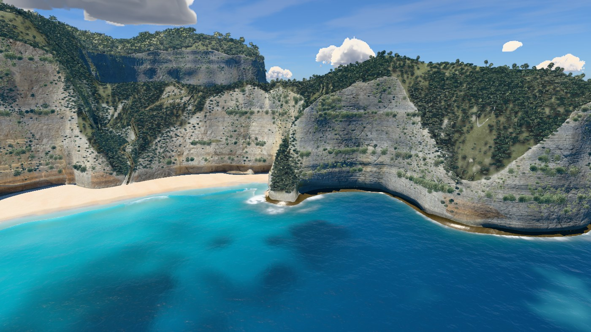
