# v23: attached blue cord, persistent grass and cloud detail

The supplied closeups exposed detached cord and rails. The rail axes now meet their posts,
and each blue tie wraps their actual bowed and tapered surfaces, with a compact locking
knot, short ends, braided relief and faded fibres. The walking route is unchanged.

## Close joints and scrolling

Same camera: before on the left, updated on the right.

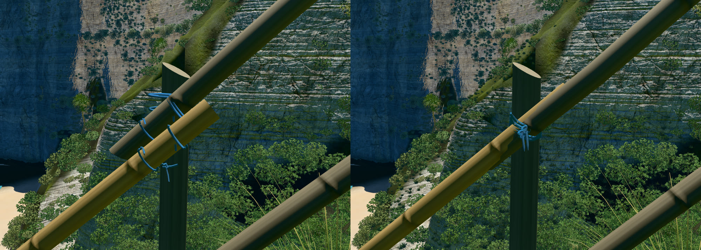

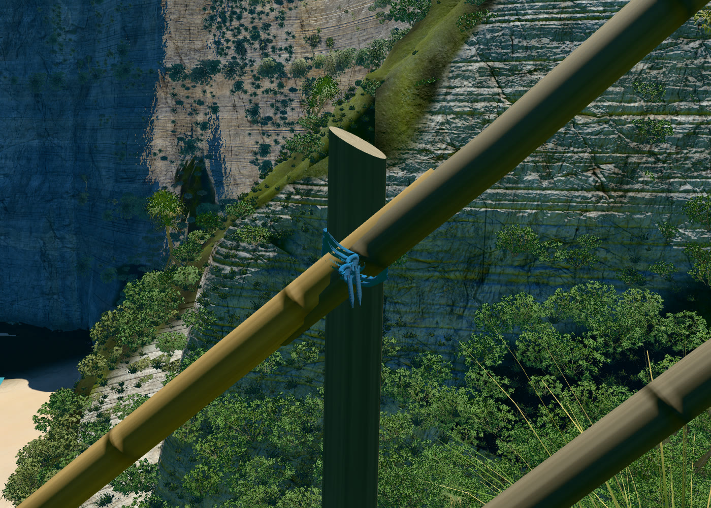

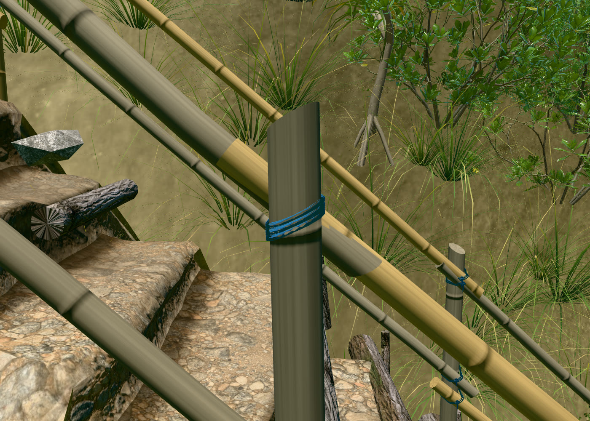

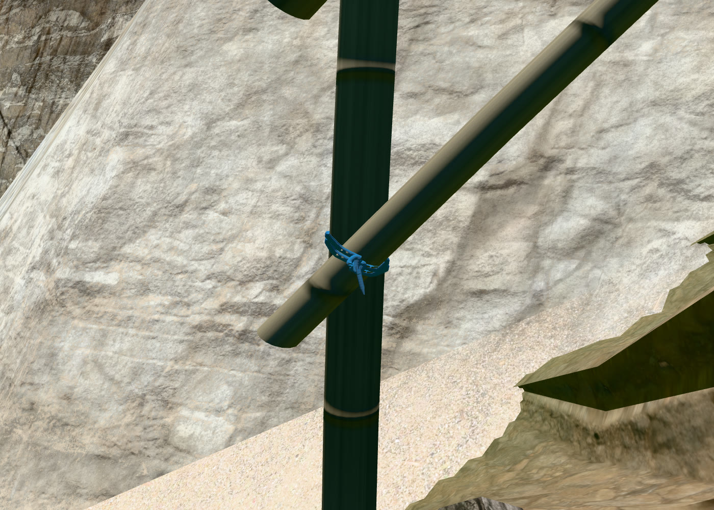

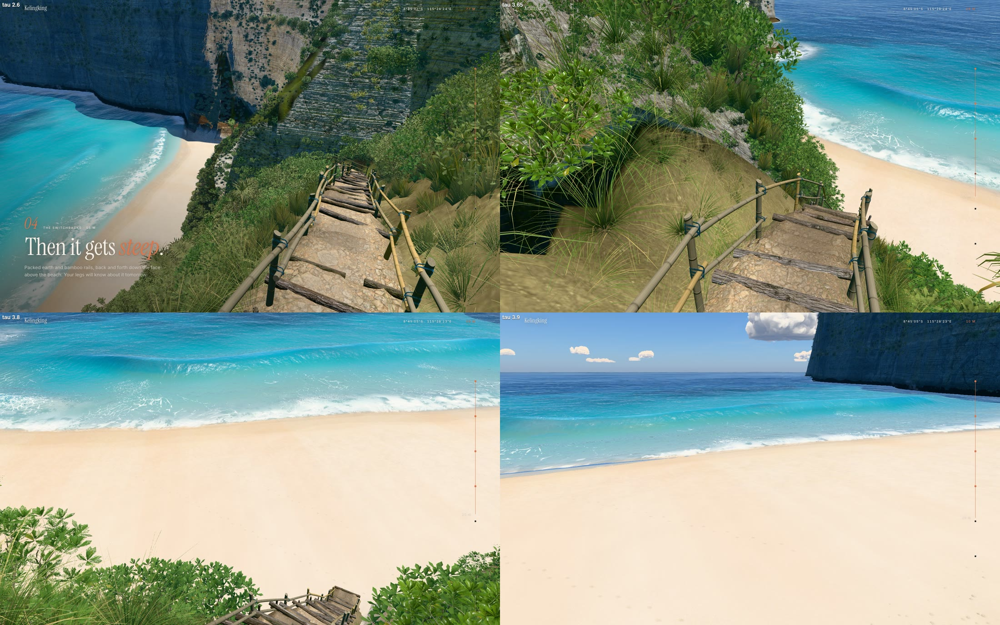

All 502 wood interfaces were measured. Their surface separation is between -0.516 and
-0.485 mm: deliberate half-millimetre seating, with no detached rail lanes. Cord geometry
uses one draw call and submits only nearby joints, with coarser rings beyond arm’s length.

## Grass and clouds

Grass previously existed only near the route and had no distant representation. Matched
grass impostors and 5,927 extra seeded tussocks in open ground retain coverage from above.
They exclude the path, sand and bare cliff faces.

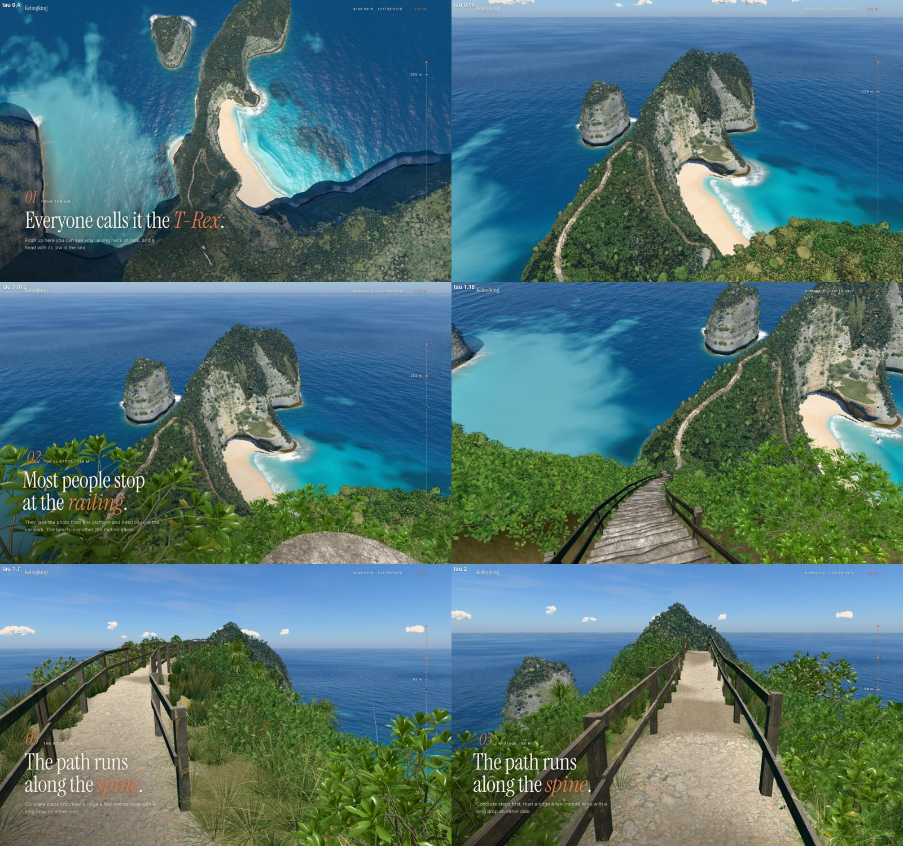

Cloud comparisons are before on the left, after on the right. Accepted large silhouettes
are retained; bounded temporal reconstruction, secondary relief and connected small cloud
bodies reduce blur and isolated bright dots. Fine outer wisps remain soft.

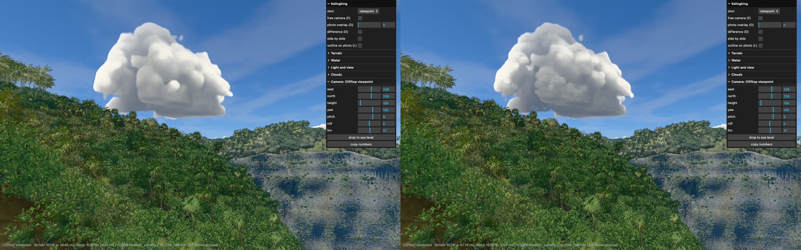

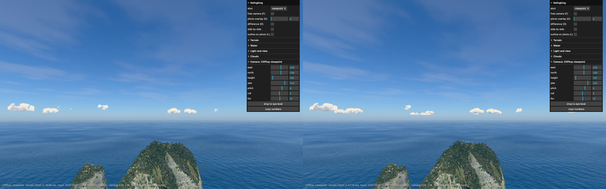

## Hero frames

Rendered with `node tools/hero.mjs v23 --q=1024 --rounds=0 --no-compare
--url=http://localhost:5183/`, then refreshed with `tools/capture.mjs --hero --console`.
The preview terrain is 1024; the sea is frozen at 17 s. All nine frames had zero console
messages. Local reference photographs were unavailable, so no photo-match claim is made.
The headland’s decoded positions, normals and triangle indices are identical to v22.

### Overview, straight down

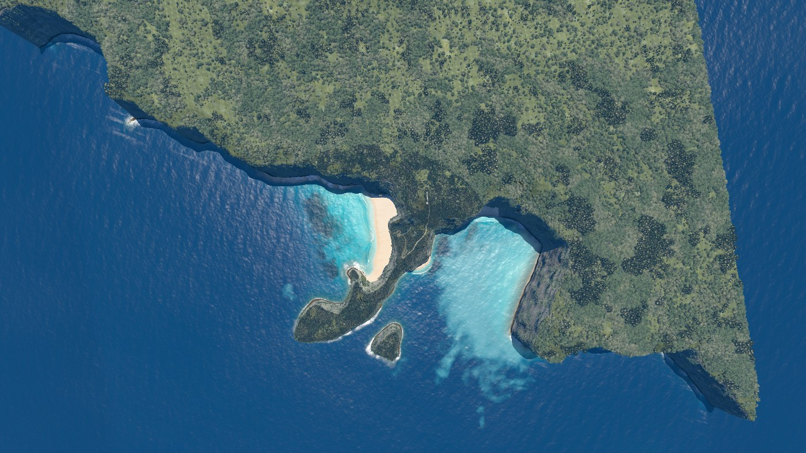

### Clifftop viewpoint

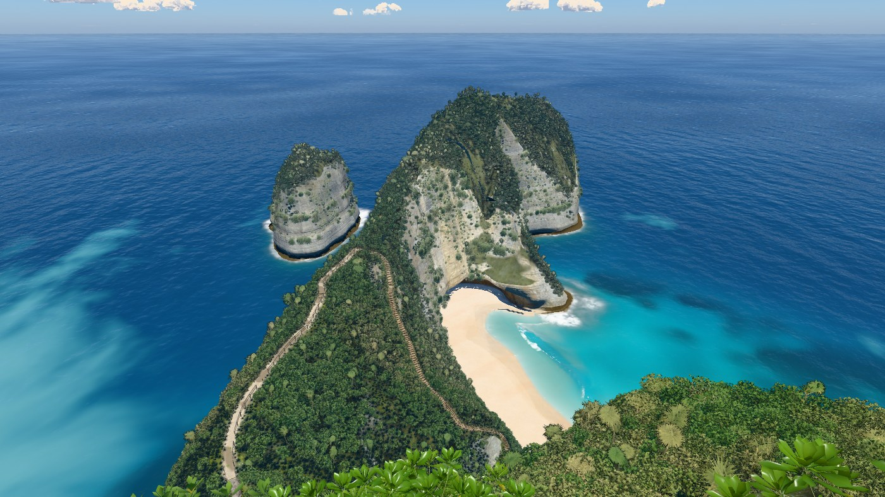

### On the stairs

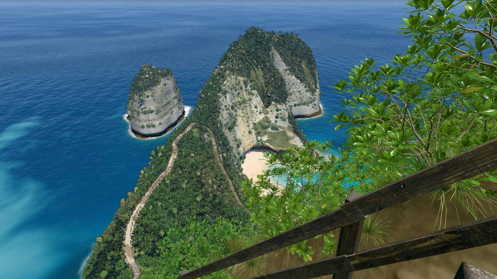

### Top of the trail

### Low on the trail

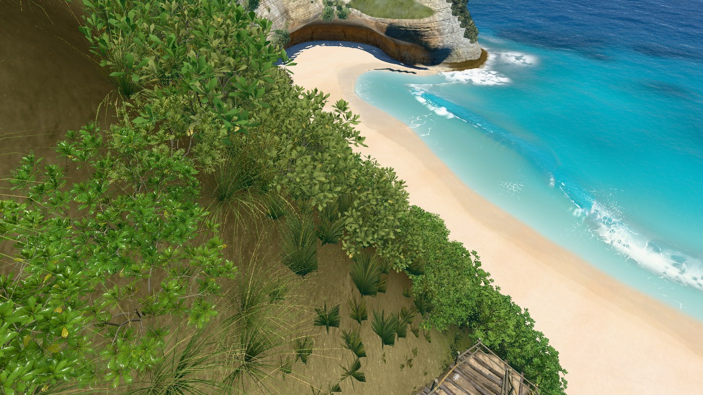

### On the sand

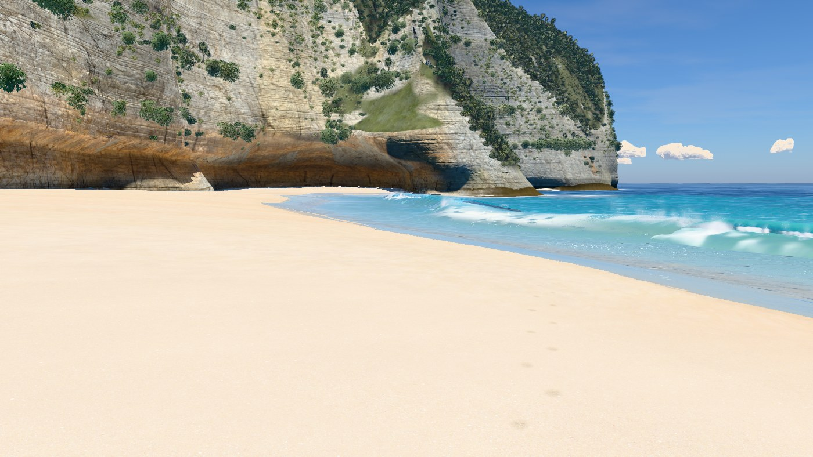

### At the water’s edge

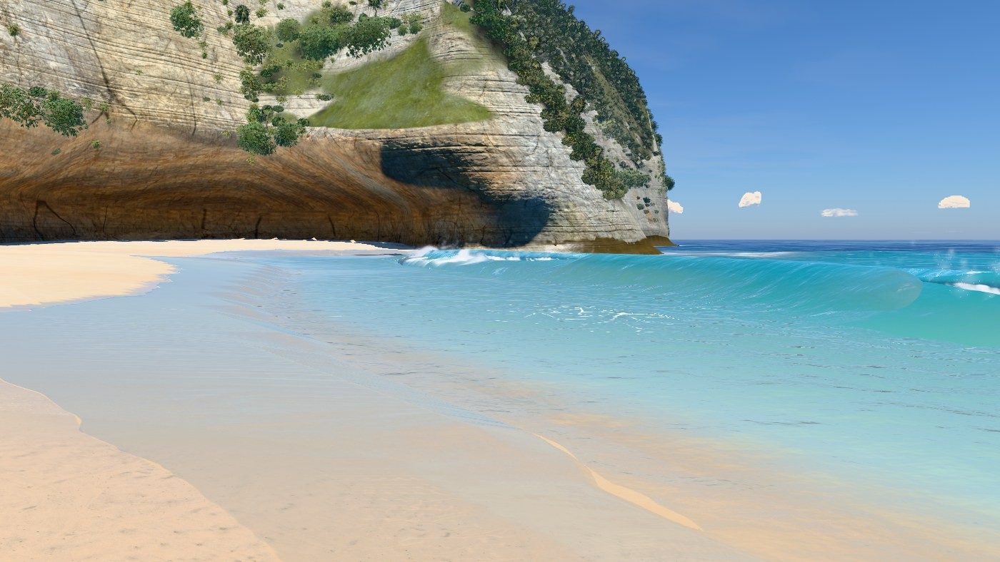

### Shore break, eye level

### Head from the sea

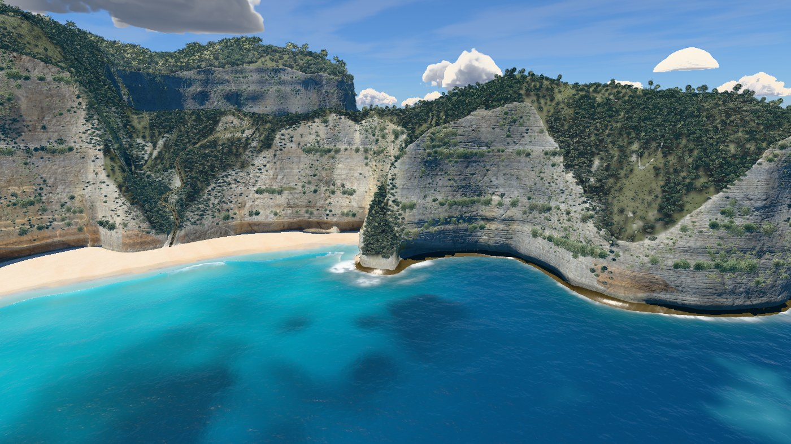

## Frame budget

Alternating full-frame GPU readback against v22 checkpoint `6463322`, 12 rounds of 8 frames,
1400 px wide, pixel ratio 1. The final close stair geometry was repeated for 16 rounds.
The change column uses paired ratios; absolute timing medians vary with background GPU load.
Every camera stays below the 10% limit. Raw results and ranges are in [bench.json](bench.json).

| Frame | Before | After | Paired change |
|---|---:|---:|---:|
| Overview, straight down | 25.04 ms | 24.01 ms | -7.9% |
| Clifftop viewpoint | 16.75 ms | 17.69 ms | +0.9% |
| On the stairs | 15.99 ms | 16.39 ms | +4.6% |
| Top of the trail | 13.26 ms | 13.70 ms | +7.1% |
| Low on the trail | 12.95 ms | 13.43 ms | +1.5% |
| On the sand | 18.02 ms | 17.19 ms | +1.7% |
| At the water’s edge | 19.81 ms | 19.84 ms | +1.5% |
| Shore break, eye level | 9.93 ms | 9.45 ms | -0.5% |
| Head from the sea | 16.64 ms | 17.40 ms | +5.6% |

Moving-cloud comparisons, 12 alternating rounds of 12 frames, measured +4.8% for the large
cloud view and -3.2% for the horizon view. The local standalone was rebuilt and loaded
with its network blocked, generating terrain without console errors.
