# v24: solid cliff joins along the stairs

The opening in Sam’s 28 m stair view came from the beach-floor pass lowering the
supporting ground outside a narrow trail mask. The separate face strip stayed above it.
The floor pass and cell replacement now preserve the complete stair bank, with a gradual
transition to the beach floor along the whole route.

## The reported opening

Same tau 3.665, sea frozen at 17 s. Before on the left, repaired on the right.

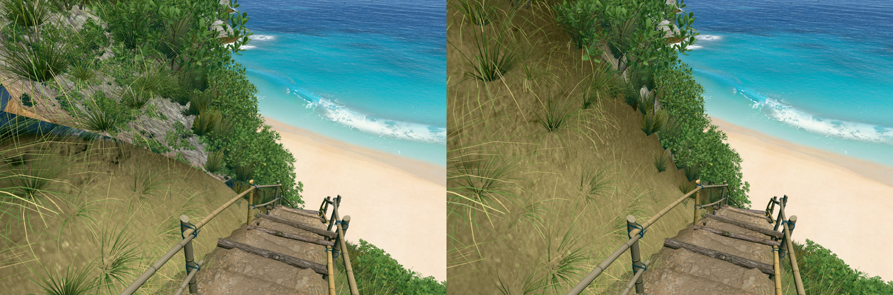

The same repair with vegetation hidden and neutral rock colouring:

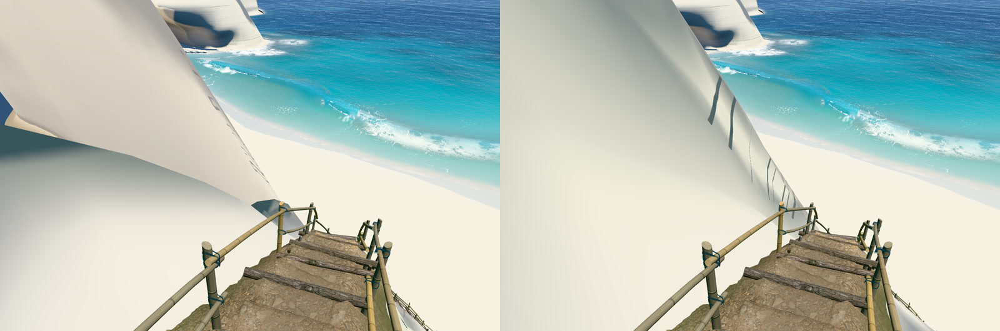

Six camera rays test the bare surface. The ray through the hole previously hit a distant
cliff 27.77 m away; it now hits supporting rock 3.56 m away. The other five also hit the
nearby bank. Raw pose and ray distances are in [ray-check.json](ray-check.json).

## Route and head turns

38 plant-free views rendered without errors. The route sheet reads left to right,
row by row, tau 1.0 to 4.2 in 0.2 steps. No see-through openings were observed in these views.

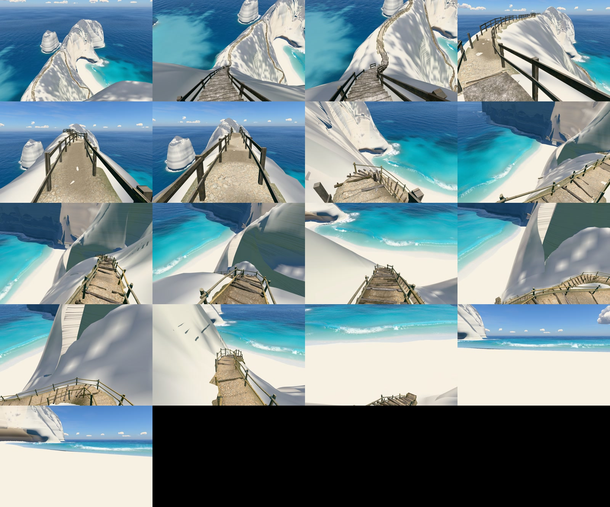

Rows below are tau 3.45, 3.6, 3.665, 3.75, 3.85, 4.0 and 4.15. Columns turn -35°, 0°
and +35° from the authored camera heading.

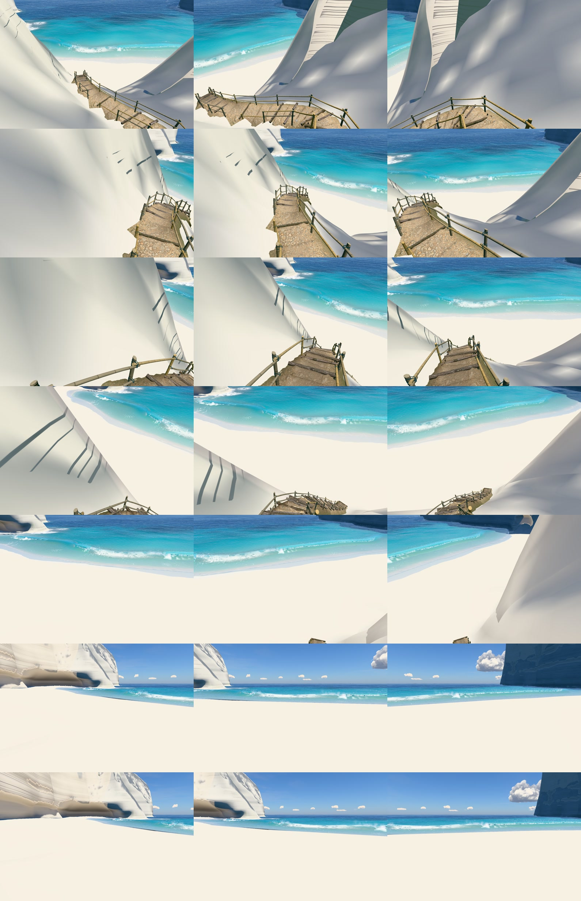

A 4.8 s actual scroll capture includes a 25° head turn; stills from that recording:

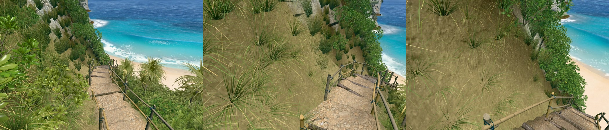

The clip is retained locally as captures/v24-closure-motion.mp4.

## Shape and runtime data

The heightfield, all 141,677 face-strip vertices, vegetation, route line and stair mesh
arrays are unchanged from v23. Only 973 ground-grid vertices move by more than 25 mm,
within the lower stair-bank region below 48.3 m. No broad silhouette remodeling was done.
The mesh has 1,202,066 vertices and 1,175,084 triangles, 227 and 46 fewer respectively.
See [mesh-check.json](mesh-check.json). Local reference photographs were unavailable;
shape checks use numerical identity of the authored faces and stored v23 hero renders.
No new photo-match claim is made.

## Hero frames

Rendered with node tools/hero.mjs v24 --q=1024 --rounds=0 --no-compare
--url=http://localhost:5183/. All nine views had zero console messages.

### Overview, straight down

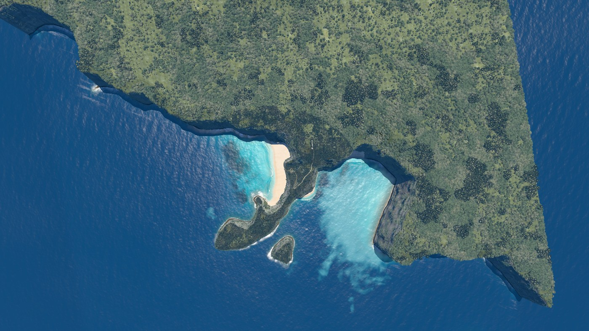

### Clifftop viewpoint

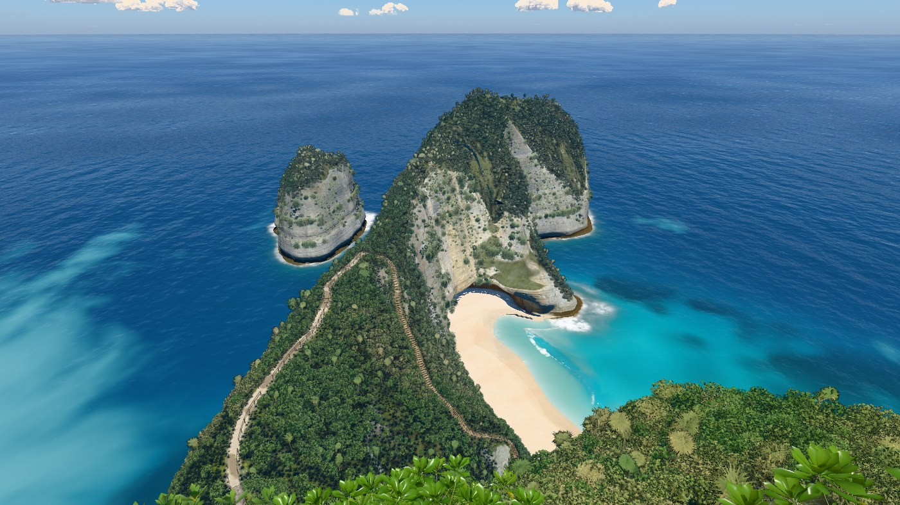

### On the stairs

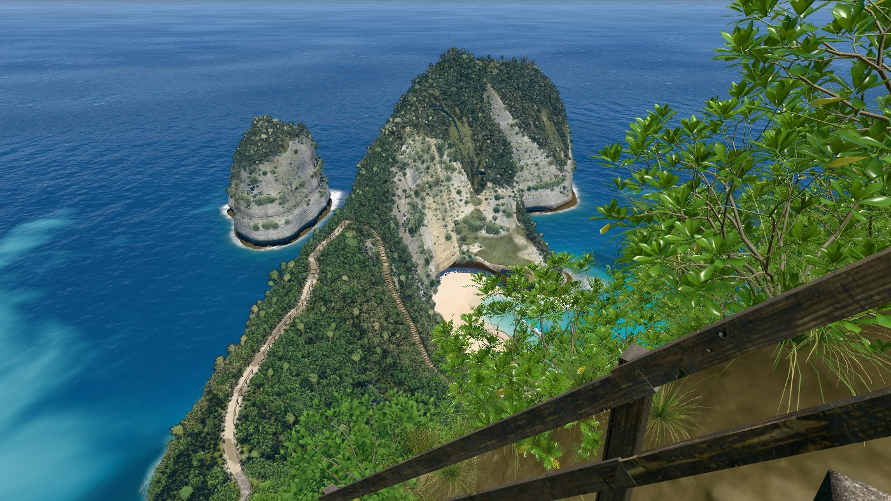

### Top of the trail

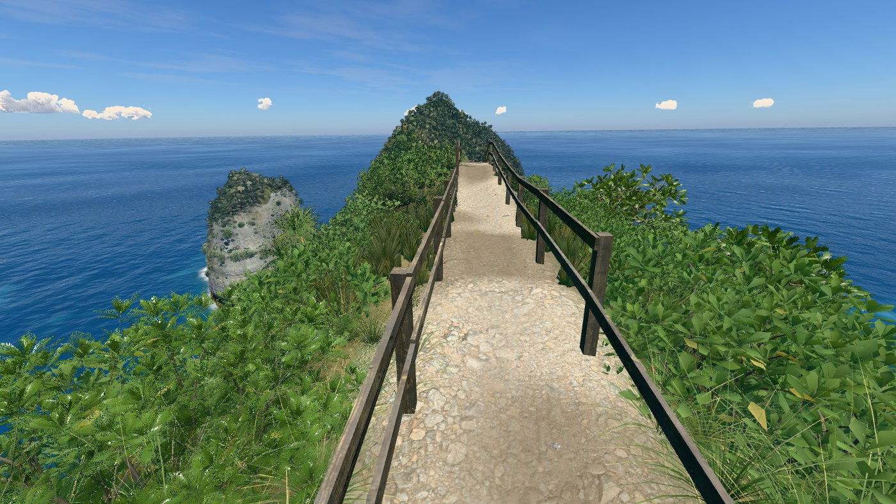

### Low on the trail

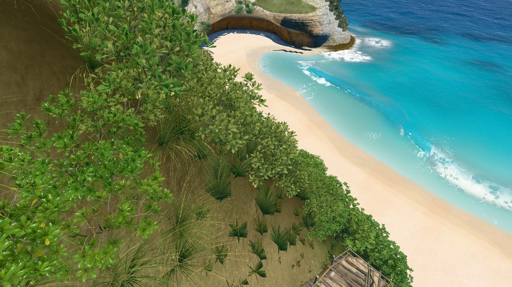

### On the sand

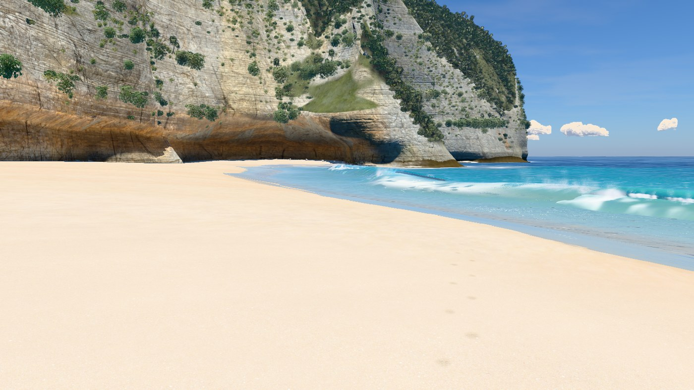

### At the water’s edge

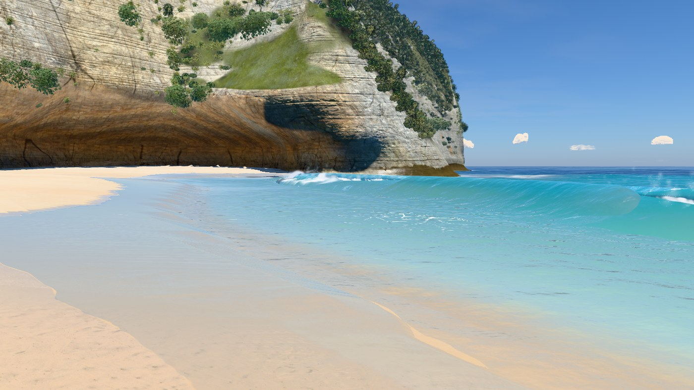

### Shore break, eye level

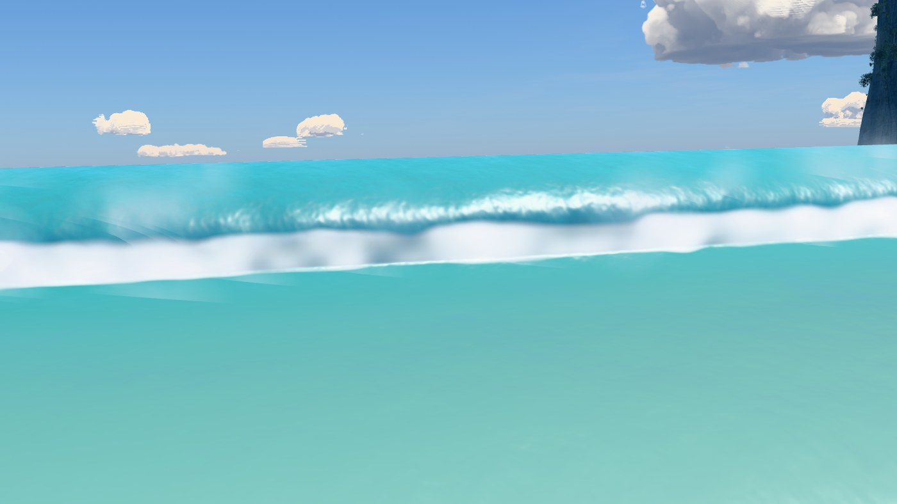

### Head from the sea

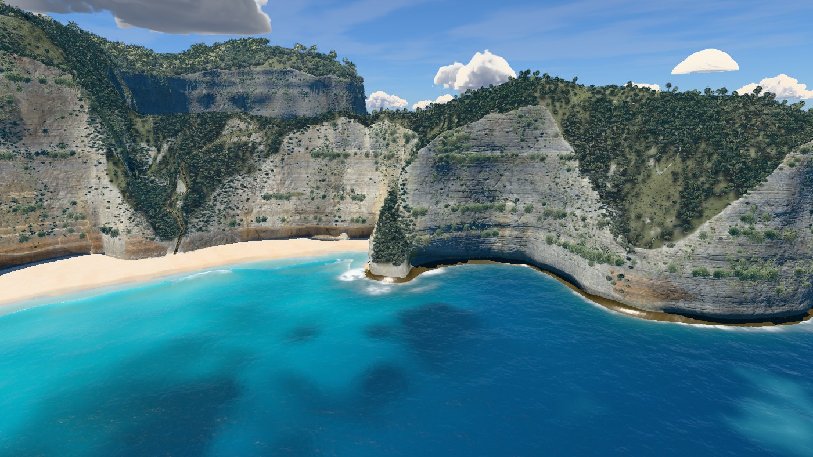

## Frame budget

12 alternating rounds of 8 complete frames against v23 checkpoint bfafc01, 1400 px wide,
pixel ratio 1. All paired median changes pass the 10% budget. Absolute timing medians vary
with GPU load; the change column uses per-round paired ratios. Raw ratios and their
middle-half ranges are in [bench.json](bench.json).

| Frame | v23 | v24 | Paired change |
|---|---:|---:|---:|
| Overview, straight down | 23.49 ms | 25.16 ms | +6.2% |
| Clifftop viewpoint | 16.40 ms | 17.34 ms | +6.1% |
| On the stairs | 15.75 ms | 15.28 ms | -2.8% |
| Top of the trail | 12.34 ms | 12.35 ms | +5.9% |
| Low on the trail | 16.71 ms | 17.13 ms | +7.2% |
| On the sand | 18.63 ms | 18.36 ms | +0.1% |
| At the water’s edge | 22.90 ms | 22.55 ms | +1.6% |
| Shore break, eye level | 11.85 ms | 11.41 ms | -6.5% |
| Head from the sea | 20.44 ms | 20.95 ms | -0.3% |

The 13.38 MB bake is current and retains exact indices after packing. The local standalone
was rebuilt from the same source. Offline load verification is recorded in the version brief.
