# v26 — Wave continuity

The swell remains solid beneath a forward-pitching lip. The crest, falling sheet, impact spray
and persistent foam follow the same phase and irregular clock.

## Latest review polish

The September 30 18:39 review accepts the continuous motion but identifies a bubble-like
forming lip. Its early reach is now coupled to its fall, and its outer profile no longer
turns back around the tip. The crest clock and final landing position are retained.

[Review the matched motion, close comparisons and verification](polish/README.md).
All nine cameras remain within the 10% timing limit against accepted v26 `1e1cc0d`.
The earlier v25-to-v26 water-level cost exception below still applies.

## Original v25 to v26 comparisons

These original-pass recordings compare v25 checkpoint `51e68d3` on the left with
accepted v26 checkpoint `1e1cc0d` on the right. Identical 1500 × 960 camera, DPR 1,
with all water state refreshed after every fixed-clock sample.

### Forming crest, 15 s

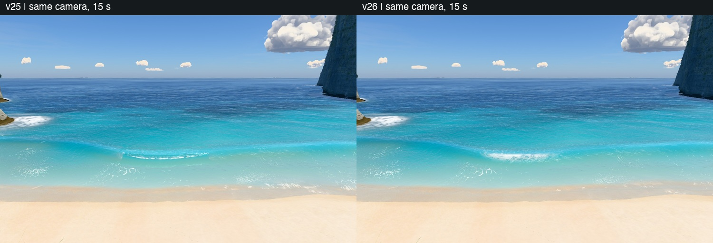

### Falling water and foam, 17 s

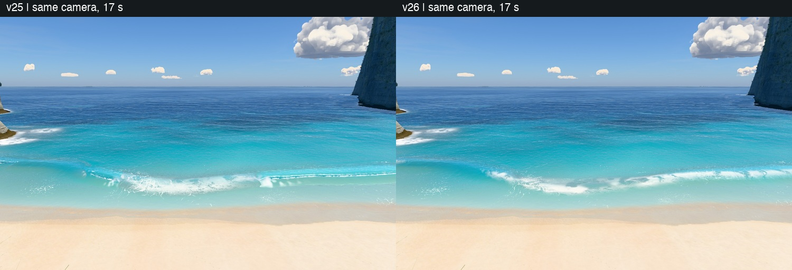

### Complete motion comparison

18 s, clock 13–31 s, 24 fps. Before on the left, after on the right.

[Watch the matched wave cycles](compare-cycle.mp4).

## Original accepted cycle audits

The stair camera is about 20 m above the beach, matching the reported view. The sand camera
is at 4.8 m. Clips follow the actual fixed simulation clock at 24 fps; they do not measure
real-time frame pacing. The close camera is at 3.5 m, sampled at 4 fps. Sheets show one-second
intervals, in reading order; the final empty tile is unused. All three captures have zero
console errors.

### From the stairs

[Watch the final stair cycle](stairs-cycle.mp4).

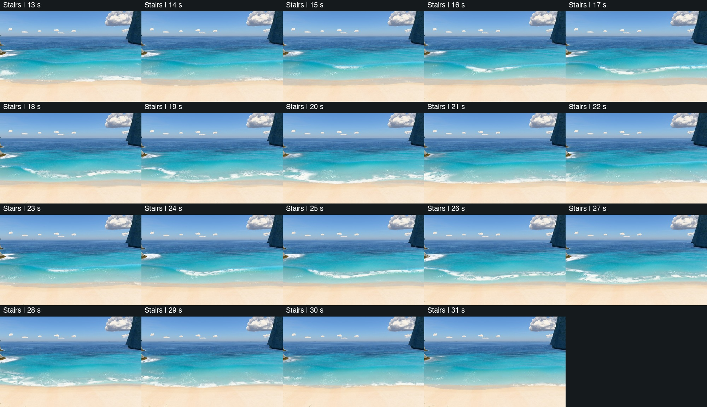

### From the sand

[Watch the final sand cycle](sand-cycle.mp4).

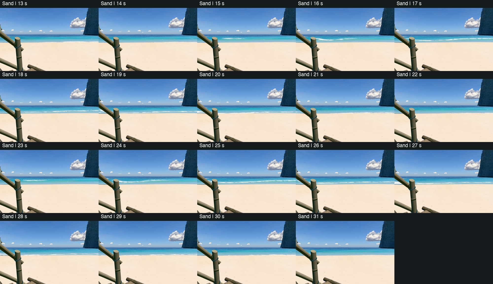

### Close crest and collapse

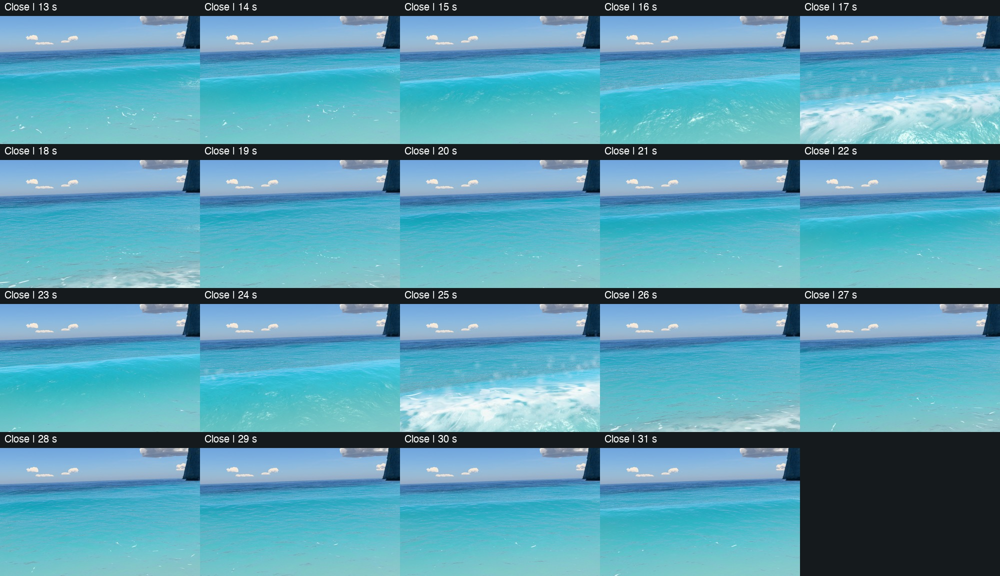

## Continuity and shape

[Continuity measurements](continuity.json), same 73 quarter-second samples from 13–31 s:

| Measurement | v25 | v26 |
|---|---:|---:|
| Largest gap between adjacent active crest columns | 6.404 m | 1.384 m |
| Adjacent gaps over 4 m | 19 | 0 |
| Largest same-wave travel in 0.25 s | 6.000 m | 1.457 m |
| Quarter-second steps over 2 m | 239 | 0 |
| Non-finite active columns | 0 | 0 |

Temporal comparisons require the column to be active in both samples and its stage to change
by less than 0.5, excluding the next-wave reset. These test continuity; they do not validate a
resolved fluid simulation. The captures retain local raw crest/stage readbacks.

[Headland silhouette regression](outline.json): with water hidden, land labels at 1400 × 788
have zero changed pixels at overview and viewpoint. Local reference photographs are
unavailable, so this is a comparison against v25, with no new photo-match claim.

## Hero frames

All nine hero views were refreshed after the September 30 lip polish, at 1400 × 788
and clock 17 s, with zero console messages.

### Overview, straight down

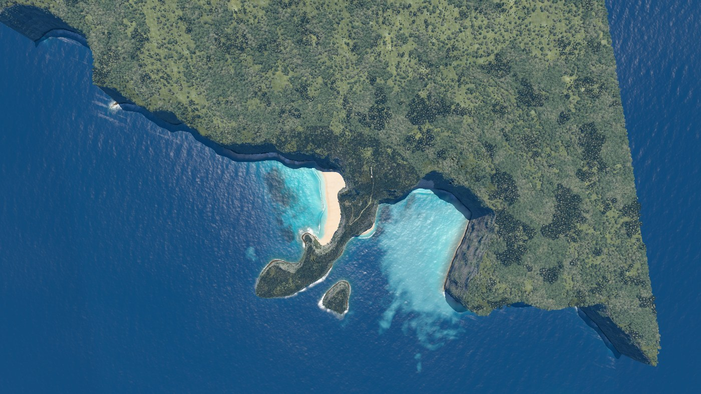

### Clifftop viewpoint

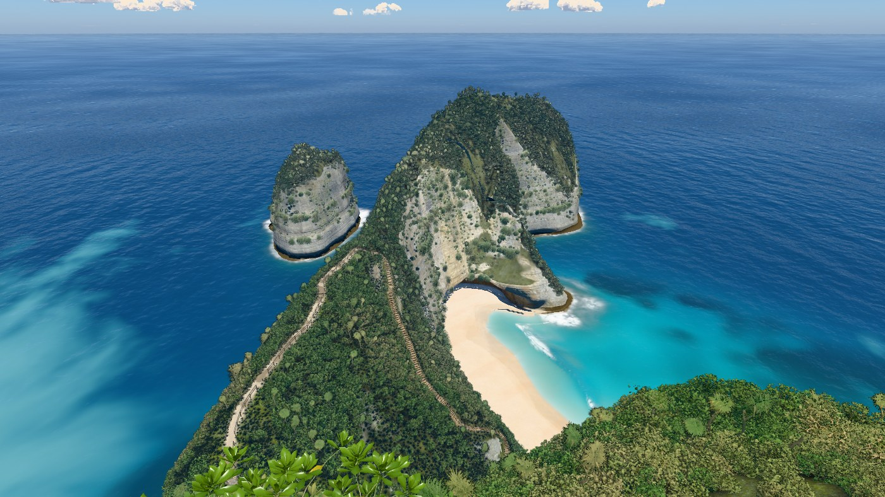

### On the stairs

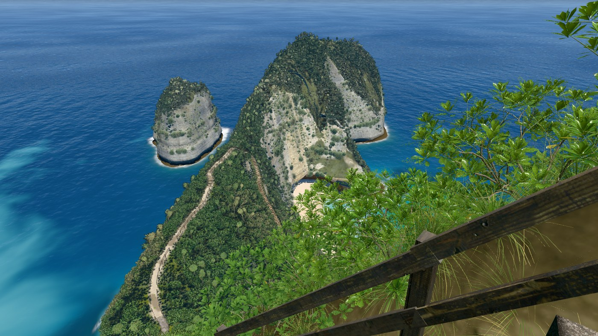

### Top of the trail

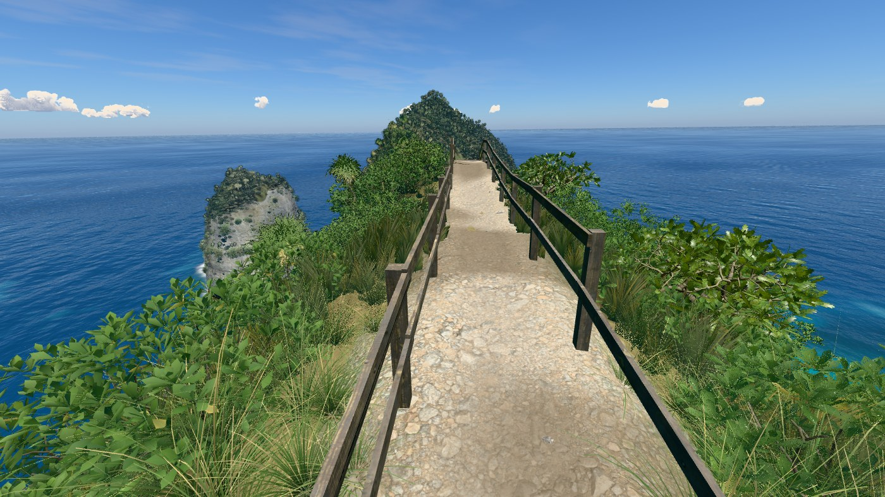

### Low on the trail

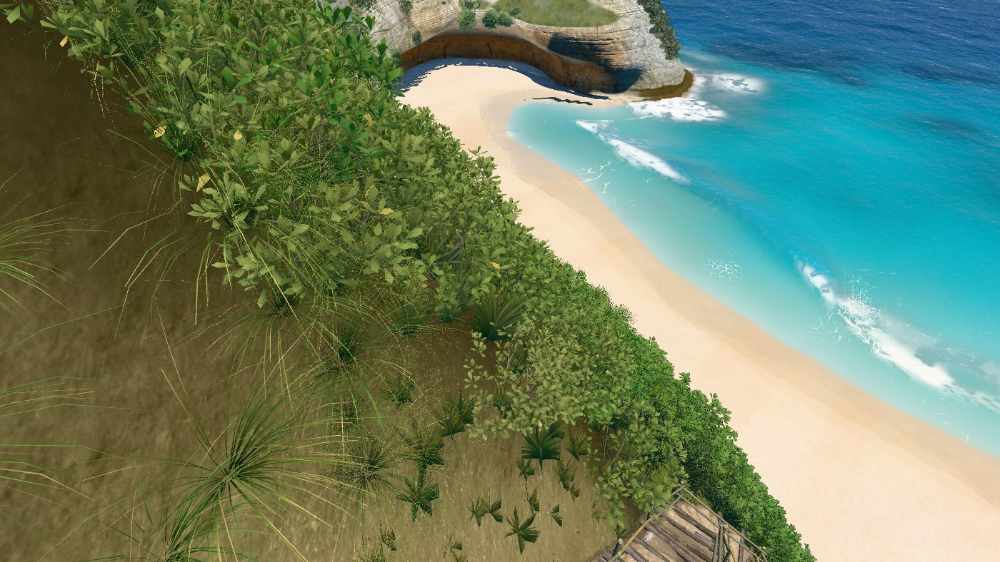

### On the sand

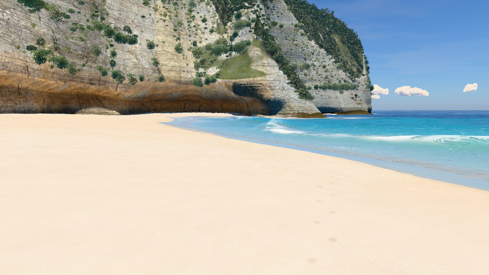

### At the water’s edge

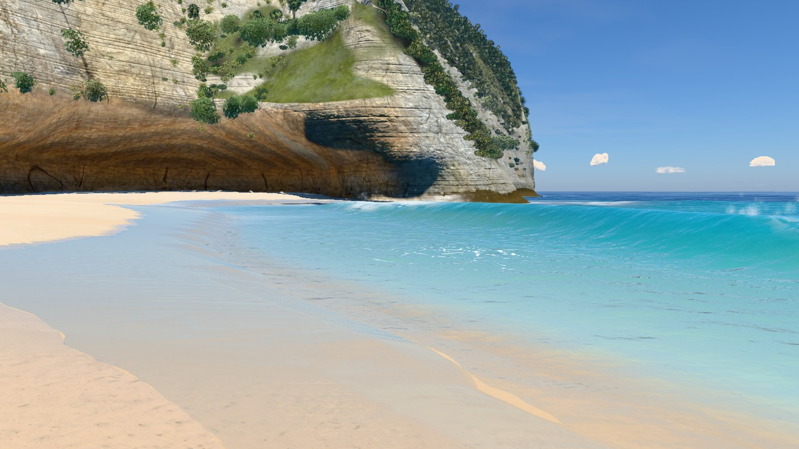

### Shore break, eye level

### Head from the sea

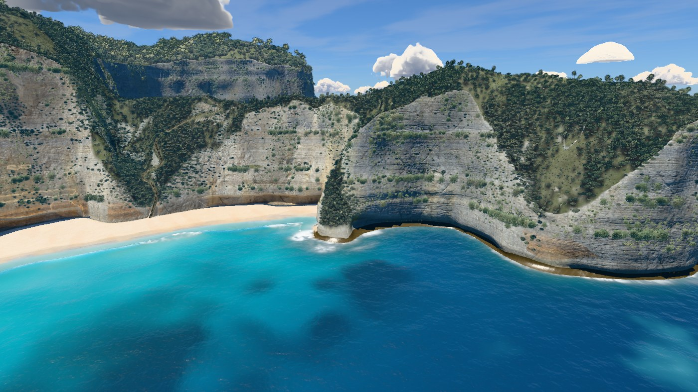

## Original v25 to v26 paired frame times

v25 checkpoint `51e68d3`, twelve alternating rounds of eight complete frames at 1400 × 788,
DPR 1. The paired ratio is calculated per alternating round and need not equal the ratio of
the two separate median times. Absolute times depend on background GPU load.

Eight cameras pass the normal 10% limit. **The close water-level `shoreBreak` camera is an
explicit realism exception, +131.6%.** The intact wave body exposes more fully shaded water.
The cost and diagnostics are recorded in PROCESS.md and the v11 speed brief.

| Camera | v25 ms | v26 ms | Paired median change | Middle half |
|---|---:|---:|---:|---:|
| Overview, straight down | 37.81 | 36.35 | -3.9% | -9.0% to +5.7% |
| Clifftop viewpoint | 25.15 | 26.26 | +6.8% | -7.7% to +9.5% |
| On the stairs | 24.10 | 25.39 | +6.2% | -7.3% to +14.0% |
| Top of the trail | 14.70 | 16.55 | +1.2% | -7.0% to +19.9% |
| Low on the trail | 21.56 | 19.97 | -4.1% | -11.8% to +11.8% |
| On the sand | 19.11 | 19.70 | +2.3% | -15.9% to +18.2% |
| At the water’s edge | 26.12 | 27.69 | -7.7% | -14.6% to +21.5% |
| Shore break, eye level | 9.95 | 25.61 | +131.6% | +90.4% to +164.0% |
| Head from the sea | 18.05 | 16.77 | -3.3% | -7.1% to +7.2% |

[Raw paired timings](bench.json).

## Build and limits

The terrain bake is current. The final local standalone is 3.16 MB with 55 bundled modules;
its classic scripts parse. With the network blocked, it generated terrain, reached all four
validation scroll stops and produced no console errors. No assets were downloaded.

The wave is authored surf geometry, not a fluid solver. A camera at the existing 1.3 m
water-level hero can enter the taller crest; this pass does not add underwater rendering.
Checks cover these cameras and the recorded sea state. The water-level render cost remains
above budget.
