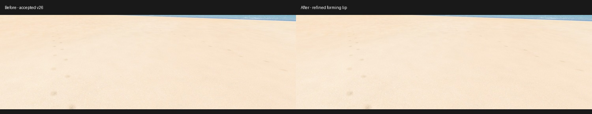
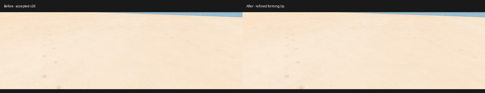
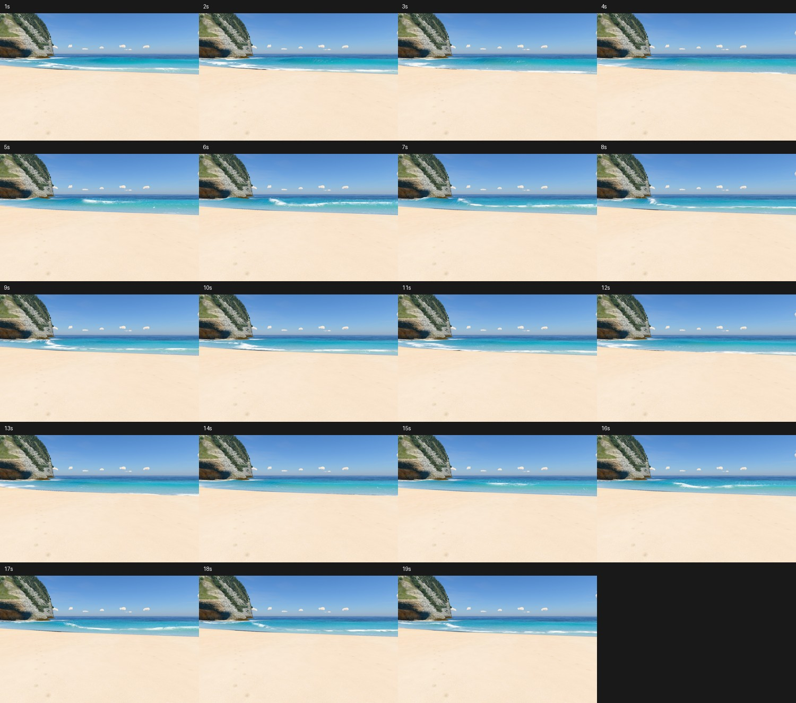
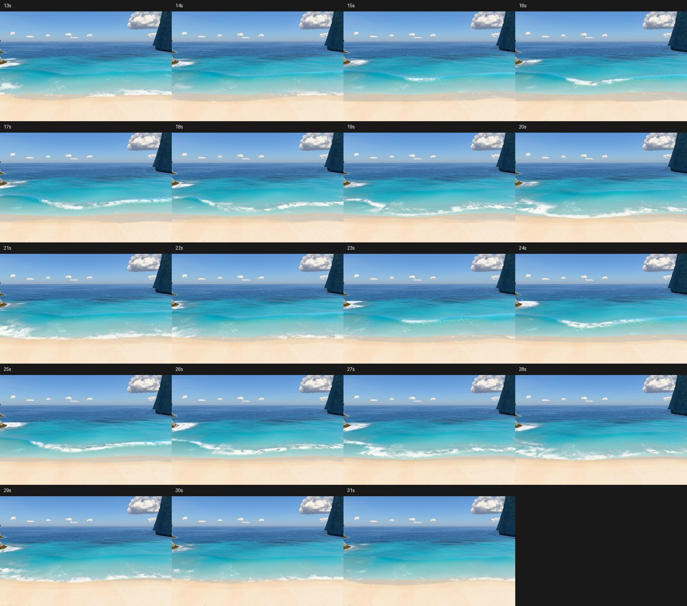
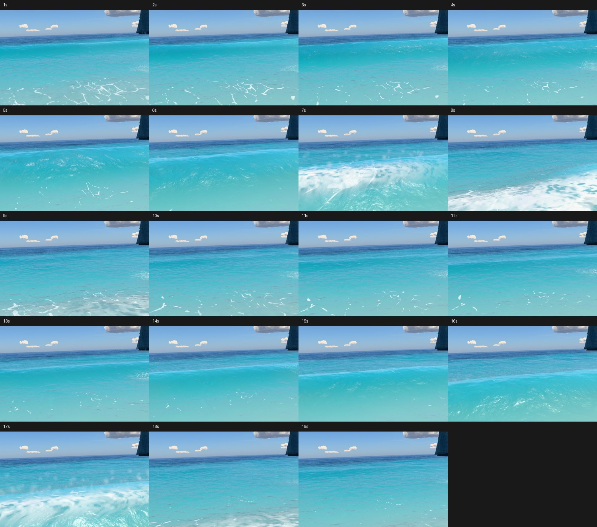

# v26 review polish — Forming lip

The accepted continuous wave occasionally developed a rounded clear-water pocket near its
peeling crest. The lip reached forward while its tip was still high, and the penultimate
cubic control overshot the tip. Together they formed a cap and a return curve around it.

Forward reach now develops with the falling tip. The outer profile's horizontal controls
are ordered, giving a descending sheet without the rounded turnback. Full reach and tip
height at impact stage 0.76 are unchanged. The common clock, crest solver, incoming swell,
foam transport and ocean shading are retained.

## Matched comparisons

Accepted v26 checkpoint `1e1cc0d` on the left; this polish on the right. Same beach camera,
1500 × 960, DPR 1. The full clips use 24 fixed-clock frames per second, clock 1–19 s.
The water is explicitly updated after setting time at every sample. These recordings show
simulation-time motion, not real-time frame pacing.

### Forming lip, 5.5 s

### Peeling transition, 6.5 s

[Watch the matched 18 s motion comparison](compare-cycle.mp4).

## Cycle audits

The review camera is about 4.55 m above the sand, obtained from scroll position 4.05 and
matching the reported beach angle. A roughly 20 m stair camera checks the next cycle at
clock 13–31 s, at 24 fps. The close camera is at 3.5 m, sampled at 4 fps, clock 1–19 s.
All captures have zero console errors. Sheets show one-second intervals in reading order;
the last empty tile is unused.

[Watch the stair cycle](stairs-cycle.mp4).

## Regression checks

[Readbacks](continuity.json) compare 73 matched quarter-second samples at the review camera:
zero changed crest or stage components, maximum difference zero, no non-finite active
columns. The accepted crest path and timing are therefore retained in the sampled cycle.
The falling sheet's shape is intentionally different. These are continuity checks, not
validation of a resolved fluid simulation.

All nine [hero views](../README.md#hero-frames) were refreshed at 1400 × 788 and clock 17 s,
with zero console messages. [Land-label masks](outline.json), with water hidden, have zero
changed pixels at both overview and viewpoint against `1e1cc0d`. Reference photographs
remain unavailable; this is a regression comparison without a new photo-match claim.

## Paired frame times

Accepted checkpoint `1e1cc0d` versus this polish. Twelve alternating rounds of eight complete
frames, 1400 × 788, DPR 1. Each change is the median of paired per-round ratios, not the
ratio of the two separate median times. Absolute times vary with background GPU activity.

| Camera | Accepted ms | Polish ms | Paired change | Middle half |
|---|---:|---:|---:|---:|
| Overview | 46.07 | 43.60 | -0.9% | -9.7% to +7.5% |
| Viewpoint | 33.56 | 31.89 | -3.4% | -6.0% to +1.0% |
| Stairs | 25.48 | 26.74 | +5.9% | +2.1% to +15.3% |
| Trail top | 16.44 | 17.01 | +5.8% | -10.6% to +13.4% |
| Trail low | 37.06 | 36.25 | -0.8% | -11.7% to +20.1% |
| Beach | 22.15 | 21.71 | -0.3% | -5.7% to +4.4% |
| Swash | 45.46 | 42.71 | +2.0% | -11.4% to +9.0% |
| Water level | 33.05 | 30.89 | +4.6% | -2.1% to +17.3% |
| Side from sea | 11.14 | 11.11 | -2.2% | -5.1% to +3.1% |

[Raw timings](bench.json). All nine paired medians pass the 10% limit, ranging from −3.4%
to +5.9%. No new exception is needed. The original v25-to-v26 water-level cost exception
(+131.6%) remains recorded in the parent gallery and the v11 speed brief.

## Build and limits

The terrain bake is current. The local standalone was rebuilt: 3.16 MB, 55 modules, classic
scripts parse. With networking blocked, it loaded in 20.3 s, generated terrain, rendered all
four validation scroll stops and produced no console errors. No assets were downloaded.

This is authored surf geometry. Verification covers the recorded time ranges and cameras,
not every sea state. The existing 1.3 m water-level camera can enter a tall crest; this pass
does not add underwater rendering.
