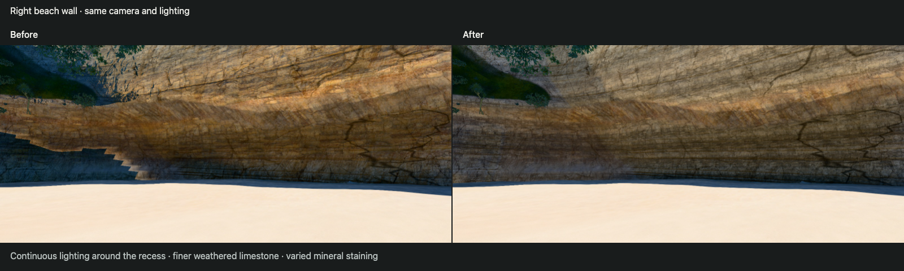
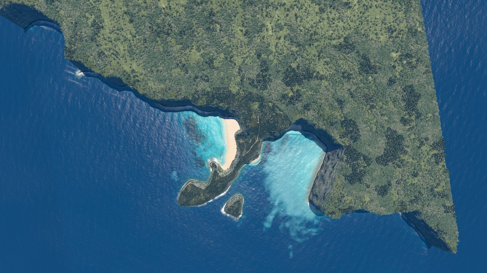
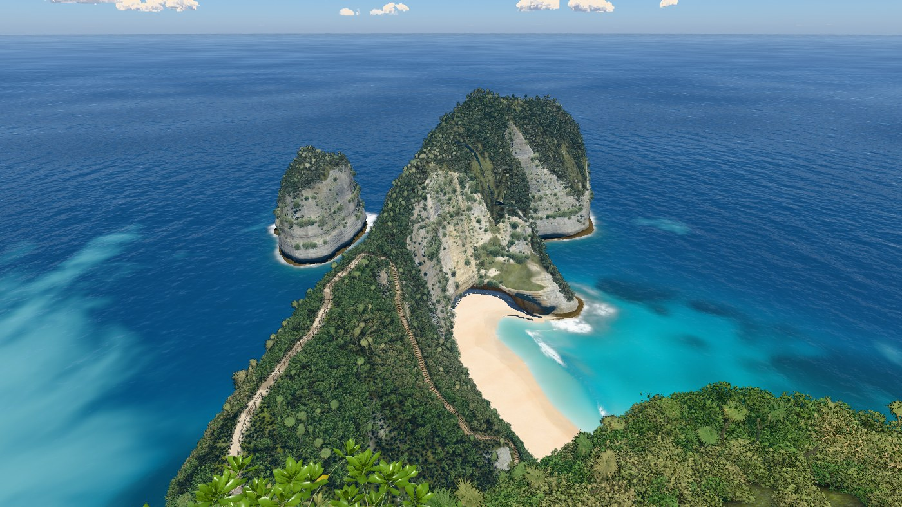
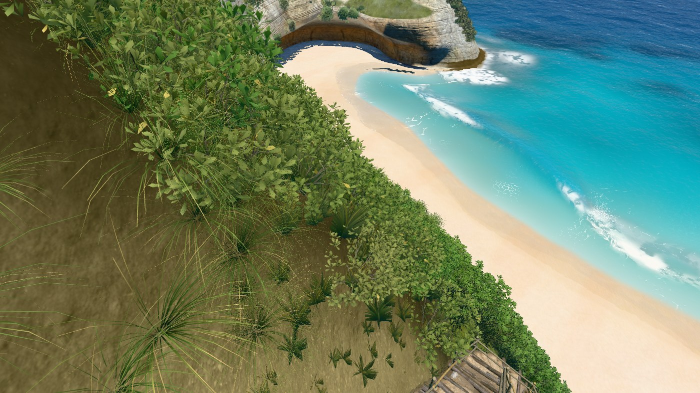
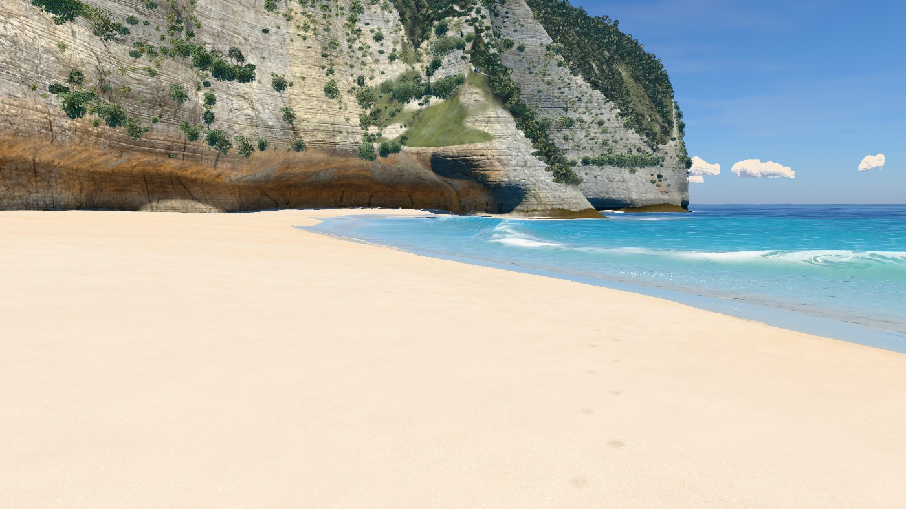
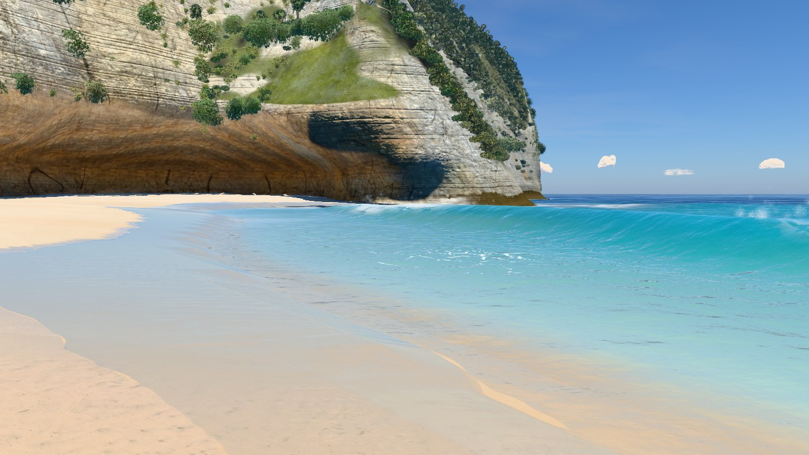

# v27 — Right beach wall foot

The September 30 18:40 report showed a blue staircase and a broad orange band beneath
the right beach wall. The staircase was a lighting discontinuity on the curved mesh:
rows with no outward overhang skipped the sky and ground visibility calculation.
Their neighbours received cave lighting, producing a false polygon-shaped boundary.

Low beach rows now include inward rock in their sky horizon and receive bounce from the
actual sand floor. This fades into the existing lighting between 18 and 32 m. The lower
right wall also carries the bedding and pitted scan at metre scale, with varied mineral
staining and less dominant marble-like crack colour.

## Same-camera comparison

[Reported beach direction](review/report.jpg), [close lower wall](review/near.jpg),
[opposite beach direction](review/left.jpg) and [sand contact](review/contact.jpg).
The matching [clay view](review/near-clay.jpg) separates lighting and form from texture.
Cameras and ray readbacks can be reproduced with `tools/cliff-foot-review.mjs`.

## Preservation

[Mesh readback](mesh-check.json): 1,180,372 triangles and 1,205,421 vertices. Positions,
normals, indices, heightfield, plants, water and coast data match accepted checkpoint
`e31c8b0` exactly. Only the lower-wall lighting attributes change; none changes above
32 m. The existing curved form and contact are retained.

Existing CC0 scans are reused with triplanar projection: colour 2048², normal and
roughness/AO 1024², mip filtering and anisotropy 8. Bedding is sampled at 1.83 m and
pitted grain up to 1.6 m in the revised region. No additional texture storage is needed.

## Hero frames

Hero frames, rendered with `node tools/hero.mjs v27`. The sea is frozen at 17 s.

### Overview, straight down

### Clifftop viewpoint

### On the stairs

### Top of the trail

### Low on the trail

### On the sand

### At the water's edge

### Shore break, eye level

### Head from the sea

## Verification

All nine final hero cameras and all four close-up/clay pairs rendered with zero console
errors. [Overview and viewpoint land-label masks](outline.json), with water hidden at
1400 × 788, have zero changed pixels against `e31c8b0`. Reference photographs are not
available locally, so this is a regression check without a new photo-match claim.

The final terrain bake is current (13,493,108 bytes). The rebuilt local standalone bundles
55 modules and its inline scripts parse as classic scripts. With the network blocked, it
loaded in 23.7 s, generated its fallback terrain and rendered scroll stops 0.3, 1, 2.6 and
4.6 without console errors. Offline mode uses generated texture fallbacks; the online
preview is the material review target. No assets were downloaded.

### Paired frame times

[Measurements](bench.json): twelve alternating rounds of eight frames, 1400 px, DPR 1,
sea clock 17 s. Every paired median is within the 10% gate (−2.5% to +5.3%). The paired
change is the median of round ratios, so it need not equal the ratio of the separate
medians in the two time columns. Absolute times depend on background GPU load.

| Camera | Baseline ms | v27 ms | Paired change |
|---|---:|---:|---:|
| overview | 25.02 | 24.91 | +1.7% |
| viewpoint | 11.69 | 11.74 | -0.1% |
| stairs | 14.96 | 15.79 | +5.3% |
| trailTop | 10.84 | 10.69 | +4.3% |
| trailLow | 9.26 | 9.52 | +2.7% |
| beach | 11.30 | 10.85 | -0.8% |
| swash | 14.01 | 14.01 | +3.0% |
| shoreBreak | 13.50 | 12.96 | -2.5% |
| sideFromSea | 13.56 | 13.34 | +3.5% |

This pass adds no performance exception. The previously recorded v25-to-v26 water-level
exception remains. Geometry is unchanged: the refinement improves how the existing
curved recess reads, rather than claiming a new reconstruction of the geology. The
visibility model is authored and column-based; these checks cover the recorded views.

