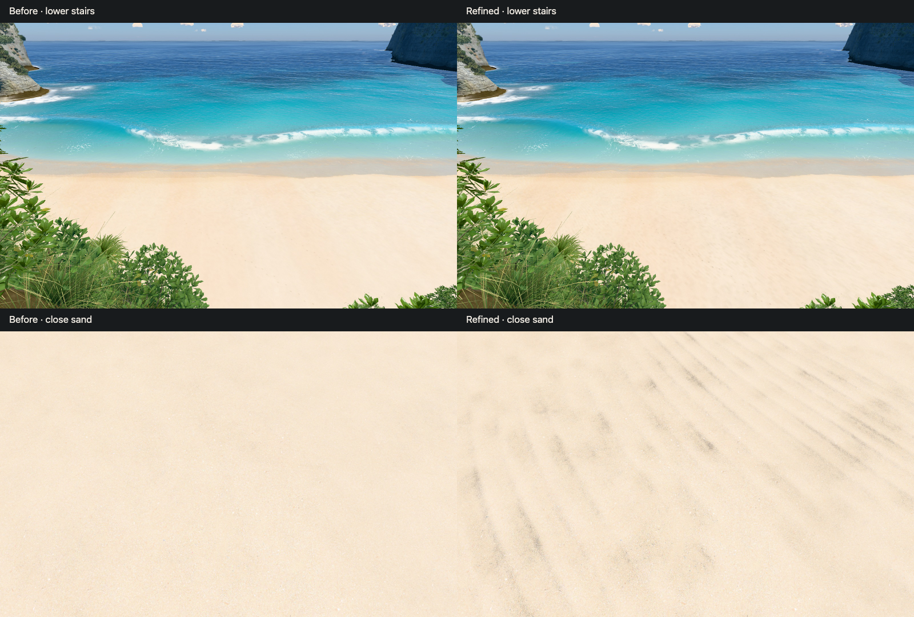
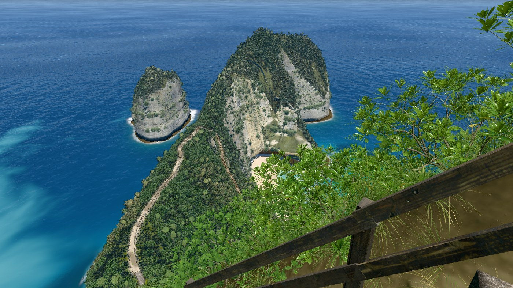
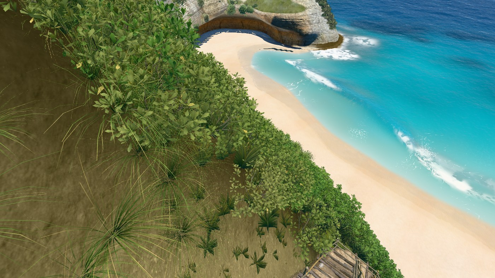
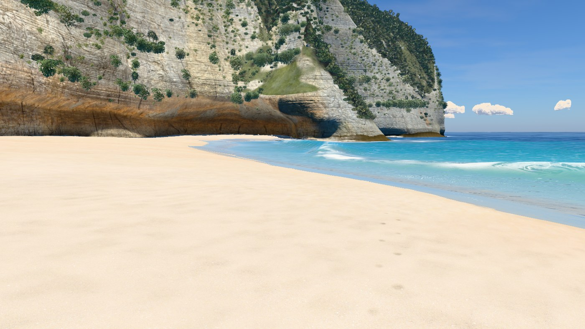
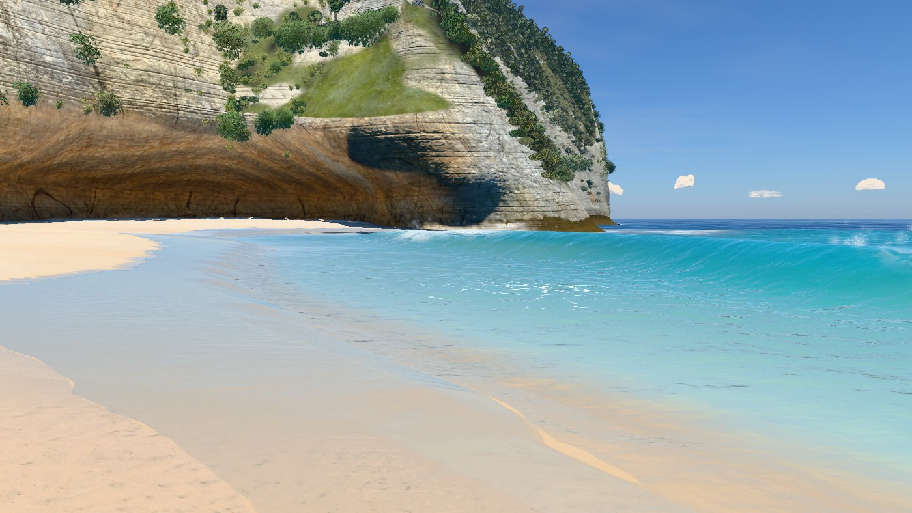
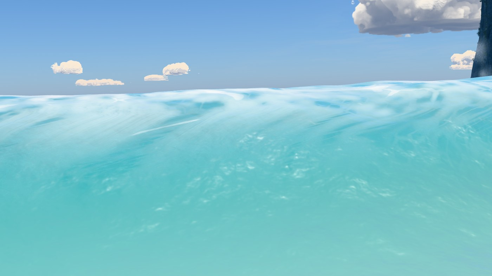
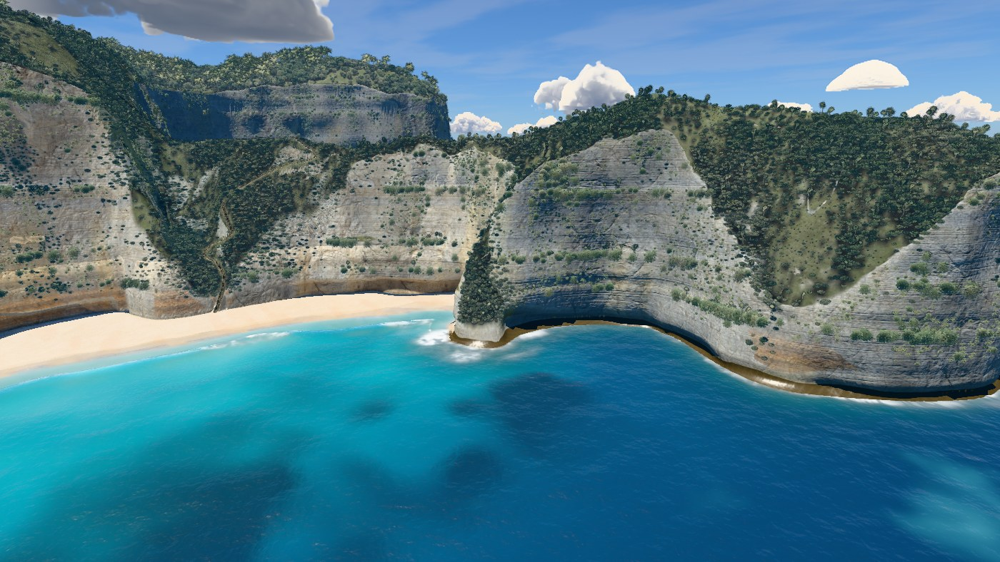

# v28 — Natural beach sand

The sand material now combines elongated hummocks and hollows, interrupted shallow
ripple patches, granular normal relief and sparse coral/shell fragments. Quiet areas
remain between deposits; packed sand near the swash stays smoother. The earlier five
walking lines and the broad geometric drifts are retained.

## Before and after

[Lower stairs](review/stairs.jpg), [beach level](review/beach.jpg),
[grazing view](review/grazing.jpg) and [close sand](review/close.jpg).
[Camera approach and head turn](review/approach.mp4) · [motion settings](review/motion.json).
`tools/sand-review.mjs final http://localhost:5183/ --motion` reproduces all four cameras
and the six second approach, with the sea held at 17 s. [Camera readbacks](review/cameras.json).

## Material

The normal-only first pass was too faint beneath the nearly overhead sun. Shader diagnostics
showed dry sand with active relief, ruling out the wet-sand mask. The final material couples
ripple hollows to cavity shading. A stronger intermediate pore tint looked like smudges,
so it was reduced and filtered in the final pass.

Ridges are about 31 cm apart with an interrupted, curved pattern and shallow surface relief.
The second harmonic filters earlier than the main ridge. Small pores and 1–3 cm fragments
fade at their pixel footprint. Existing CC0 maps provide the fine grain: 2048² colour,
1024² normal/mask, mipmaps, anisotropy 8. All patterns use world coordinates; no additional
texture storage, asset download, or reference-image upload is needed.

Reference observations: [branching ripple photo](https://wordpress.org/photos/photo/685663641b/),
[varied sand grains](https://scienceofsand.info/sand/countries/fiji/fijiout.htm), and
[NPS beach profile description](https://www.nps.gov/articles/beach-profile-changes.htm).
The images were viewed in browser and are not included in the build or gallery.

## Hero frames

Nine hero frames rendered with `node tools/hero.mjs v28`, q=1024, DPR 1, sea clock 17 s.

### Overview, straight down

### Clifftop viewpoint

### On the stairs

### Top of the trail

### Low on the trail

### On the sand

### At the water's edge

### Shore break, eye level

### Head from the sea

## Verification

Nine hero renders, four matched sand views and 145 moving-camera frames have zero console
errors. Reviewed approach frames keep the same ridges and deposits fixed to the beach;
small detail filters into the distance. The shader source parses as an ES module and
`git diff --check` passes.

[Land-label masks](outline.json), with water hidden at 1400 × 788, have zero changed pixels
at overview and viewpoint against `7ca785b`. Geometry, scatter, bake, coast, waves, wetness
clock and camera choreography are unchanged. Local photo references are unavailable, so
this is an outline regression check rather than a new photo-match claim.

The bake remains current. The rebuilt local standalone contains 55 modules; all inline
scripts parse as classic scripts. With networking blocked, it loaded in 23.0 s and rendered
stops 0.3, 1, 2.6 and 4.6 with zero console errors. Offline mode uses generated texture
fallbacks; the online preview is the scan-material review target.

### Paired frame times

[Final measurements](bench.json): 12 alternating rounds of eight complete frames per hero,
against `7ca785b`, 1400 px, DPR 1. The first beach median was marginally over the gate at
+10.14%; a focused 16-round repeat measured −0.28% (middle half −9.5% to +6.4%). Both the
[first run](bench-first.json) and [repeat](bench-beach-repeat.json) are retained. The table
uses the focused repeat for beach. All final paired medians are within the 10% gate,
from −6.9% to +4.7%. No new performance exception is required.

| Camera | Baseline ms | v28 ms | Paired change |
|---|---:|---:|---:|
| overview | 20.25 | 19.09 | -0.4% |
| viewpoint | 12.80 | 12.28 | -5.0% |
| stairs | 15.56 | 14.49 | -3.9% |
| trailTop | 13.89 | 13.98 | +4.7% |
| trailLow | 19.85 | 18.96 | -6.9% |
| beach | 18.15 | 17.76 | -0.3% |
| swash | 17.45 | 17.94 | +4.5% |
| shoreBreak | 11.57 | 11.55 | +4.1% |
| sideFromSea | 11.07 | 11.35 | +0.9% |

The original v25-to-v26 water-level cost exception remains. Material detail approximates
small-scale deposited sand rather than adding geometric grains. Verification covers these
cameras and the approach. The existing thin blue swash-film join in the grazing camera
is recorded in the v26 brief for a separate water pass.
