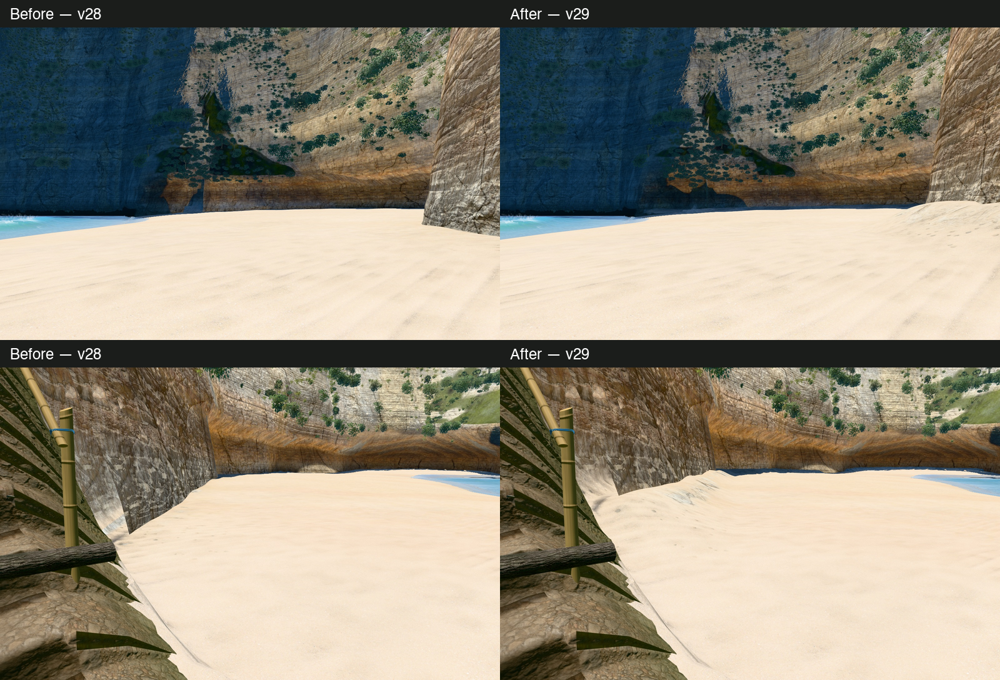
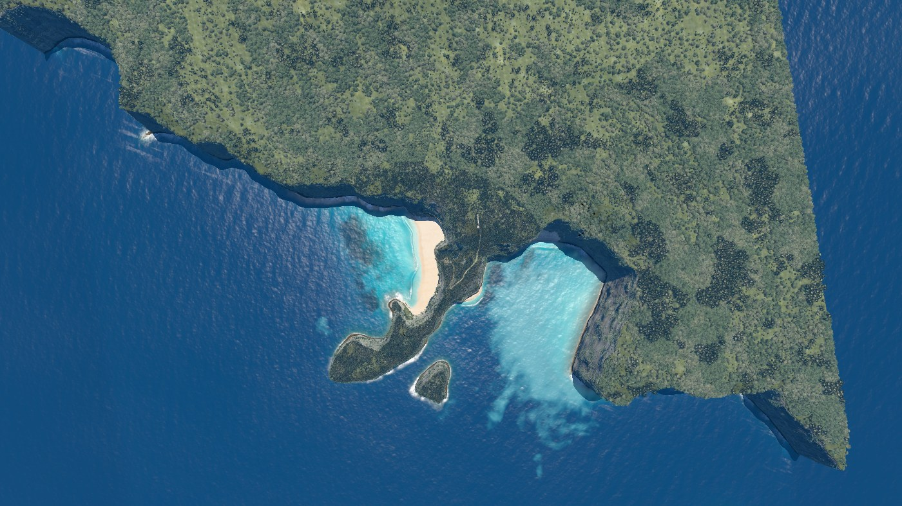
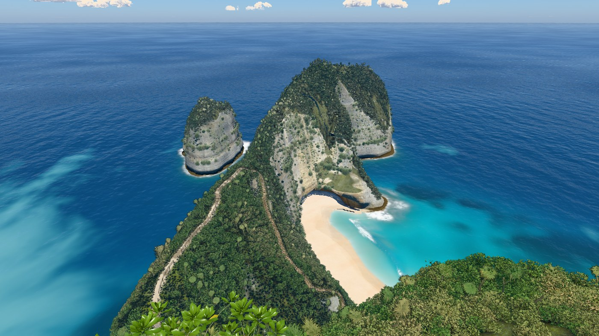
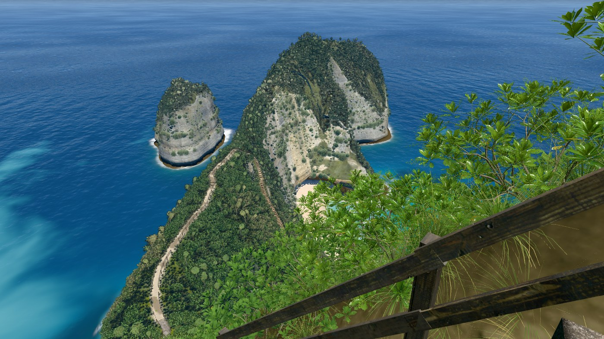
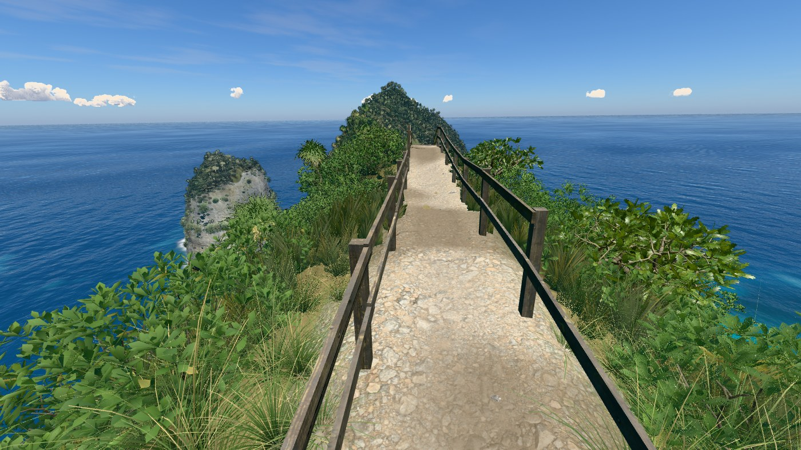
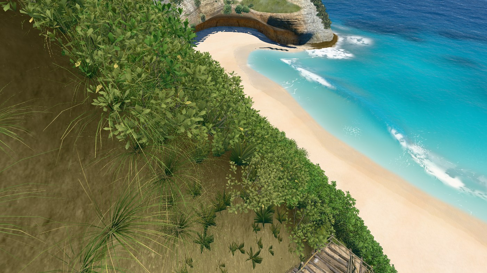
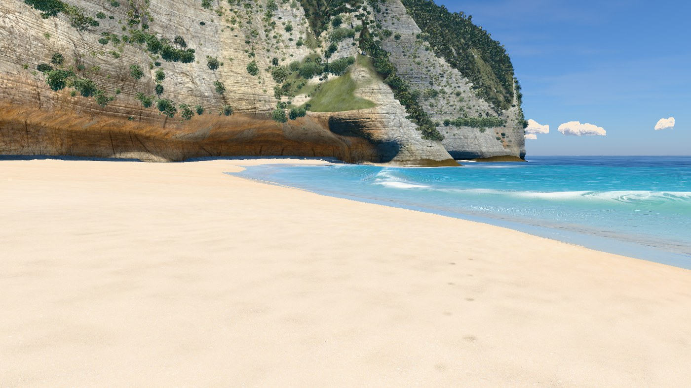
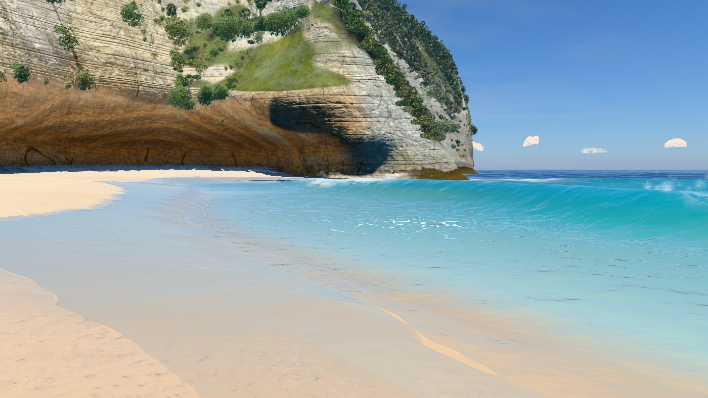
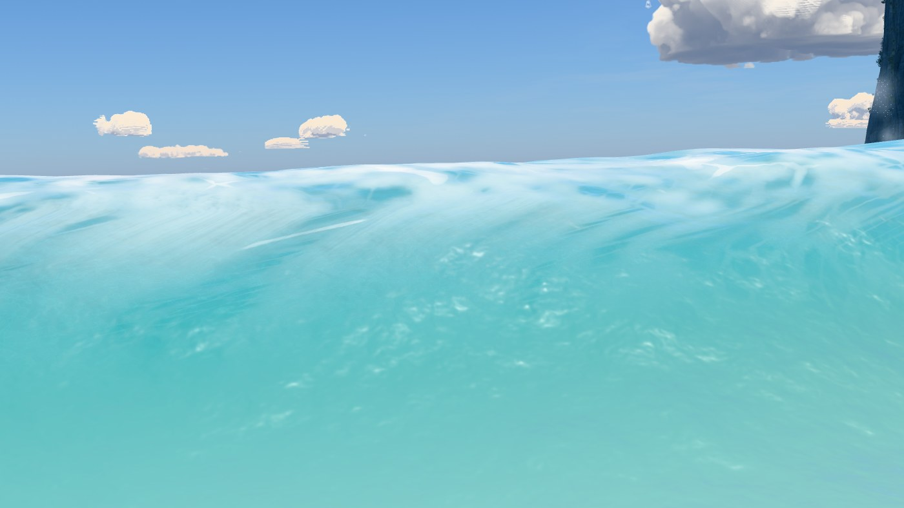
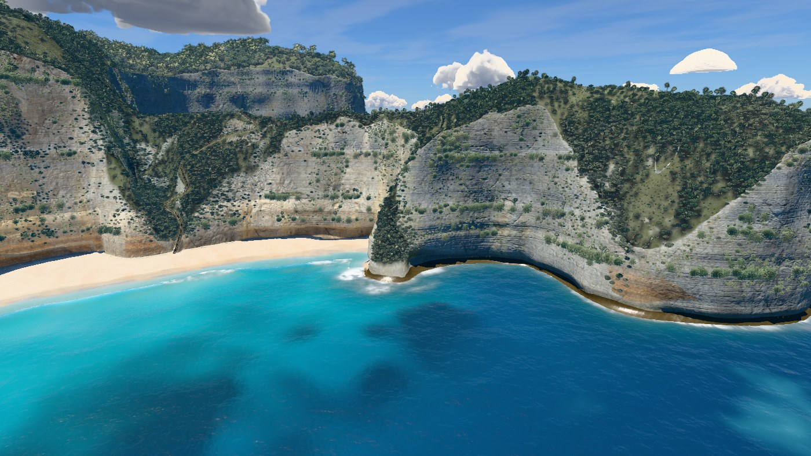

# v29 — Lower cliff texture and sand contact

The opposite-cove wall now continues below the shrub gully as a rounded recess.
A shallow deposited sand bank follows the final carved rock toe, with matching fades
where a wall strip returns to the supporting terrain beside the stairs.

## Before and after

[Reported wall](review/report.jpg) · [stair-side contact](review/left.jpg) ·
[close recess](review/near.jpg) · [contact](review/contact.jpg) ·
[final stairs](review/stairsContact.jpg). Each also has a plant-free `-clay.jpg` view.

[Cove camera sweep](review/cove-turn.mp4) ·
[stair contact approach](review/stair-contact.mp4) ·
[motion samples](review/motion-samples.jpg) · [motion settings](review/motion.json).
Five cameras and two 73-frame tracks are reproducible with
`node tools/cliff-contact-review.mjs checked http://localhost:5183/ --motion`.
The sea remains fixed at 17 s during this geometry review.
[Camera poses and terrain ray readbacks](review/hits.json).

## Geometry and materials

A shortened radial window left a foreground terrain ramp between carved wall sections.
Different column start heights produced the hanging ochre fin beside a blue vertical gap.
The affected cove corner now continues from a shared 23 m bedding datum into a rounded
lower recess. The continuous beach floor closes the exposed foreground ramp.

At the strip ends, the ground's recess and culling now fade with the wall's carving.
The sand bank uses distance to line segments along the final carved toe, rather than
the original terrain edge. Its rise is at most 0.95 m over a three metre shoulder,
with clearance from the stair tread and the packed wet sand. The existing adaptive
contact mesh supplies the curved bank. Sand cover remains limited to the bank's surface;
it does not follow the original rising wall height. Weathering continues through the
gully instead of relying on abrupt carving-attribute thresholds.

A broad early deposit mask painted pale streaks up the rock and was removed. Another
intermediate geometry pass altered hidden sea-level crossings. The final mesh preserves
every vertex on those crossing triangles; the coast and surf inputs are identical to v28.

No new maps or asset downloads. Existing CC0 scans, world-space projection, mipmaps,
2048² colour maps, 1024² normal/mask maps and anisotropy 8 are retained. The v28 sand
surface and the accepted waves, foliage, blue cord and camera choreography are unchanged.

## Hero frames

Nine hero frames at q=1024, DPR 1 and sea time 17 s, with zero console messages.

### overview

### viewpoint

### stairs

### trailTop

### trailLow

### beach

### swash

### shoreBreak

### sideFromSea

## Verification

[Render checks](render-check.json): five textured/clay pairs, 146 moving-camera frames,
the earlier 28 m closure view and nine heroes have no console errors. The reviewed camera
approach and turns retain continuous contact without reopening the earlier stair-bank hole.
The [closure ray](review/closure.json) still meets nearby terrain at 3.161 m.

[Decoded bake audit](review/bake-audit.json), against `3f1978c`, confirms identical
heightfield, field normals, vegetation scatter, trail, water, coast, shoreline direction,
breaker and rock-site data. The contact refinement adds 17,476 triangles and 8,814 vertices:
1,197,848 triangles and 1,214,235 vertices total. The current bake is 13,561,329 bytes;
round-trip position error remains 12.2 mm and heightfield error 1.9 mm, with exact indices
and water data. Array element deltas in appended contact vertices are not a correspondence
measure; the audit separately compares original grid and wall vertices.

[Land-label outline check](outline.json), water hidden at 1400 × 788: viewpoint has zero
changed pixels; overview has one changed pixel among 505,927 baseline land pixels
(0.00020%). Local reference photos remain unavailable, so this is a regression check
rather than a new photographic outline match.

The rebuilt local standalone contains 55 modules and all inline scripts compile as
classic scripts. [Offline verification](offline-check.json), with networking blocked,
loaded in 20.1 s and rendered stops 0.3, 1, 2.6 and 4.6 with zero console errors.
Offline mode uses generated texture fallbacks; the online preview is the material target.
ES-module syntax, bake freshness and `git diff --check` pass.

### Paired frame times

[Raw measurements](bench.json): 12 alternating rounds of eight complete frames per hero,
against `3f1978c`, 1400 px, DPR 1. Every paired median passes the 10% gate, ranging from
−4.0% to +3.8%. No new performance exception. The earlier v26 water-level exception remains.

| Camera | v28 ms | v29 ms | Paired change |
|---|---:|---:|---:|
| overview | 16.12 | 15.89 | -0.2% |
| viewpoint | 10.41 | 10.50 | +0.3% |
| stairs | 10.69 | 10.49 | +1.1% |
| trailTop | 8.21 | 8.12 | -4.0% |
| trailLow | 11.19 | 10.96 | -3.6% |
| beach | 11.35 | 11.86 | +3.6% |
| swash | 12.39 | 12.36 | +3.8% |
| shoreBreak | 12.18 | 11.38 | -1.9% |
| sideFromSea | 10.77 | 11.08 | +2.8% |

The lower wall and deposited bank are authored approximations. The geological surface
and column-based lighting remain approximate; this pass is verified in the recorded
cameras and approaches and does not claim perfect realism from every possible position.
