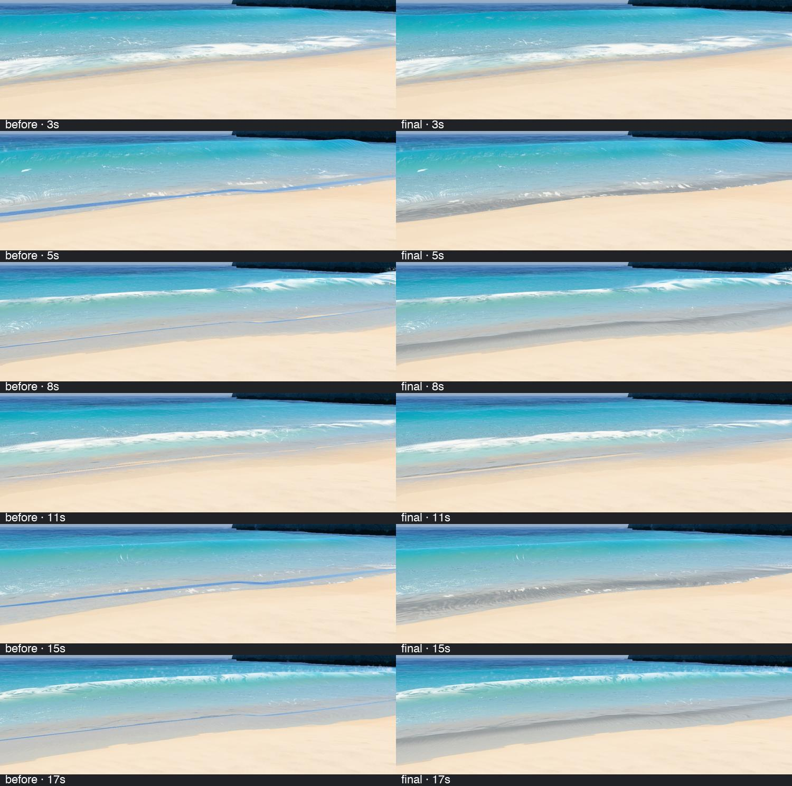
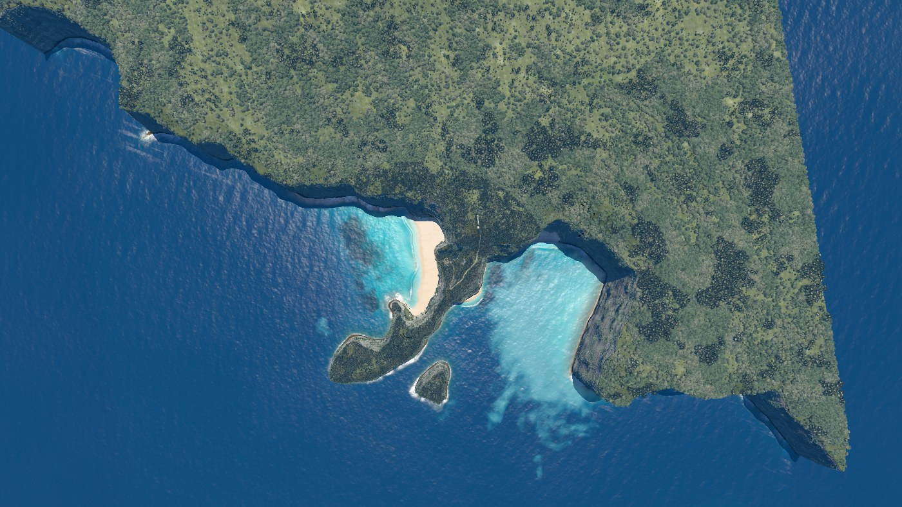
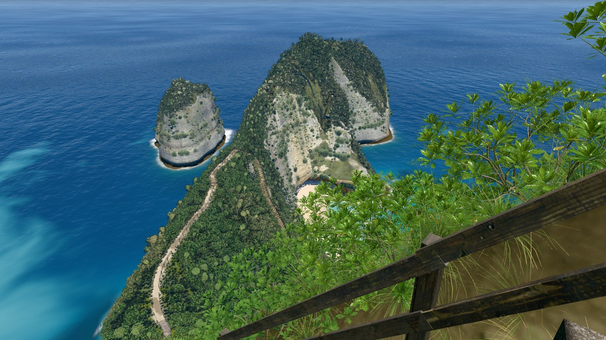
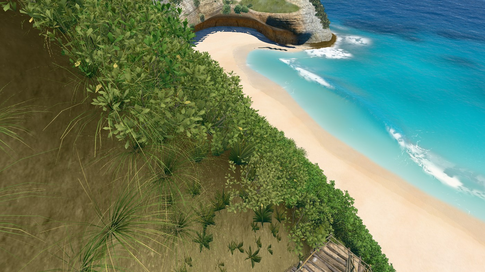
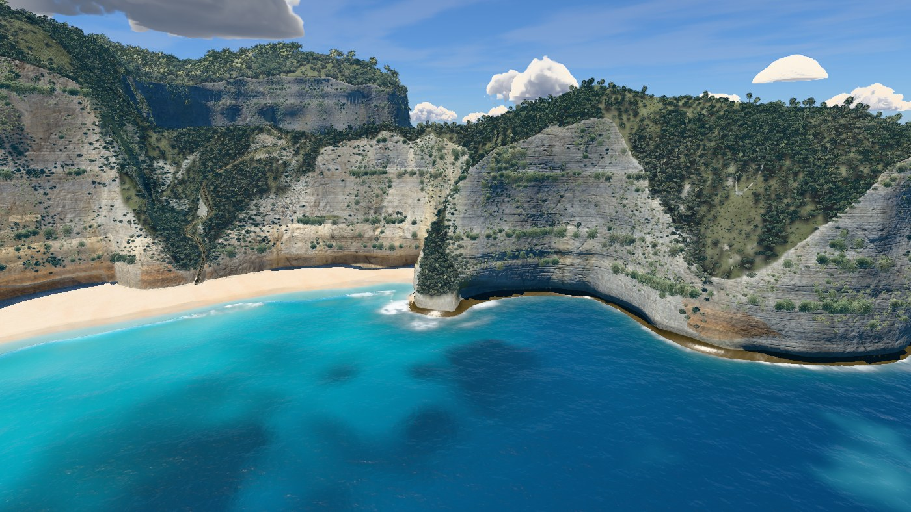

# v30 — Final water texture and wave polish

A final material pass over the accepted swell, folding lip, impact and shore wash.
The crest solve and timing remain unchanged. Ripple travel, wash thickness through
reversal, surface normals and small foam transitions now join more continuously.

## Before and after



[Beach cycle, 1–19 s](review/beach.mp4) ·
[Lower stairs cycle, 13–31 s](review/stairs.mp4).
Both contain 433 frames at 24 fps. [Stair sequence](review/stairs-sequence.jpg) and
[close wave sequence](review/near-sequence.jpg) show the formation, break and foam.
[Beach at 17 s](review/beach-17s.jpg) · [close wave at 17 s](review/near-17s.jpg).

Reproduce with:

```bash
node tools/wave-cycle.mjs final-beach clip 1 18 http://localhost:5183/ beach
node tools/wave-cycle.mjs final-stairs clip 13 18 http://localhost:5183/ stairs
node tools/wave-cycle.mjs final-near sheet 13 18 http://localhost:5183/ near
```

## Surface continuity

The swash ripple and caustic coordinates use the simulation's accumulated travel.
Multiplying instantaneous velocity by total time previously made patterns slip as
water slowed and reversed. Uprush and backwash now blend two fixed-coordinate fields;
the global texture coordinates do not rescale during the turn.

The shared wash thickness also blends through reversal. The previous laws dropped
about a centimetre at that instant. The bore and sheet use a smooth maximum within
a 12 cm overlap; its maximum additional rise is 3 cm. Slope samples differentiate
the same displaced surface, including the sheet. The bed normal under a thin film
is filtered over four metres, softening the coarse depth-map shoulder.

The sharp blue shore stripe became a softer reflective wash in the matched beach
frames. The narrow reflection path now masks below-horizon facets consistently with
the rough path, and unresolved wash ripples contribute a small slope variance. A flat
sheet normal, sea-level floor and height interpolation that introduced a trough were
tried and rejected. The rendered wash still has a broad reflective shoulder.

Foam cell detail fades towards its mean before each distance cutoff. Crest feathering
uses a soft threshold; face-foam edges account for their pixel footprint. The accepted
crest/lip geometry, clocks, spectrum and impact sequence are retained. No added assets,
texture allocations, downloads or changes to land, vegetation, stairs or camera path.

## Hero frames

Nine heroes at q=1024, DPR 1, sea time 17 s; no console messages.

### overview



### viewpoint


### stairs



### trailTop


### trailLow



### beach


### swash


### shoreBreak


### sideFromSea



## Verification

[Render checks](render-check.json) cover both recorded cycles, 73 close review frames
and nine heroes. [Matched motion audit](review/motion-audit.json) compares 933,976 finite
crest-column values across 146 quarter-second samples: zero changes, with matching
inactive values. Compressed [beach readbacks](review/beach-columns.json.gz) and
[stair readbacks](review/stairs-columns.json.gz) retain the actual sampled data.
This checks crest motion; the shore sheet thickness and shading are intentionally changed.

The [GPU reversal audit](turn-audit.json) samples the actual shared GLSL at 0.5 ms intervals
from 3.1–3.3 s, for runup 1 m and turn time 3.2 s, at three bed heights. Maximum adjacent
film steps decrease from 10.04–11.00 mm to 0.0115–0.0348 mm. All samples are finite and
there are no shader errors. Velocity values retain their previous behavior.

[Water-hidden land labels](outline.json), at 1400 × 788, have zero changed pixels at
both overview and viewpoint against `fe00f69`. Reference photos remain unavailable;
this verifies the accepted land outline without a new photographic-match claim.
The terrain bake is current. ES-module parsing and whitespace checks pass.

The local standalone bundles 55 modules and its inline scripts compile as classic
scripts. [Offline check](offline-check.json), with network blocked, loaded in 20.7 s
and rendered stops [0.3](offline/tau-0.3.jpg), [1](offline/tau-1.jpg),
[2.6](offline/tau-2.6.jpg) and [4.6](offline/tau-4.6.jpg) without console errors.
Offline mode uses generated texture fallbacks; the online preview is the material target.
The build accepts `--asset-base=http://localhost:5183/assets/` for this preview server.

### Paired frame times

[Raw measurements](bench.json): 12 alternating rounds of eight complete frames,
against `fe00f69`, 1400 px wide, DPR 1. All nine paired medians pass the 10% limit,
from −2.5% to +7.6%. The change is the median of paired ratios, so it need not equal
the ratio of the two separate median times. No new performance exception; v26's
original close water-level exception remains documented in its brief and v11.

| Camera | v29 ms | v30 ms | Paired change |
|---|---:|---:|---:|
| overview | 21.40 | 21.79 | +2.7% |
| viewpoint | 16.10 | 15.89 | +3.4% |
| stairs | 15.04 | 14.61 | +0.3% |
| trailTop | 12.62 | 12.60 | +1.3% |
| trailLow | 15.42 | 16.52 | +7.6% |
| beach | 16.44 | 16.44 | -2.5% |
| swash | 18.65 | 19.65 | +5.1% |
| shoreBreak | 16.55 | 16.35 | -2.0% |
| sideFromSea | 16.24 | 16.69 | +3.5% |

This remains an authored real-time water model. The recorded beach, stair and close
views preserve the approved sequence and improve the wash transition; this is not a
claim of perfect fluid simulation or photographic realism from every possible view.
