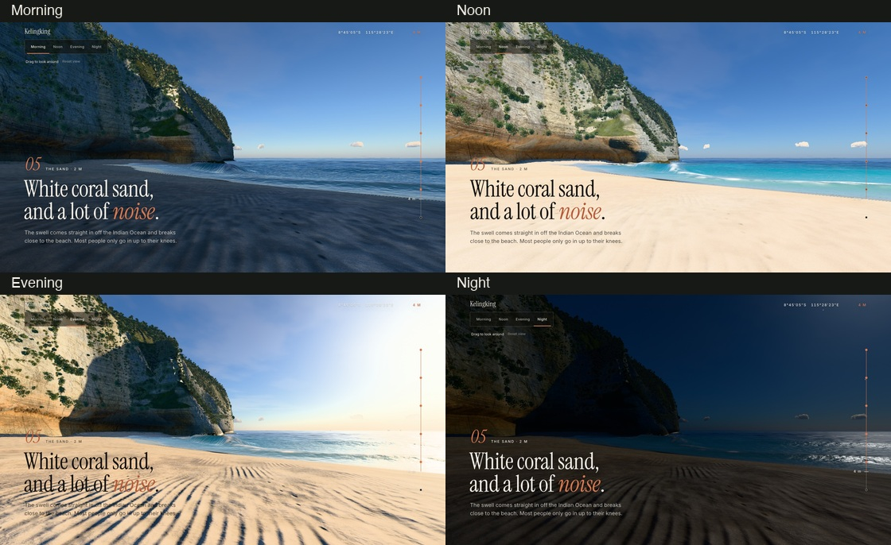
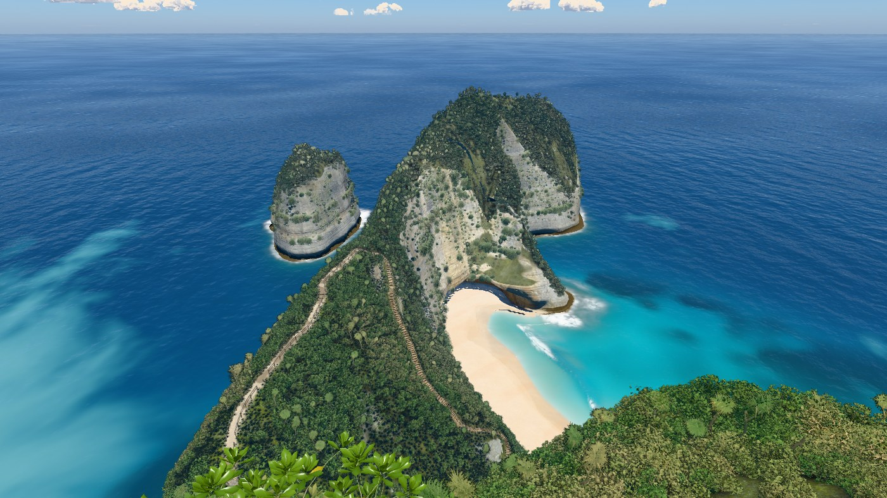
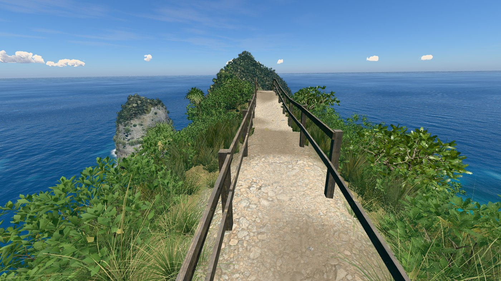
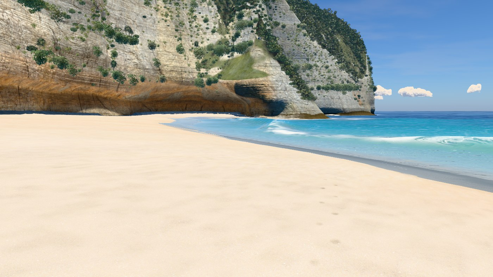
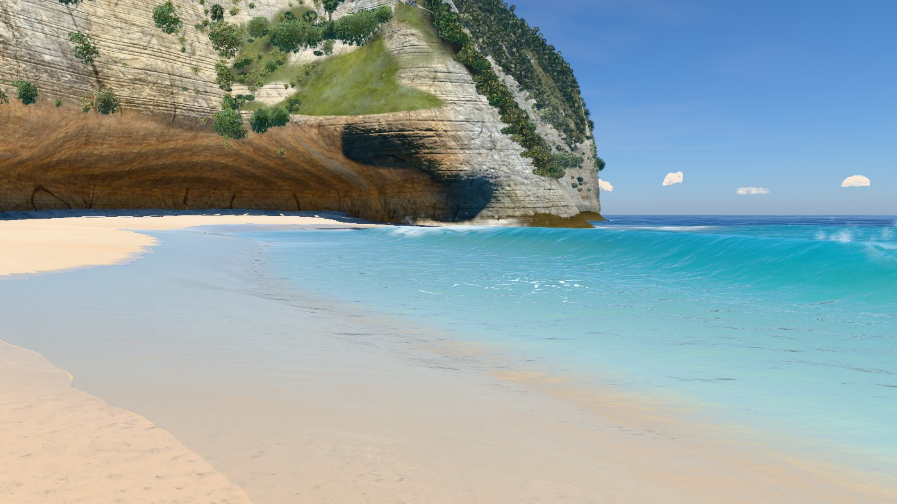

# v31 — Beach camera and time of day

The beach view widens after the last stair. Drag to choose a view, use **Reset view**
to return to the guide, and select **Morning / Noon / Evening / Night** above the scene.
The stair camera and accepted v30 waves are preserved.

## Camera and lighting review

- [Continuous stair-to-beach approach](review/beach-camera.mp4): 377 frames, 24 fps, 15.7 s.
- [Camera sequence](review/camera-sequence.jpg), [before](review/before-camera.jpg), [after](review/after-camera.jpg).
- [Morning](review/morning.jpg), [noon](review/noon.jpg), [evening](review/evening.jpg), [night](review/night.jpg), [moon](review/moon.jpg).
- [Phone](review/phone.jpg), [offline night](review/night-offline.jpg), [input and clearance readbacks](review/review.json).

A 1,001-sample comparison preserves stair poses and all camera positions exactly.
Minimum sampled ground clearance is 1.498 m; closest reviewed terrain ray hit is
3.103 m, with none inside 0.6 m. Drag/scroll, reset, return to stairs, rapid lighting
switches, keyboard radios, reduced motion, vertical touch scroll and rotation pass.

Night is an authored moonlit setting. Offline renders use generated fallback materials;
the online preview is the scan-material target. No downloaded assets or publication.

## Paired frame times

Against `8310f05`, 12 alternating rounds of eight complete frames at 1400 × 788,
pixel ratio 1. The change is the median of paired ratios, not the ratio of these
separate absolute medians. All nine pass the 10% incremental limit. The historical
v26 close water-level exception remains; no new exception is needed.

| Frame | Baseline median | v31 median | Paired change |
|---|---:|---:|---:|
| Overview, straight down | 20.33 ms | 20.30 ms | +0.6% |
| Clifftop viewpoint | 15.46 ms | 15.66 ms | +0.1% |
| On the stairs | 15.55 ms | 15.69 ms | +0.1% |
| Top of the trail | 13.89 ms | 14.19 ms | +0.5% |
| Low on the trail | 15.70 ms | 16.00 ms | -0.4% |
| On the sand | 15.24 ms | 15.16 ms | +0.0% |
| At the water’s edge | 17.54 ms | 17.17 ms | +1.3% |
| Shore break, eye level | 14.79 ms | 14.91 ms | +5.1% |
| Head from the sea | 15.05 ms | 15.26 ms | +4.5% |

[Raw paired timings](bench.json). [Outline regression](outline.json): zero changed
water-hidden land pixels at overview and viewpoint against the accepted baseline.
Photo references were unavailable. Terrain bake is current, local standalone scripts
compile, and four offline scroll stops plus night switch have zero console errors.

## Nine noon heroes

Rendered with `node tools/hero.mjs v31 --rounds=0 --no-compare`; sea frozen at 17 s.
These fixed hero cameras review the scene; the changed guided beach view is above.

### Overview, straight down

### Clifftop viewpoint

### On the stairs

### Top of the trail

### Low on the trail

### On the sand

### At the water’s edge

### Shore break, eye level

### Head from the sea

