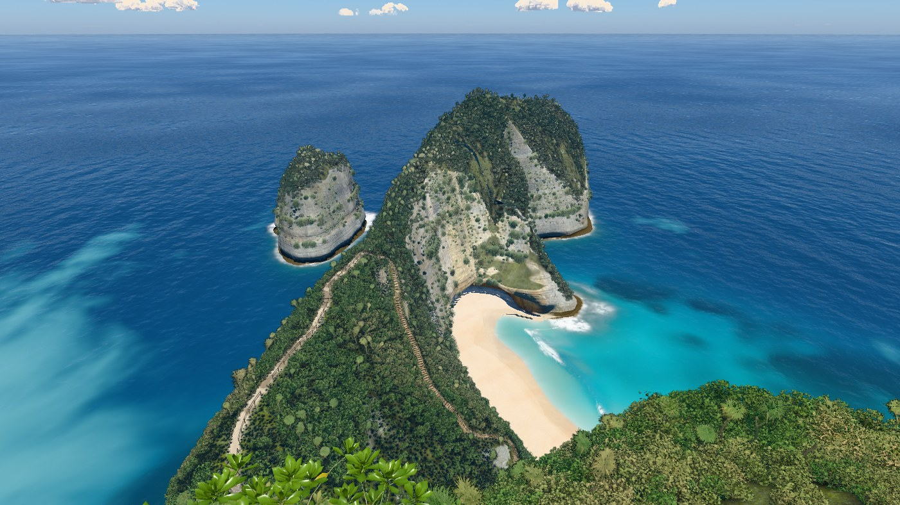
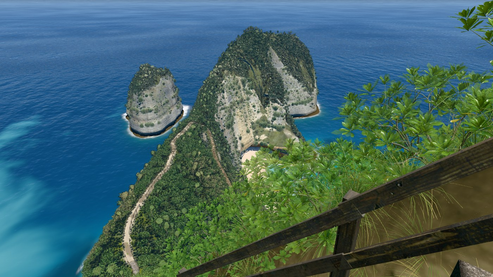
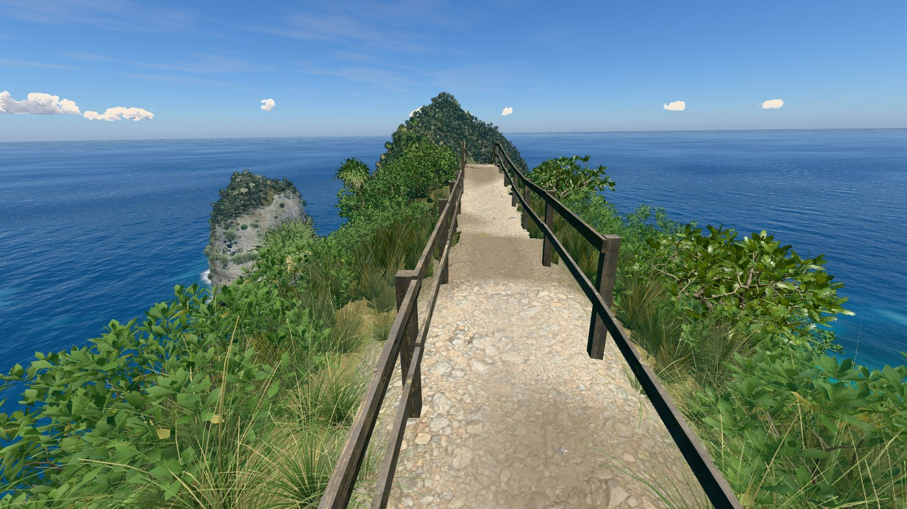
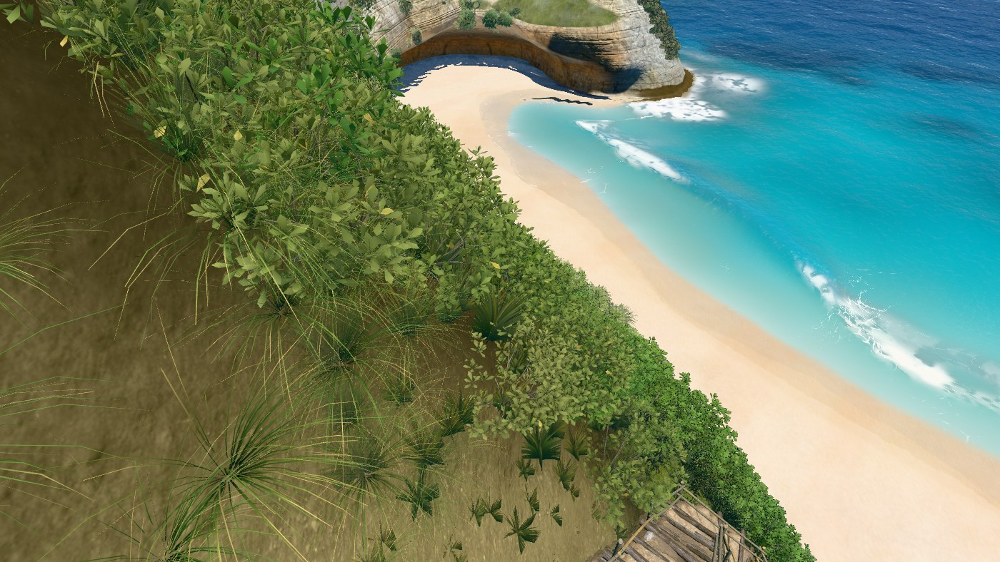
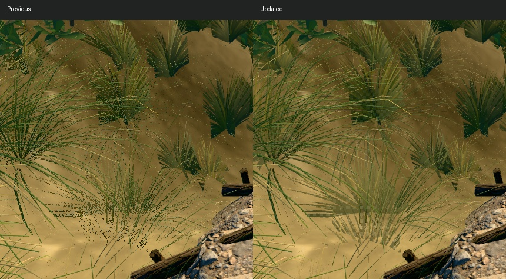
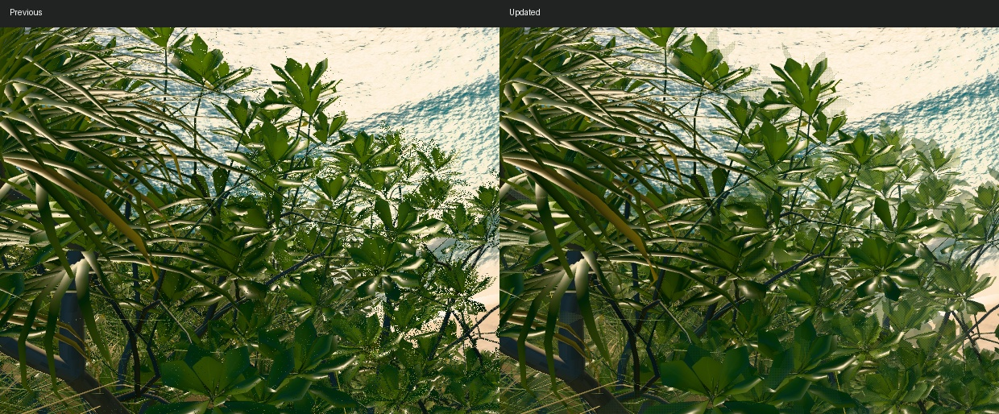
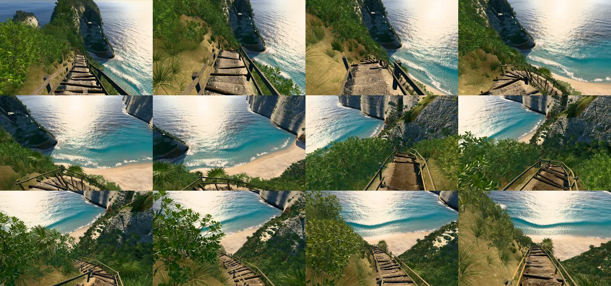

# v32

Hero frames, rendered with `node tools/hero.mjs v32`. The sea is frozen at 17 s.

### Overview, straight down

### Clifftop viewpoint

### On the stairs

### Top of the trail

### Low on the trail

### On the sand

### At the water's edge

### Shore break, eye level

### Head from the sea

## Foliage review

The camera views from Sam's screenshots were reproduced at 94, 88 and 61 m in evening
light. Whole-pixel random discard during LOD and lens fades caused the dotted grass and
leaf edges. Near geometry and distant cards now use continuous MSAA coverage with a mild
coverage bias to retain the crown during overlap. Empty near-instance intervals are culled.
Plant geometry, scatter, texture assets, camera, lighting and water are unchanged.

[Render and resolution readbacks](foliage-checks.json) cover all three views at 0.75×, 1×
and 2×, four lighting choices, and a 2× resize. The main target has four MSAA samples.
At 2×, 1587 × 1000 CSS pixels produce a 3174 × 2000 buffer. The adaptive main resolution
policy is preserved: raising resolution alone does not fix the random discard artifact.

## Frame times

Twelve alternating paired rounds of eight complete frames against accepted `5cd561d`,
1400 px wide, pixel ratio 1, q=1024. The stairs initially measured +10.4% with a wide
−0.6% to +21.2% middle-half range; a targeted 24-round / 12-frame recheck measured +4.6%
(middle half +0.2% to +9.5%). The table uses that recheck for stairs and the original
paired run for the other eight views. All incremental hero limits pass. Absolute times
vary with background GPU activity; the median per-round ratio is the comparison.

| Frame | Previous ms | Updated ms | Paired change |
|---|---:|---:|---:|
| overview | 23.44 | 22.85 | -0.7% |
| viewpoint | 15.14 | 14.58 | -0.2% |
| stairs | 9.70 | 10.15 | +4.6% |
| trailTop | 9.34 | 9.39 | +0.4% |
| trailLow | 14.61 | 15.00 | +3.8% |
| beach | 14.35 | 14.65 | +1.1% |
| swash | 17.64 | 17.16 | -2.8% |
| shoreBreak | 14.58 | 14.49 | +1.1% |
| sideFromSea | 14.45 | 14.99 | +3.7% |

Raw results: [initial run](paired-ab-initial.json), [stairs recheck](paired-stairs-recheck.json),
[combined passing results](paired-ab.json). The historical v26 water-level exception
remains; this version adds no exception.

## Motion, silhouette and build checks

A 144-frame / 24 fps review covers two moving approaches (tau 2.08–2.32 and 2.75–2.98)
with animated wind. [Motion readbacks](motion-check.json) include the same-camera 1× / 2×
render timings and target sizes; first rounds include cold-target overhead, so they are
not a frame-budget comparison. [Retina motion readbacks](retina-motion-check.json) cover
72 further frames at 2×. The local clips are in `captures/v32/`.

[Accepted-outline regression](outline.json): overview and viewpoint land labels with water
hidden have zero changed pixels against `5cd561d`. Reference photographs remain unavailable.
The terrain bake is current. The local standalone contains 56 modules, its inline scripts
compile as classic scripts, and an offline load (21.0 s) renders four stops and the night
option without console errors, using generated terrain and texture fallbacks.
