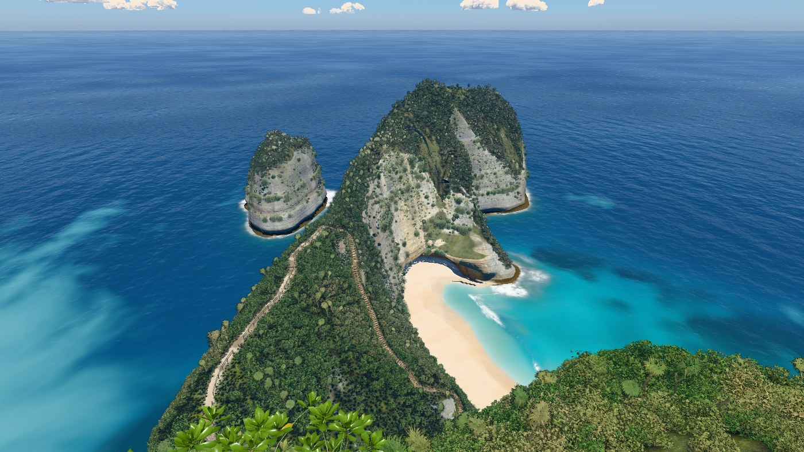
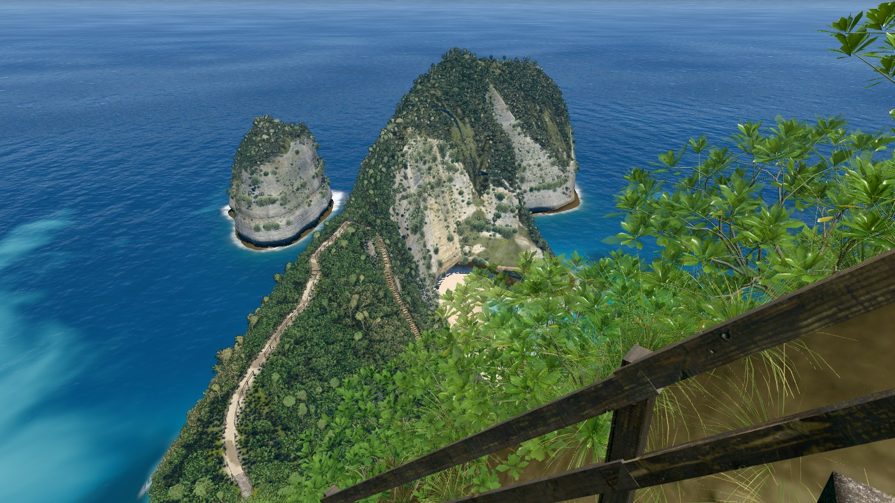
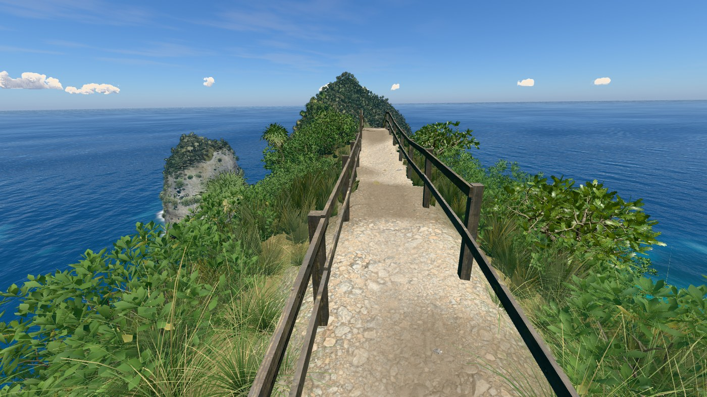
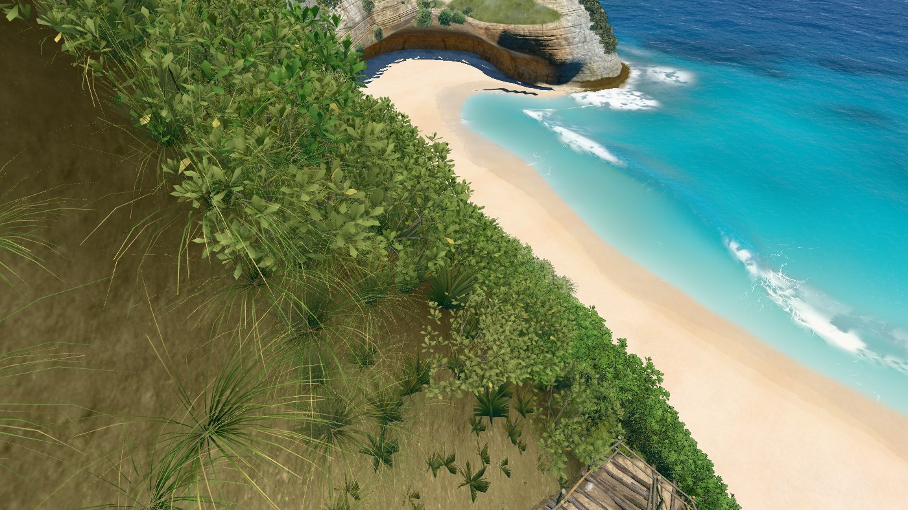
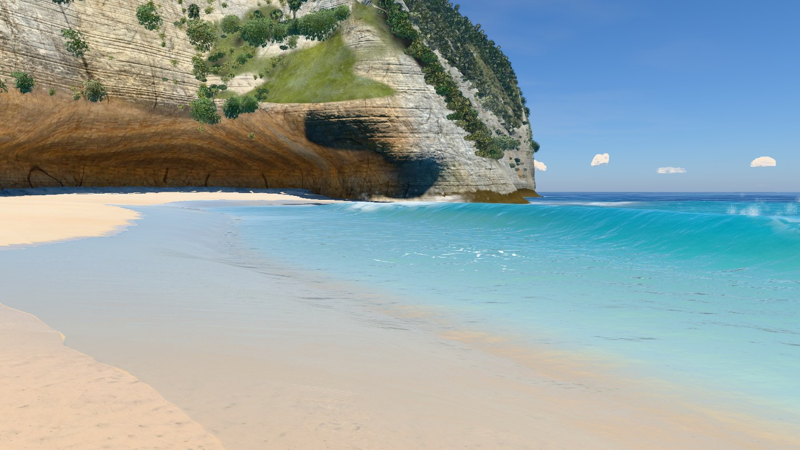
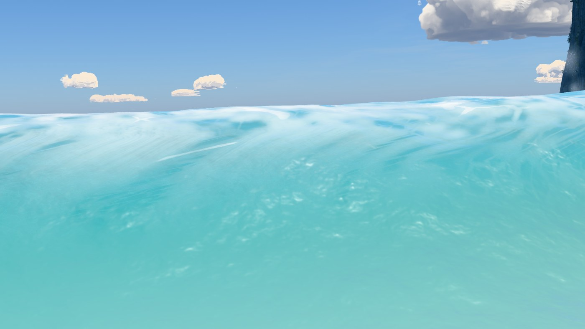
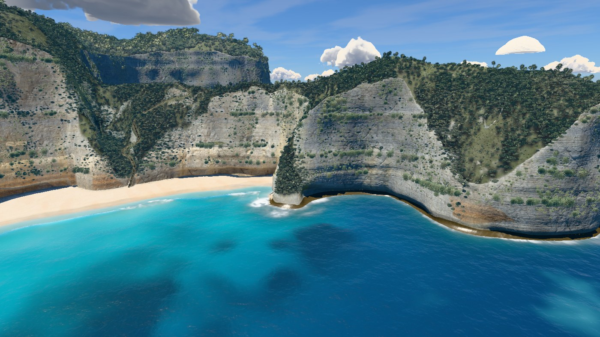
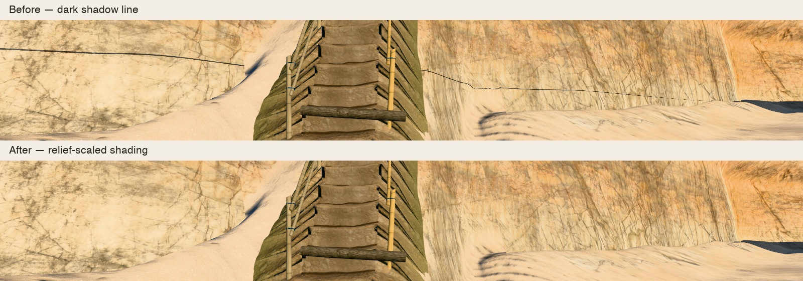
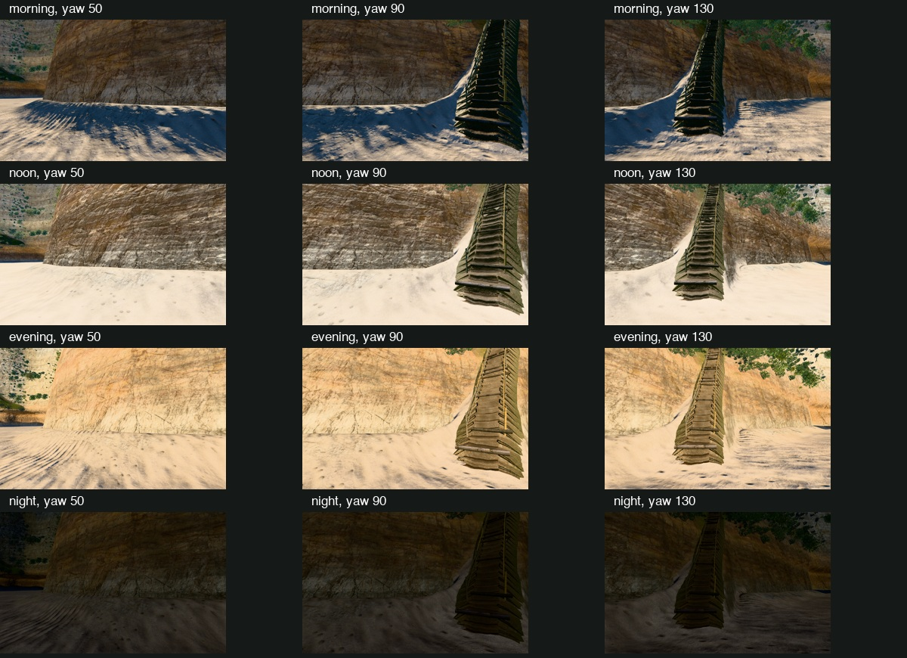
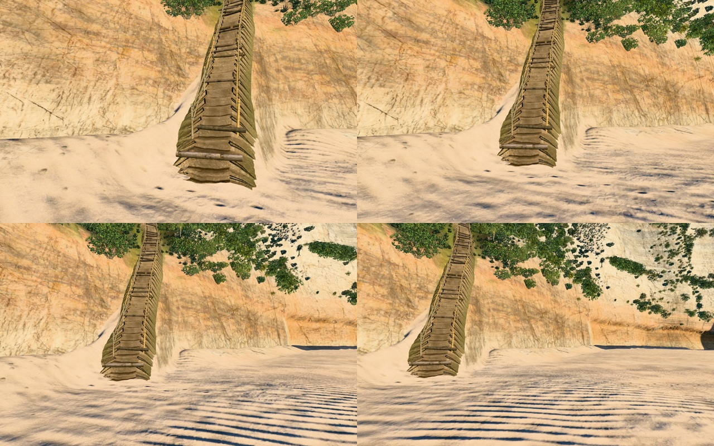

# v33

Hero frames, rendered with `node tools/hero.mjs v33`. The sea is frozen at 17 s.

### Overview, straight down

### Clifftop viewpoint

### On the stairs

### Top of the trail

### Low on the trail

### On the sand

### At the water's edge

### Shore break, eye level

### Head from the sea

## Cliff line correction

The reported line behind the last stairs came from the fine limestone ledge shadows.
The table returns a margin in unscaled relief metres, but the shader compared it directly
with a world-space bias and pixel footprint. Applying the local relief strength to the
margin restores consistent units and prevents tiny ledges from casting a full dark seam.
The correction applies to every terrain face. Rock textures, geometry and the depth pass
remain as before.

[Full before](wall-before.jpg), [full after](wall-evening-130.jpg),
[Retina after](wall-evening-retina.jpg).

## Angle and light checks

Three beach headings (50°, 90°, 130°) in morning, noon, evening and night: no reported
line reappears in the inspected renders. No console errors. A 1600 × 1000 CSS canvas
at 2× produces a 3200 × 2000 drawing buffer with four MSAA samples.

[Raw camera and render readbacks](wall-check.json). A 72-frame, 24 fps recording moves
four metres along the beach and turns from 110° to 148°; the wall remains continuous.
The local clip is `captures/v33/cliff-sweep.mp4`.

## Frame times

Twelve alternating paired rounds of eight complete frames compare all nine hero views
with accepted `6cf2940`, at 1400 px wide, pixel ratio 1, q=1024. All incremental limits
pass (−12.8% to +3.1%). Absolute frame times vary with GPU load; the comparison is the
median per-round ratio. No new performance exception. The historical v26 close-water
exception remains.

| Frame | Previous ms | Updated ms | Paired change |
|---|---:|---:|---:|
| overview | 51.44 | 48.11 | -0.7% |
| viewpoint | 29.89 | 30.65 | -2.6% |
| stairs | 28.54 | 28.24 | -3.6% |
| trailTop | 22.23 | 19.49 | -12.8% |
| trailLow | 21.19 | 21.09 | +3.1% |
| beach | 15.12 | 15.24 | +0.5% |
| swash | 17.61 | 17.18 | -2.3% |
| shoreBreak | 15.00 | 15.23 | -0.9% |
| sideFromSea | 14.86 | 14.89 | +2.6% |

[Raw paired measurements](paired-times.json).

## Shape and build checks

[Accepted land-outline regression](outline.json): zero changed pixels at overview and
viewpoint with water hidden. Photographic references remain unavailable, so this checks
the accepted scene silhouette. The terrain bake is current. The local standalone contains
56 modules and its inline scripts compile. Offline verification is recorded in PROCESS.md.

Only one functional shader expression changes. Fine ledge shadows remain an approximation
from the relief table; this correction keeps their existing filtering and makes their
strength consistent with the surface relief. No asset changes, downloads or publication.
