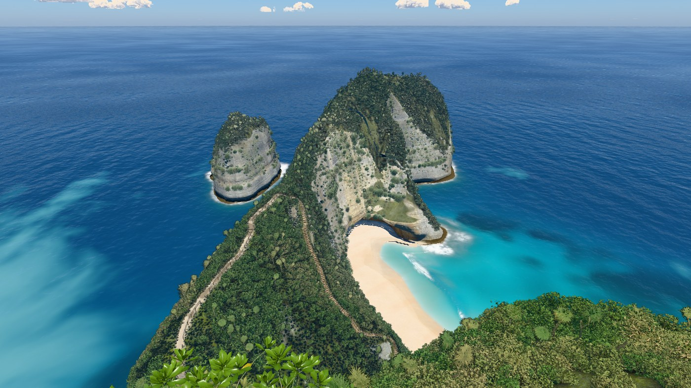
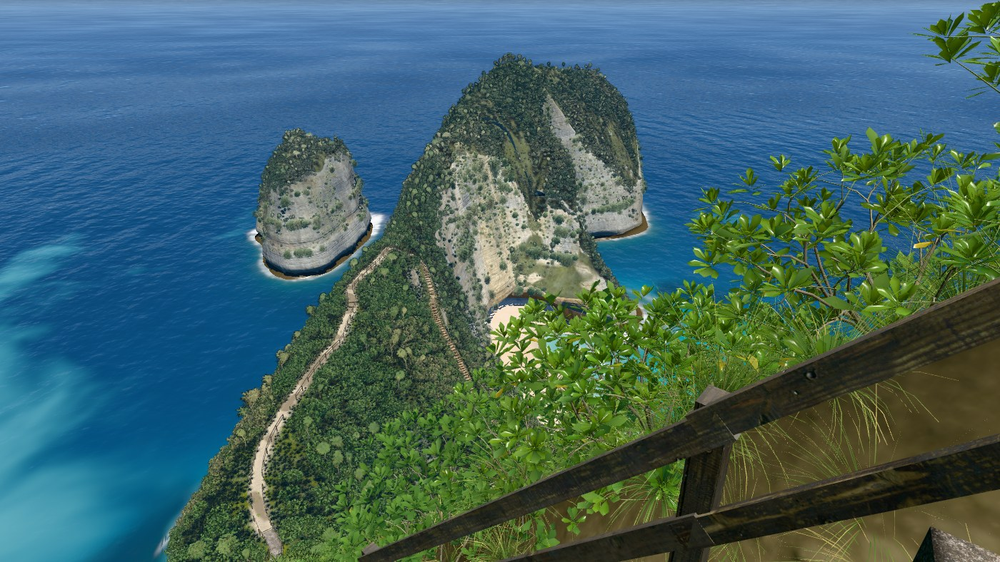
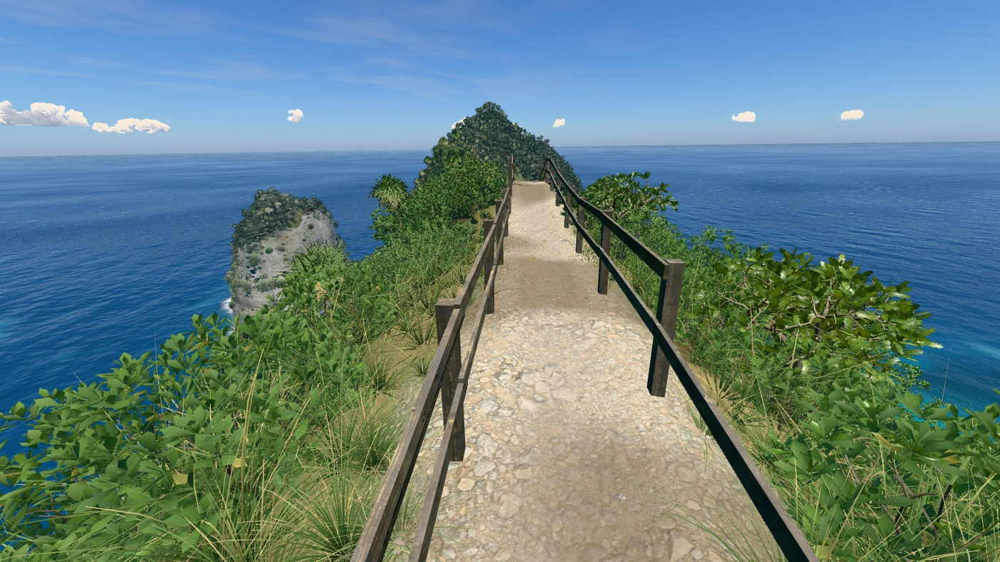
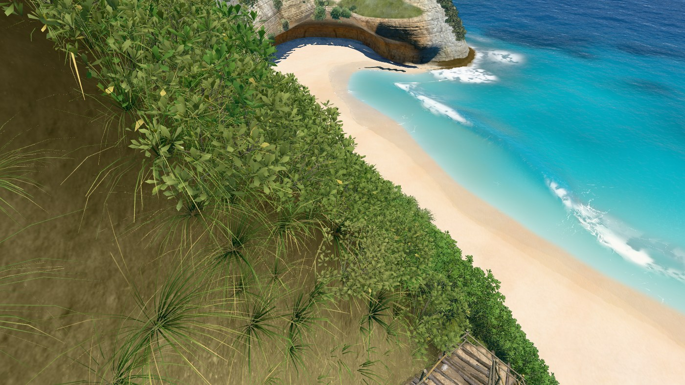
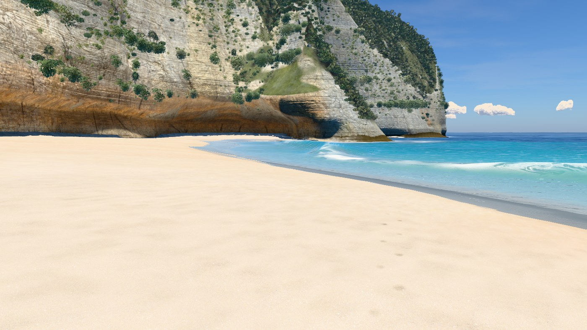
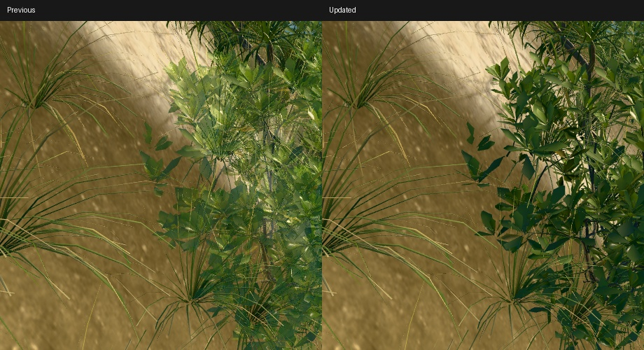
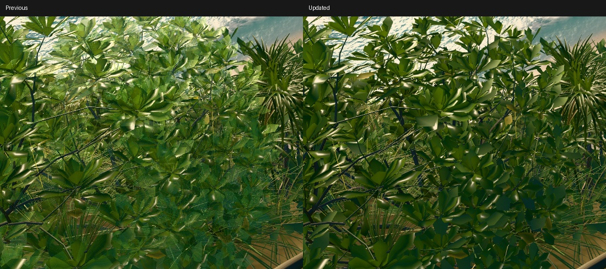
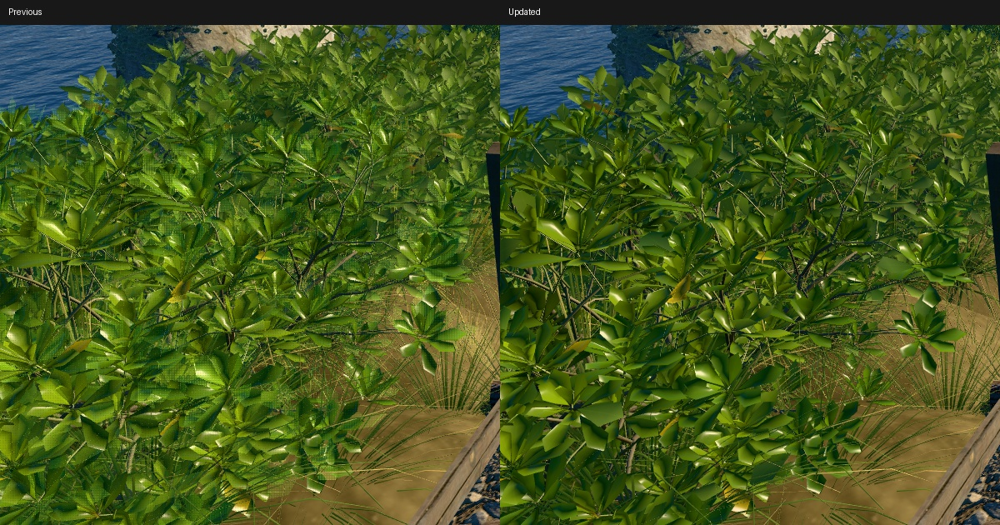
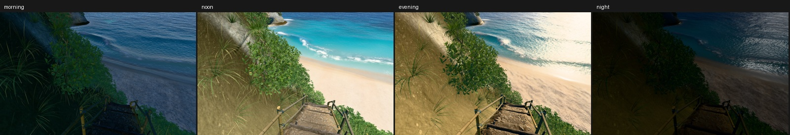
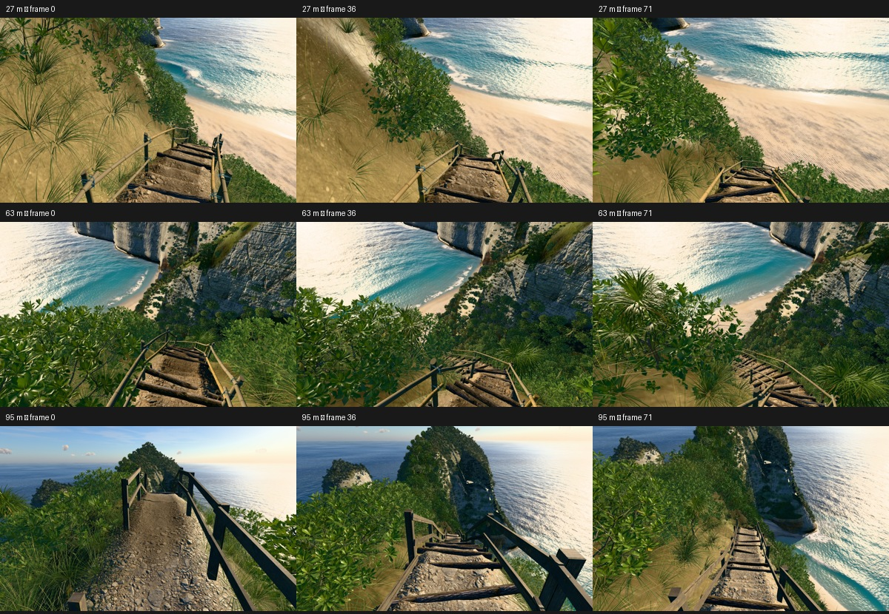

# v34

Hero frames, rendered with `node tools/hero.mjs v34`. The sea is frozen at 17 s.

### Overview, straight down

### Clifftop viewpoint

### On the stairs

### Top of the trail

### Low on the trail

### On the sand

### At the water's edge

### Shore break, eye level

### Head from the sea

## Foliage review

Matched the reported evening views at 27 m (tau 3.690), 63 m (tau 2.823) and 95 m
(tau 2.076). Uniform opacity across overlapping geometry produced a correlated four-sample
MSAA pattern. The transition now selects stable leaves/blades in plant space and reveals
only the boundary leaf along its length; interiors retain full depth and coverage.
The lighter grass level uses curved blades from the same seeded tuft, rather than
three painted cards. The scatter, source textures and resolution governor are unchanged.

[Render readbacks](foliage-checks.json) record all three views at 0.85×, 1× and 2×.
At 2×, 1587 × 1000 CSS pixels produce 3174 × 2000 drawing buffers. A DPR=2 resize
produces 2048 × 1280 for 1024 × 640 CSS pixels. No console errors.

Moving approaches cover each affected view: 216 frames at 1× and 144 frames at 2×,
24 fps with animated wind. Local clips and full PNG buffers are in `captures/v34/`.
The stable leaf selection follows the plant rather than screen pixels. Actual leaf edges
still use MSAA; subpixel blades can soften at reduced resolution. Distant impostors retain
their existing baked view selection.

## Frame times

Twelve alternating paired rounds of eight completed frames against accepted `af278c3`,
1400 px wide, pixel ratio 1, q=1024. All nine incremental limits pass; no new exception.
The historical v26 close-water exception remains. Absolute timing depends on background
GPU activity, so the median per-round ratio is the comparison.

| Frame | Previous ms | Updated ms | Paired change |
|---|---:|---:|---:|
| overview | 23.90 | 24.62 | -1.0% |
| viewpoint | 15.16 | 14.89 | -3.1% |
| stairs | 14.75 | 13.58 | -9.5% |
| trailTop | 10.43 | 10.52 | -2.0% |
| trailLow | 16.12 | 16.08 | +0.2% |
| beach | 15.05 | 16.15 | +6.6% |
| swash | 40.40 | 40.43 | +1.4% |
| shoreBreak | 25.34 | 25.12 | -2.0% |
| sideFromSea | 19.74 | 20.65 | +4.2% |

[Raw paired results](paired-times.json).

## Landscape and build checks

[Accepted-outline regression](outline.json): overview and viewpoint land labels with
water hidden have zero changed pixels against `af278c3`. Reference photos remain
unavailable. The terrain bake is current. Nine hero frames have no console errors.
The local standalone contains 56 modules and its inline scripts compile as classic scripts.
Offline verification is recorded in PROCESS.md.
