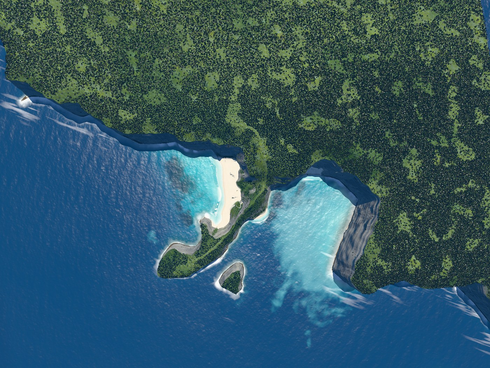
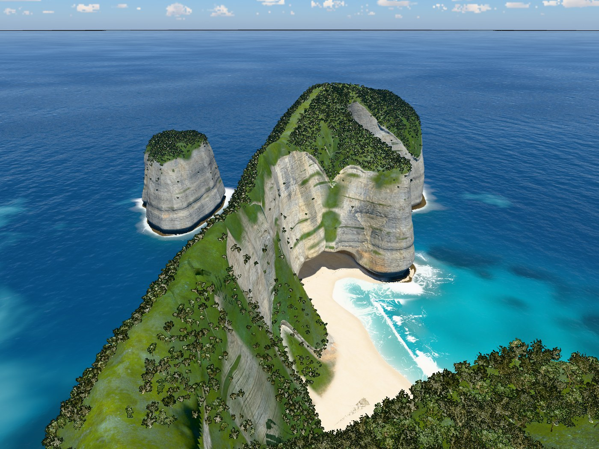
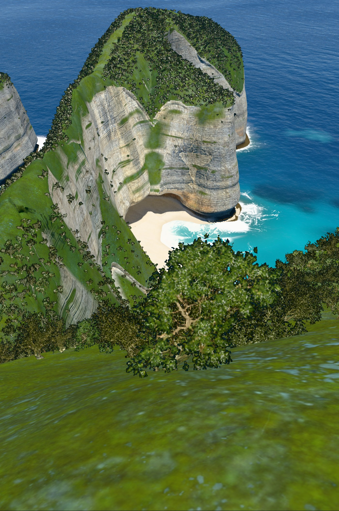
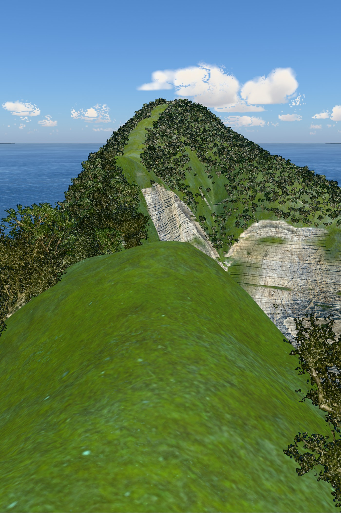
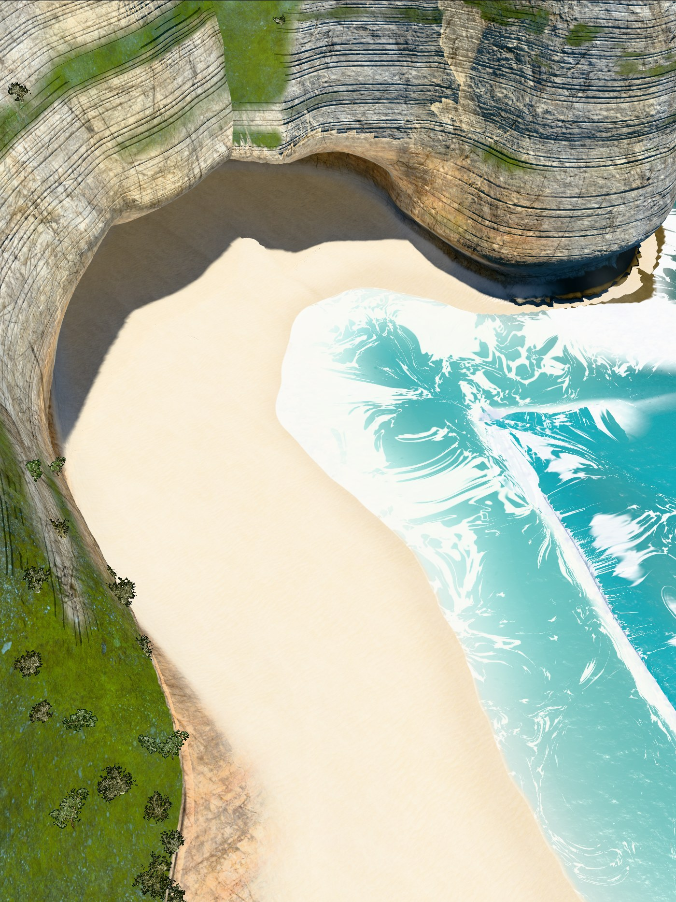
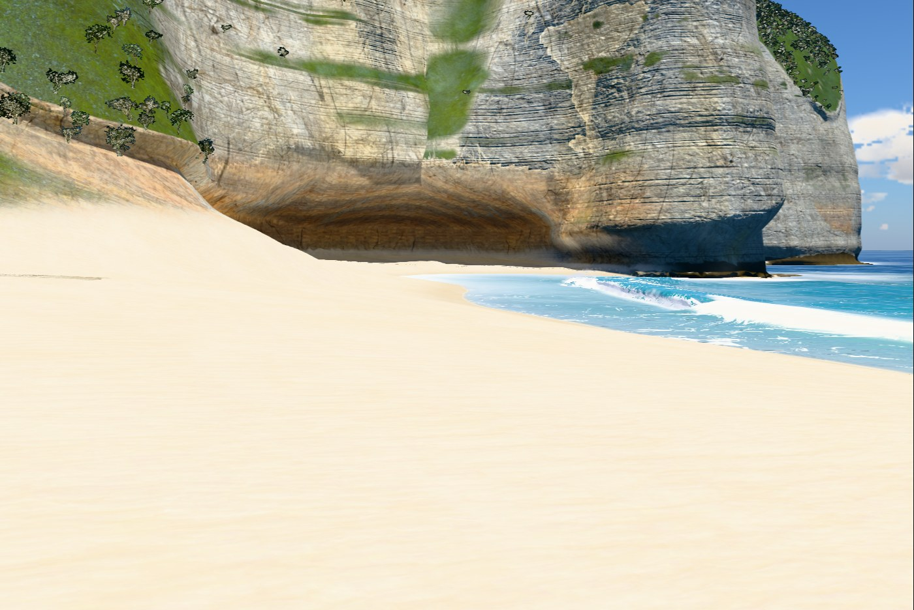
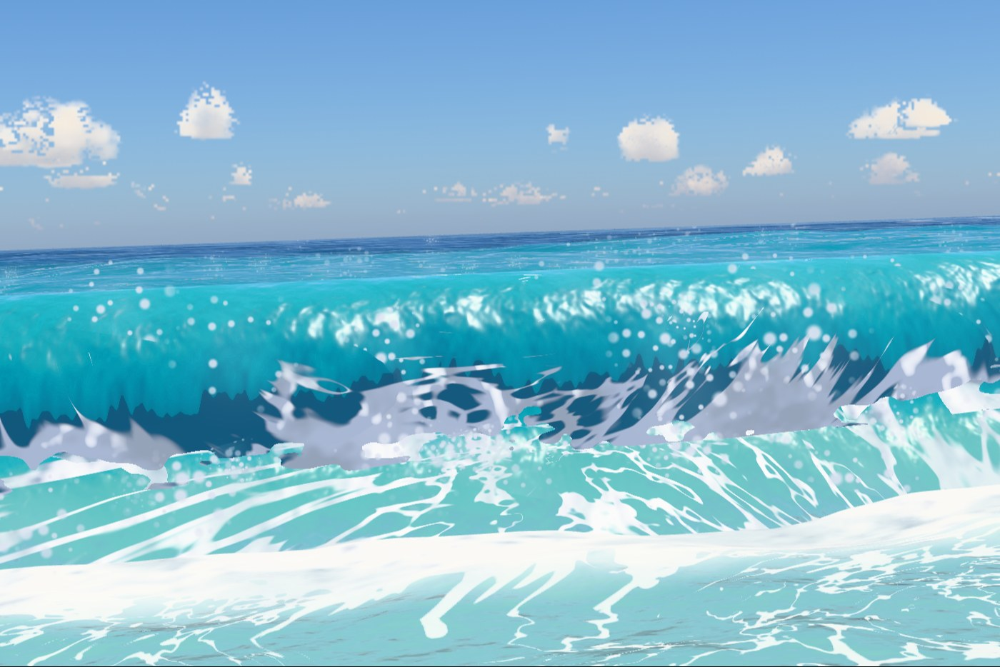
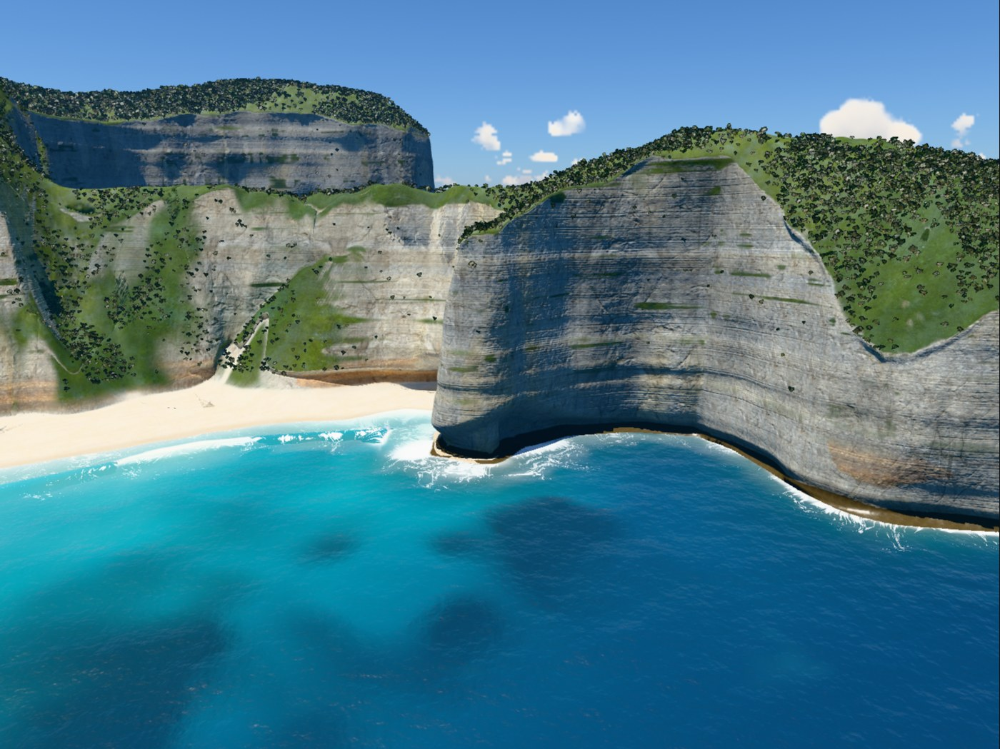

# v4

Hero frames, rendered with `node tools/hero.mjs v4`. The sea is frozen at 17 s.

### Overview, straight down

### Clifftop viewpoint

### On the stairs

### Top of the trail

### Low on the trail

### On the sand

### Shore break, eye level

### Head from the sea

## Frame times

Time to render one frame to completion at 1400 px wide, pixel ratio 1, best of three rounds, on
the build machine (Apple M1 Max). Absolute times depend on what else is using the GPU, so only
the change column means anything: it is against v3, timed in the same run.

| Frame | Time | fps | Change |
|---|---|---|---|
| Overview, straight down | 12.1 ms | 83 | -8% |
| Clifftop viewpoint | 8.6 ms | 116 | +5% |
| On the stairs | 8.5 ms | 118 | -4% |
| Top of the trail | 6.9 ms | 145 | +10% |
| Low on the trail | 8.0 ms | 125 | -32% |
| On the sand | 6.7 ms | 149 | -7% |
| Shore break, eye level | 11.5 ms | 87 | +1% |
| Head from the sea | 7.5 ms | 133 | -26% |

Timed side by side instead (`node tools/ab.mjs --hero`: both versions open in one browser,
timed in turns), the same build came out overview +7%, viewpoint +16%, stairs +19%, trailTop
+19%, trailLow +19%, beach +26%, shoreBreak -1% (its camera moved in v4), sideFromSea 0%. Both
tools swung by 10 to 40 points between runs on this machine. See v4 in `PROCESS.md`.
