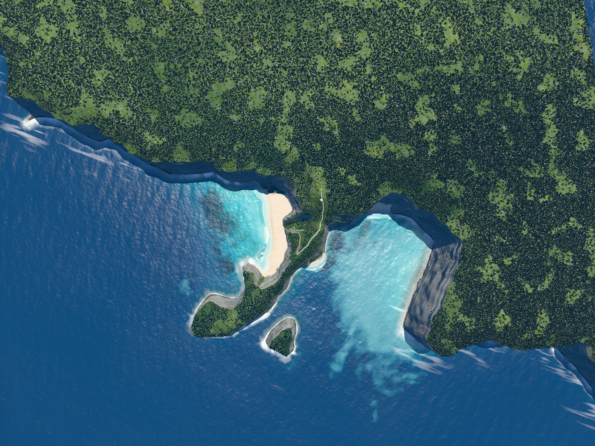
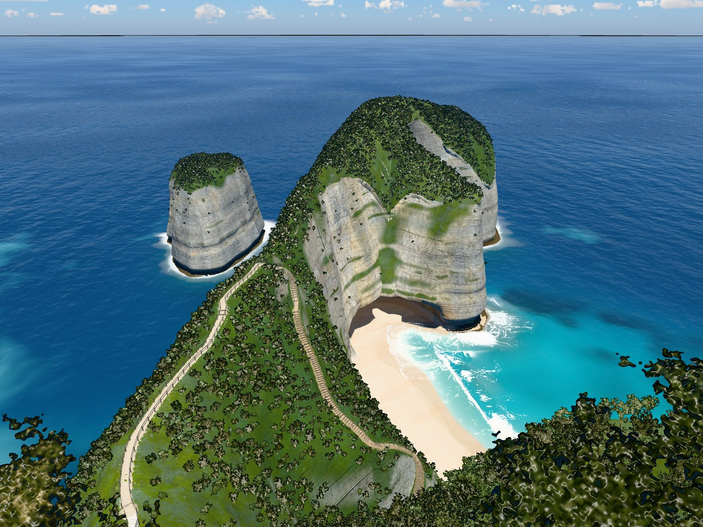
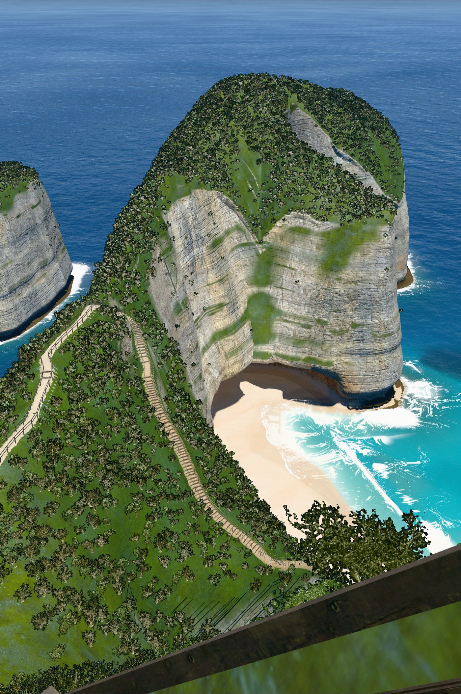
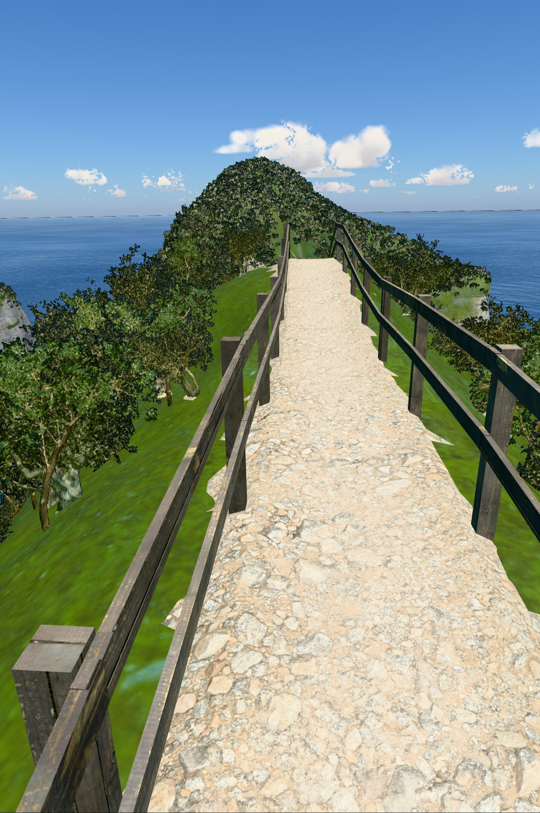
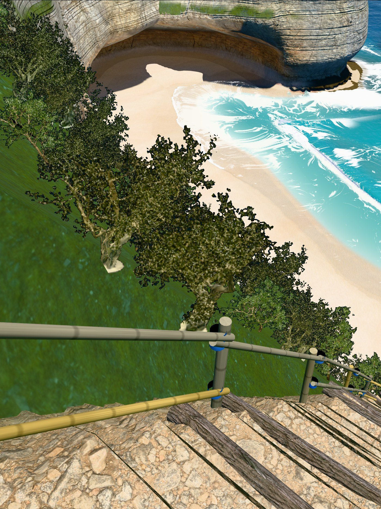
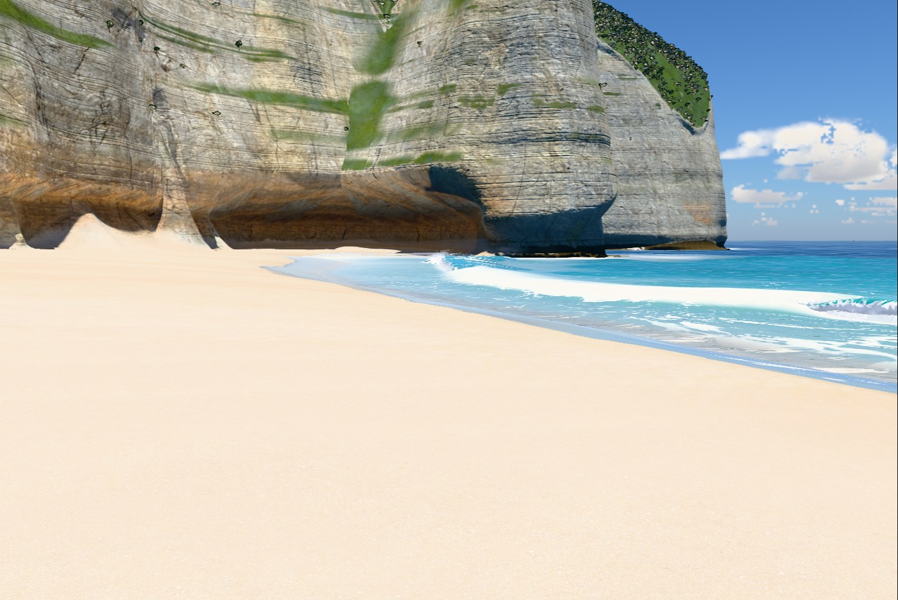
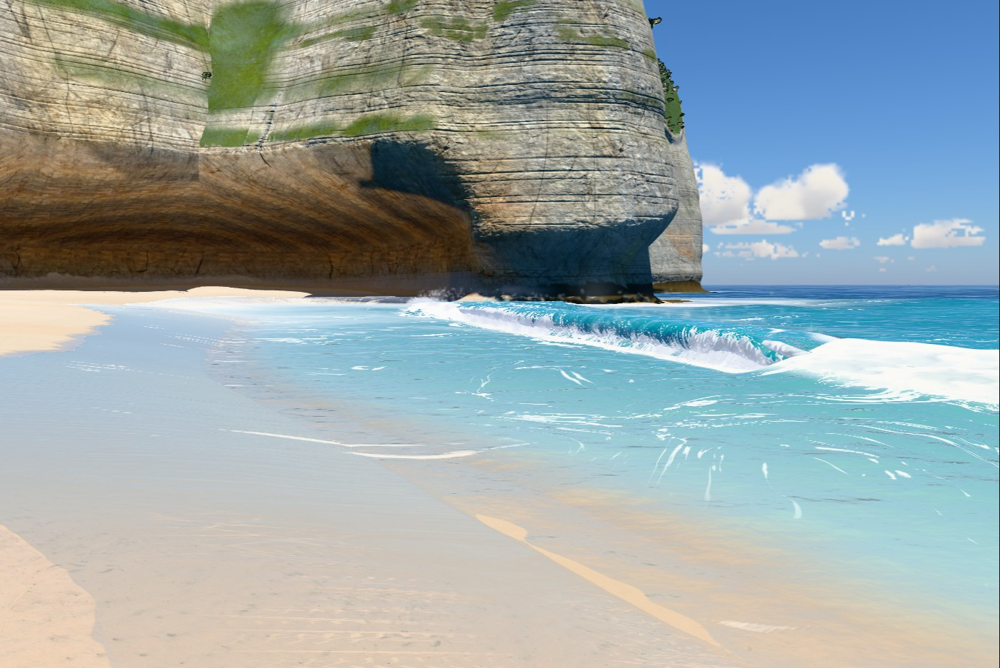
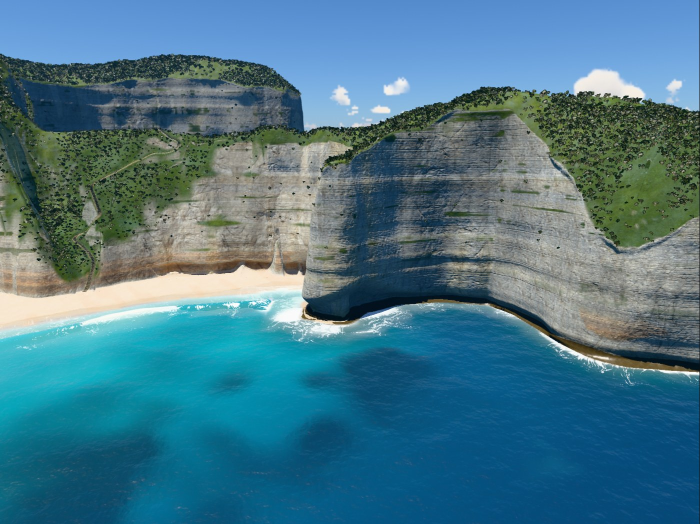

# v6

Hero frames, rendered with `node tools/hero.mjs v6`. The sea is frozen at 17 s.

### Overview, straight down

### Clifftop viewpoint

### On the stairs

### Top of the trail

### Low on the trail

### On the sand

### At the water's edge

### Shore break, eye level

### Head from the sea

## Frame times

Time to render one frame to completion at 1400 px wide, pixel ratio 1, best of three rounds, on
the build machine (Apple M1 Max). Absolute times depend on what else is using the GPU, so only
the change column means anything: it is against v5, timed in the same run.

| Frame | Time | fps | Change |
|---|---|---|---|
| Overview, straight down | 24.3 ms | 41 | +93% (over budget) |
| Clifftop viewpoint | 8.7 ms | 115 | +23% (over budget) |
| On the stairs | 21.2 ms | 47 | +104% (over budget) |
| Top of the trail | 11.0 ms | 91 | +20% (over budget) |
| Low on the trail | 16.3 ms | 61 | +10% (over budget) |
| On the sand | 9.9 ms | 101 | +1% |
| At the water's edge | 10.5 ms | 95 | -20% |
| Shore break, eye level | 11.1 ms | 90 | +5% |
| Head from the sea | 10.1 ms | 99 | +26% (over budget) |

These are from the last of five `hero.mjs` runs, and they swung from run to run by more than
anything v6 changed: `overview` came out -5%, +7%, +15% and +93%, `stairs` +1% to +104%. The
budget was judged with `tools/ab.mjs` instead (both builds open side by side, timed in turns),
which put every frame within 10% of v5: see the v6 section of `PROCESS.md`.
