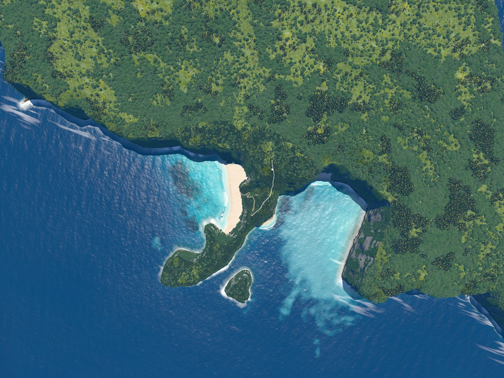
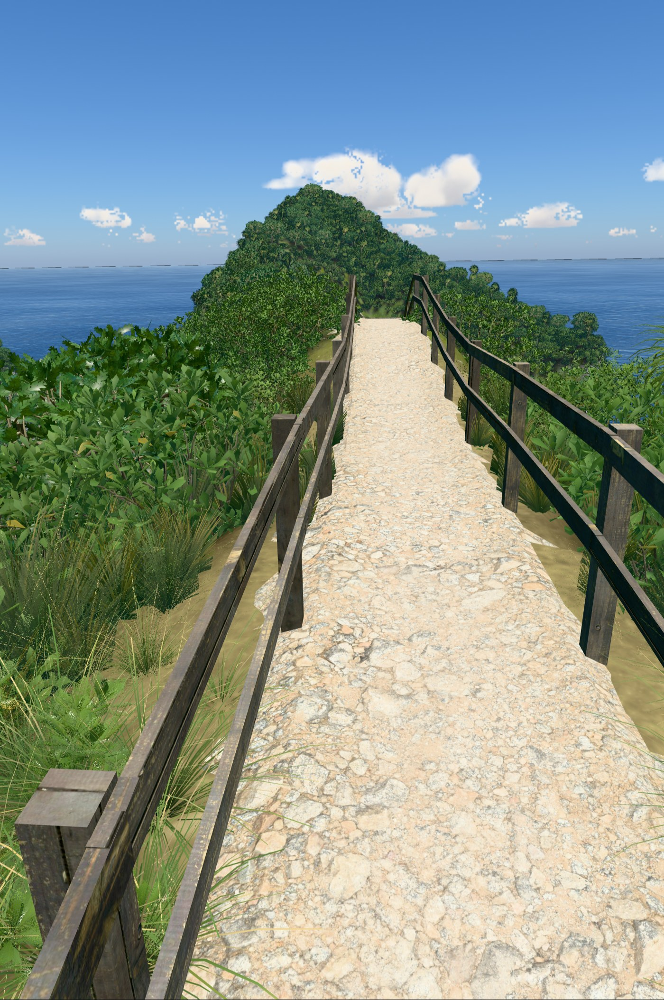
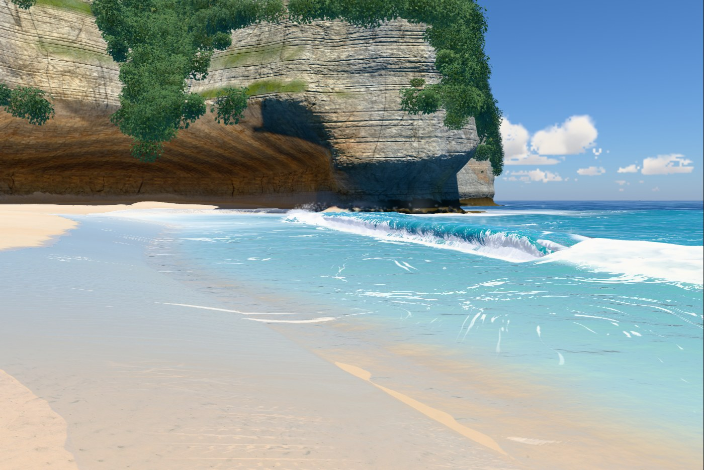
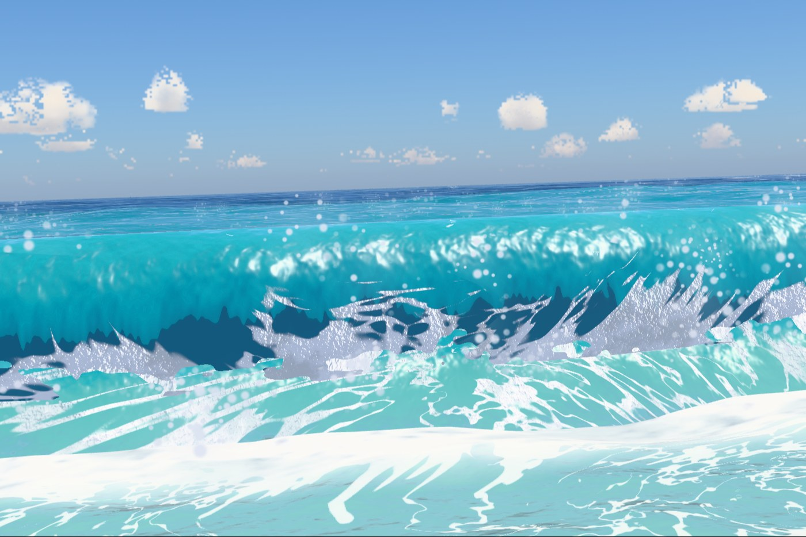
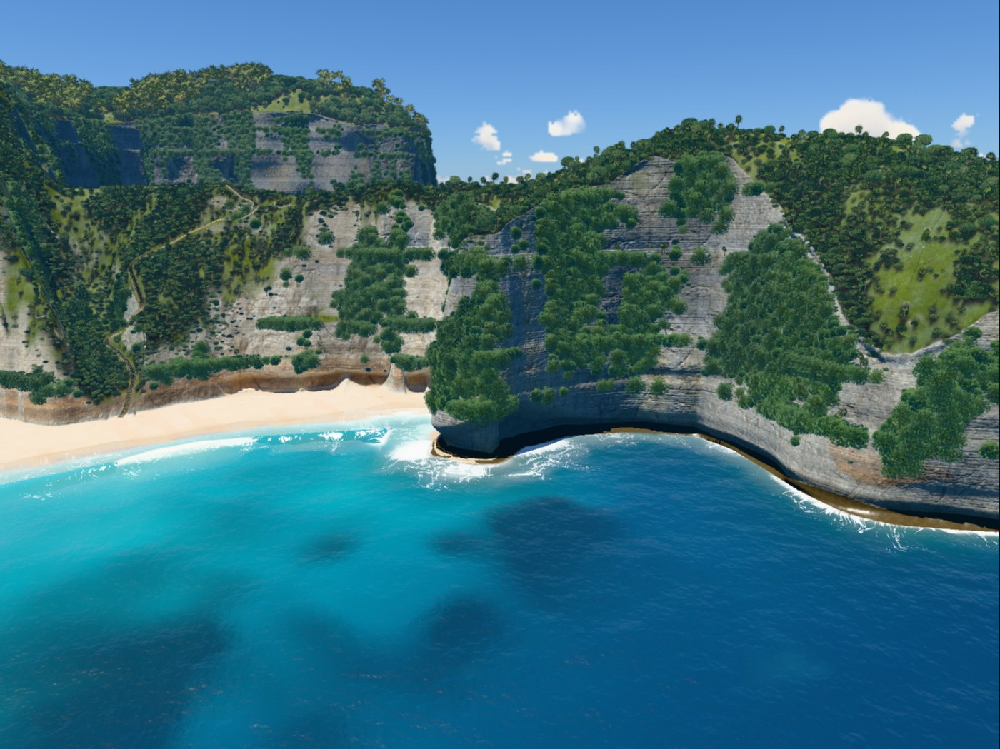

# v8

Hero frames, rendered with `node tools/hero.mjs v8`. The sea is frozen at 17 s.

### Overview, straight down

### Clifftop viewpoint

### On the stairs

### Top of the trail

### Low on the trail

### On the sand

### At the water's edge

### Shore break, eye level

### Head from the sea

## Frame times

Time to render one frame to completion at 1400 px wide, pixel ratio 1, best of three rounds, on
the build machine (Apple M1 Max). Absolute times depend on what else is using the GPU, so only
the change column means anything: it is against v7, timed in the same run.

| Frame | Time | fps | Change |
|---|---|---|---|
| Overview, straight down | 11.8 ms | 85 | +18% (over budget) |
| Clifftop viewpoint | 10.9 ms | 92 | -11% |
| On the stairs | 7.6 ms | 132 | -42% |
| Top of the trail | 9.7 ms | 103 | +9% |
| Low on the trail | 9.6 ms | 104 | +20% (over budget) |
| On the sand | 7.6 ms | 132 | +13% (over budget) |
| At the water's edge | 10.8 ms | 93 | +10% (over budget) |
| Shore break, eye level | 9.2 ms | 109 | -4% |
| Head from the sea | 8.9 ms | 112 | -11% |

These are from one `hero.mjs` run, which put four frames over and one 42% faster, although
v8 changed nothing these frames draw (eight of them came out bit-identical to v7's, and
`sideFromSea` differs in a handful of pixels, PSNR 99 dB). Timed side by
side with v7 in one browser (`ab.mjs --hero`, 16 rounds) every frame is within budget: from
-7% (`sideFromSea`) to +10% (`shoreBreak`, with the widest spread), most within 1 to 4%. v8's
own budget is the scroll's: frame times along the whole path, and the page's real pacing, in
the v8 section of `PROCESS.md`.
