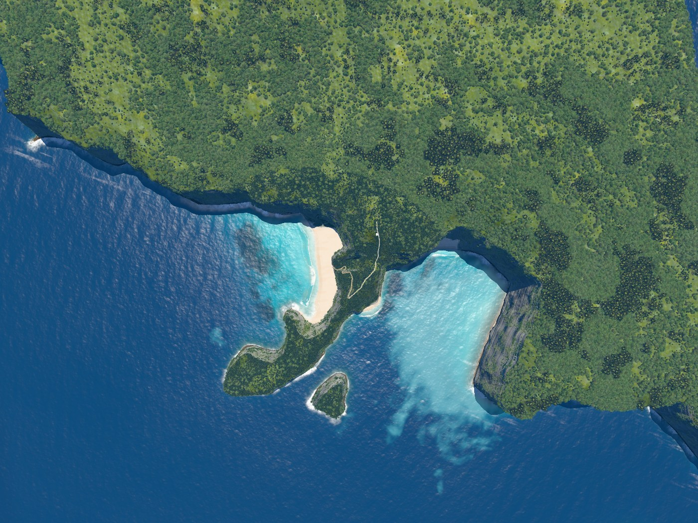
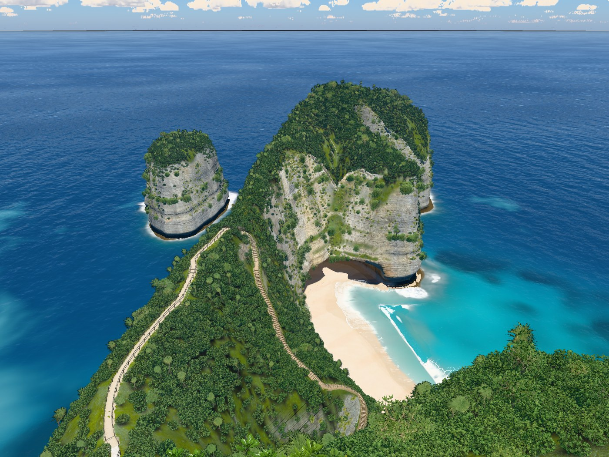
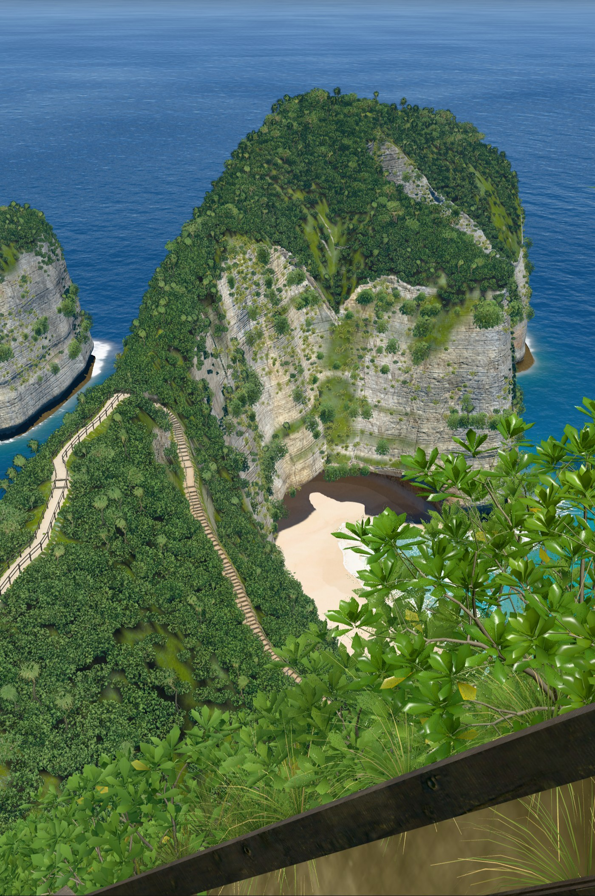
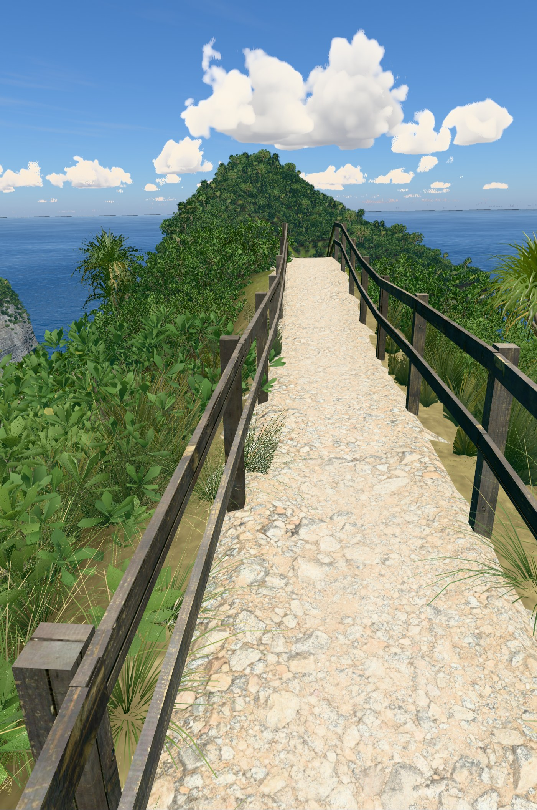
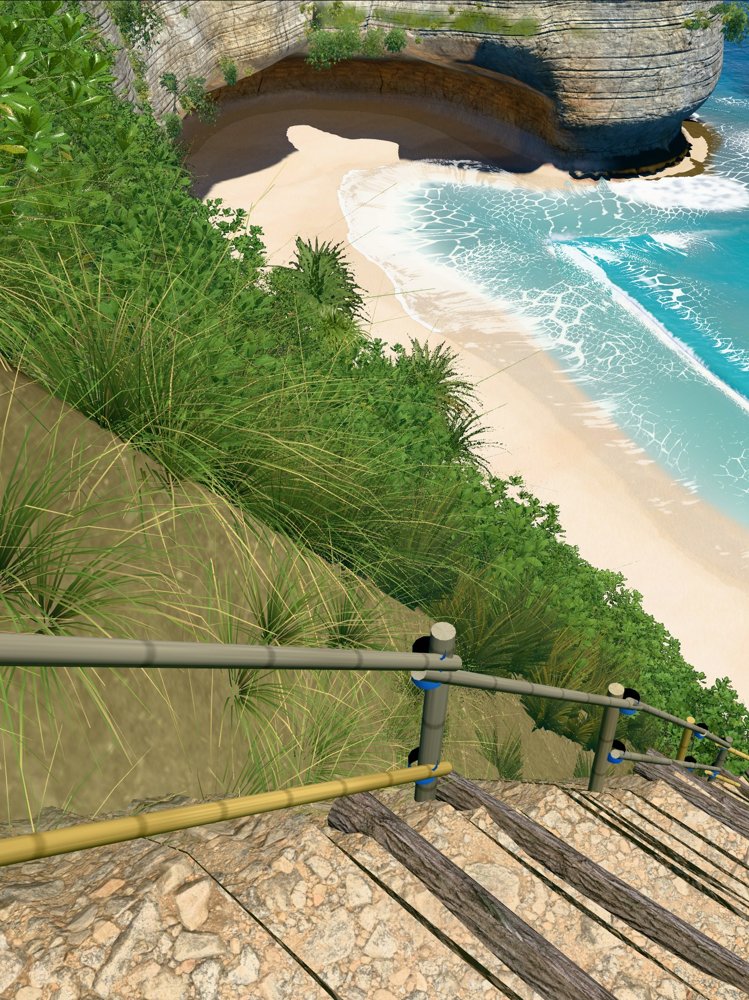
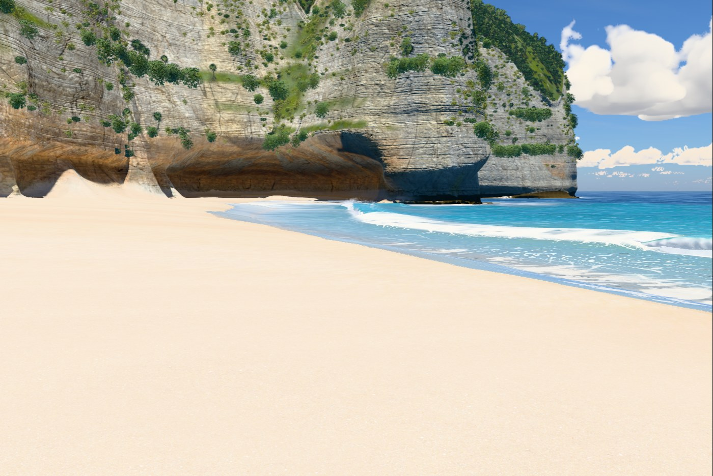
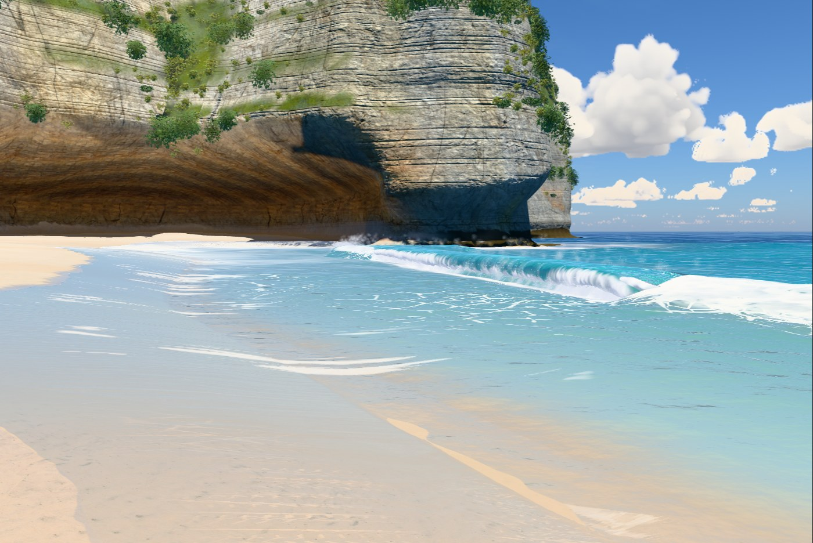
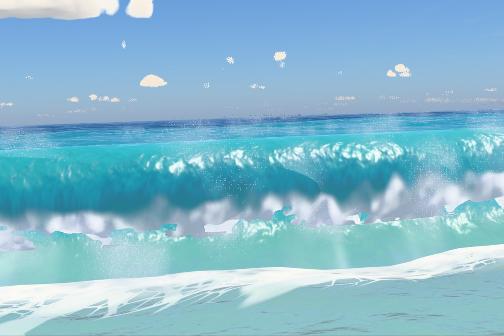
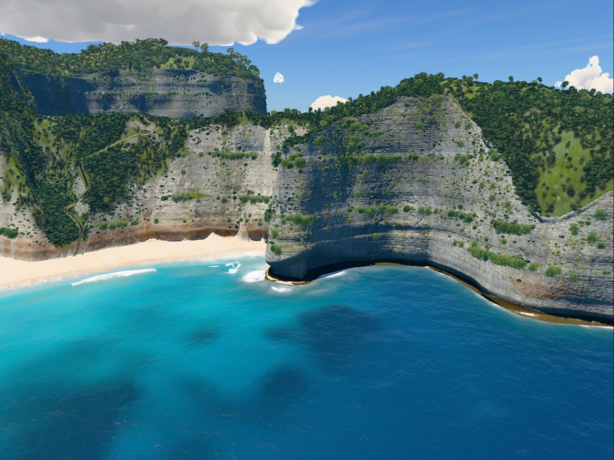

# v9

Hero frames, rendered with `node tools/hero.mjs v9`. The sea is frozen at 17 s.

### Overview, straight down

### Clifftop viewpoint

### On the stairs

### Top of the trail

### Low on the trail

### On the sand

### At the water's edge

### Shore break, eye level

### Head from the sea

## Frame times

Time to render one frame to completion at 1400 px wide, pixel ratio 1, best of three rounds, on
the build machine (Apple M1 Max). Absolute times depend on what else is using the GPU, so only
the change column means anything: it is against v8, timed in the same run.

| Frame | Time | fps | Change |
|---|---|---|---|
| Overview, straight down | 11.5 ms | 87 | -3% |
| Clifftop viewpoint | 6.7 ms | 149 | +12% (over budget) |
| On the stairs | 7.6 ms | 132 | +9% |
| Top of the trail | 5.2 ms | 192 | +8% |
| Low on the trail | 8.5 ms | 118 | +25% (over budget) |
| On the sand | 6.4 ms | 156 | +12% (over budget) |
| At the water's edge | 15.6 ms | 64 | +114% (over budget) |
| Shore break, eye level | 14.5 ms | 69 | +1% |
| Head from the sea | 6.1 ms | 164 | +7% |

These numbers come from one `hero.mjs` run and swing a lot on this Mac (the same frames came out
within budget in six side-by-side runs). Side by side with v8 in one browser
(`node tools/ab.mjs --hero`, 20 rounds): overview +7%, viewpoint +4%, stairs +11% (+10% at 24
rounds), trailTop +1%, trailLow +2%, beach +6%, swash +6%, shoreBreak -15%, sideFromSea +6%.
See v9 in `PROCESS.md`.
